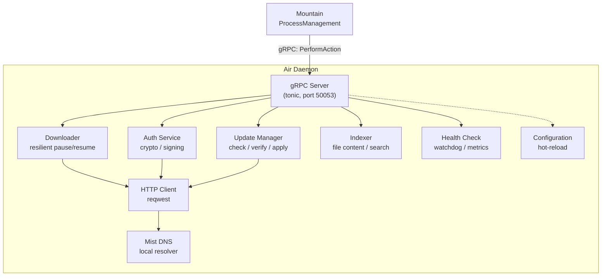

# Air: Background Daemon 🪁

This document describes the `Air` background daemon:

- A persistent `Rust` sidecar process that runs alongside `Mountain`
- Handles resource-intensive operations to keep the main editor process responsive
- Operations include: update management, file indexing, cryptographic operations, and background downloads

---

## Table of Contents

1. [Overview](#overview)
2. [Architecture](#architecture)
3. [Module Map](#module-map)
4. [Services](#services)
5. [Data Flow](#data-flow)
6. [Startup Sequence](#startup-sequence)
7. [Configuration](#configuration)
8. [Related Documentation](#related-documentation)

---



## Overview 📋

| Attribute    | Value                                                          |
| ------------ | -------------------------------------------------------------- |
| Language     | `Rust` (edition 2024)                                          |
| Crate type   | Binary                                                         |
| IPC          | `gRPC` (`tonic`) on port 50053                                 |
| Dependencies | `tokio`, `tonic`, `prost`, `reqwest`, `ring`, `Common`, `Mist` |
| Managed by   | `Mountain` `ProcessManagement`                                 |

---

## Architecture 🏗️

`Air` is structured around a central `gRPC` server that receives task delegation from `Mountain`. Internal modules handle distinct responsibilities.

```
                    +------------------------------------------+
                    |               Mountain                    |
                    |  ProcessManagement/AirManagement.rs       |
                    |  Sends work via PerformAction gRPC call   |
                    +-------------------+----------------------+
                                        |
                                        | gRPC (port 50053)
                                        v
+----------------------------------------------------------------+
|                        Air Daemon                               |
|                                                                 |
|  +------------------+  +------------------+  +----------------+ |
|  | gRPC Server      |  | Update Manager   |  | Downloader     | |
|  | (tonic)          |  | (check, verify,  |  | (resilient     | |
|  | routes tasks     |  |  apply patches)  |  |  pause/resume) | |
|  +------------------+  +------------------+  +----------------+ |
|                                                                 |
|  +------------------+  +------------------+  +----------------+ |
|  | Auth Service     |  | Indexer          |  | Health Check   | |
|  | (crypto, signing)|  | (file content    |  | (watchdog,     | |
|  |                  |  |  search index)   |  |  metrics)      | |
|  +------------------+  +------------------+  +----------------+ |
|                                                                 |
|  +------------------+  +------------------+  +----------------+ |
|  | HTTP Client      |  | Mist DNS         |  | Configuration | |
|  | (reqwest)        |  | (local resolver) |  | (hot-reload)   | |
|  +------------------+  +------------------+  +----------------+ |
+----------------------------------------------------------------+
```

---

## Module Map 🗺️

| Path                      | Purpose                                                                        |
| ------------------------- | ------------------------------------------------------------------------------ |
| `Source/Binary/Binary.rs` | Binary entry point; bootstraps `Tokio` runtime, starts daemon                  |
| `Source/Initialize/`      | Startup sequence: config loading, `gRPC` binding, state initialization         |
| `Source/Vine/`            | `gRPC` server implementation using `tonic`; routes incoming calls              |
| `Source/Updates/`         | Update lifecycle: check for updates, download, verify signature, apply patches |
| `Source/Downloader/`      | Resilient download manager with pause, resume, retry, and progress reporting   |
| `Source/Authentication/`  | Cryptographic signing of binaries, secure token storage                        |
| `Source/HTTP/Client.rs`   | HTTP client configured to use `Mist` local DNS resolver                        |
| `Source/HealthCheck/`     | Self-monitoring and watchdog for process health                                |
| `Source/Metrics/`         | Telemetry collection and reporting to `Mountain`                               |
| `Source/Logging/`         | Structured tracing output via the `tracing` crate                              |
| `Source/Indexing/`        | File content indexing for workspace search                                     |
| `Source/CLI/`             | Command-line argument parsing for daemon startup options                       |
| `Source/Resilience/`      | Retry logic and circuit breakers for network operations                        |
| `Source/Security/`        | Signature verification and secure storage utilities                            |
| `Source/Configuration/`   | Runtime configuration loading with hot-reload support                          |
| `Source/Library.rs`       | Library root exposing the public API for integration tests                     |
| `Source/Daemon/`          | Daemon lifecycle management (start, stop, restart)                             |

### gRPC Service Definition (Vine/Air.proto) 📜

```protobuf
service BackgroundServices {
    // Registration and lifecycle
    rpc Connect(ConnectRequest) returns (ConnectResponse);
    rpc Disconnect(DisconnectRequest) returns (DisconnectResponse);
    rpc Heartbeat(HeartbeatRequest) returns (HeartbeatResponse);

    // Task execution
    rpc PerformAction(ActionRequest) returns (ActionResponse);
    rpc CancelAction(CancelRequest) returns (CancelResponse);

    // Health
    rpc HealthCheck(HealthCheckRequest) returns (HealthCheckResponse);
    rpc GetStatus(StatusRequest) returns (StatusResponse);
}
```

---

## Services 🔌

### Update Manager 🔄

The update manager owns the full lifecycle of application updates:

| Phase    | Operation        | Description                                    |
| -------- | ---------------- | ---------------------------------------------- |
| Check    | `CheckForUpdate` | HTTP GET to update server for release manifest |
| Verify   | `VerifyChecksum` | SHA-256 verification of downloaded artifact    |
| Stage    | `StageUpdate`    | Cache update binary in staging directory       |
| Apply    | `ApplyUpdate`    | Replace running binary on next restart         |
| Rollback | `RollbackUpdate` | Restore previous version on failure            |

### Download Manager 📥

The resilient download manager handles extension downloads, language server binaries, and dependency fetching:

| Feature    | Implementation                                        |
| ---------- | ----------------------------------------------------- |
| Resume     | HTTP Range headers for partial download resume        |
| Retry      | Exponential backoff with configurable max attempts    |
| Progress   | Streaming progress reporting to `Mountain` via `gRPC` |
| Bandwidth  | Configurable rate limiting per download               |
| Concurrent | Parallel download queue with configurable concurrency |

### Indexing Service 🔍

File indexing builds and maintains a searchable content index of the workspace:

1. File system walker discovers files (respecting `.gitignore` and exclude patterns)
2. Language-aware content extraction (plain text, code tokens, symbols)
3. Inverted index construction for fast text search
4. Incremental indexing on file system change events
5. Index persistence across daemon restarts

### Authentication Service 🔐

Manages sensitive cryptographic operations:

- Binary signing for update authenticity verification
- Secure token storage for remote service authentication
- Login flow orchestration for cloud services
- Key generation and rotation for local encryption

---

## Data Flow 📊

### Update Check Flow 🔄

```
Mountain triggers update check
    |
    v
Air gRPC server receives CheckForUpdate
    |
    v
Update Manager sends HTTP GET to update server
    |
    +---> Server responds with release manifest
    |       (version, URL, checksum, signature)
    |
    v
Update Manager verifies response signature
    |
    v
Air returns update metadata to Mountain
    |
    v
Mountain displays update notification to user
```

### Download with Progress Flow 📥

```
Mountain calls PerformAction(StartDownload { url, target })
    |
    v
Download Manager begins HTTP download with Range support
    |
    +---> Streaming progress events: bytesReceived, totalBytes, speed
    |        Mountain relays progress to Wind (UI progress bar)
    |
    +---> On complete: SHA-256 verification
    +---> On failure: retry with backoff (up to 3 attempts)
    +---> On all retries exhausted: return error to Mountain
    |
    v
Download Manager returns ActionResponse { success, filePath }
```

---

## Startup Sequence 🚀

```
1. Mountain spawns Air binary via ProcessManagement
   - Sets environment: VINE_PORT, MIST_PORT, DATA_DIR, LOG_LEVEL
   - Watches process health via heartbeat

2. Air Binary::main() executes
   - Parses CLI arguments
   - Initializes tracing/logging
   - Loads Configuration (with hot-reload)

3. Air starts gRPC server on port 50053
   - Registers BackgroundServices service handlers
   - Begins listening for incoming connections

4. Air sends Connect request to Mountain
   - Registers available services: [updater, indexer, auth, downloader]
   - Exchanges version and capability information

5. Heartbeat monitoring begins
   - Both sides send Heartbeat every 5 seconds
   - Air includes resource usage metrics in heartbeat
   - Mountain detects timeout after 3 missed heartbeats

6. Air signals ready for task processing
   - Mountain begins dispatching background work
```

---

## Configuration ⚙️

`Air` reads configuration from environment variables and supports hot-reload via file watching:

| Variable                   | Default            | Description                           |
| -------------------------- | ------------------ | ------------------------------------- |
| `VINE_PORT`                | `50053`            | `gRPC` server port                    |
| `MIST_PORT`                | `5380`             | `Mist` DNS server port                |
| `DATA_DIR`                 | `~/.land/data/air` | Data directory for caches and indexes |
| `LOG_LEVEL`                | `info`             | Tracing log level                     |
| `MAX_CONCURRENT_DOWNLOADS` | `3`                | Parallel download limit               |
| `UPDATE_CHECK_INTERVAL`    | `3600`             | Update check interval in seconds      |

---

## Related Documentation 📖

- [Common](https://Editor.Land/Doc/common) -- Abstract core traits
- [Mountain](https://Editor.Land/Doc/mountain) -- Main backend application
- [Mist](https://Editor.Land/Doc/mist) -- DNS isolation server
- [Vine](https://Editor.Land/Doc/vine) -- `gRPC` protocol specification
- [BuildPipeline](https://Editor.Land/Doc/build-pipeline) -- Build pipeline

## Funding 💎

Air is developed as part of the CodeEditorLand project, funded through the NGI0 Commons Fund, a grant programme of the European Commission's Next Generation Internet initiative.

---

**Project Maintainers:** Source Open ([Source/Open@Editor.Land](mailto:Source/Open@Editor.Land)) | [GitHub Repository](https://github.com/CodeEditorLand/Air) | [Report an Issue](https://github.com/CodeEditorLand/Air/issues)
