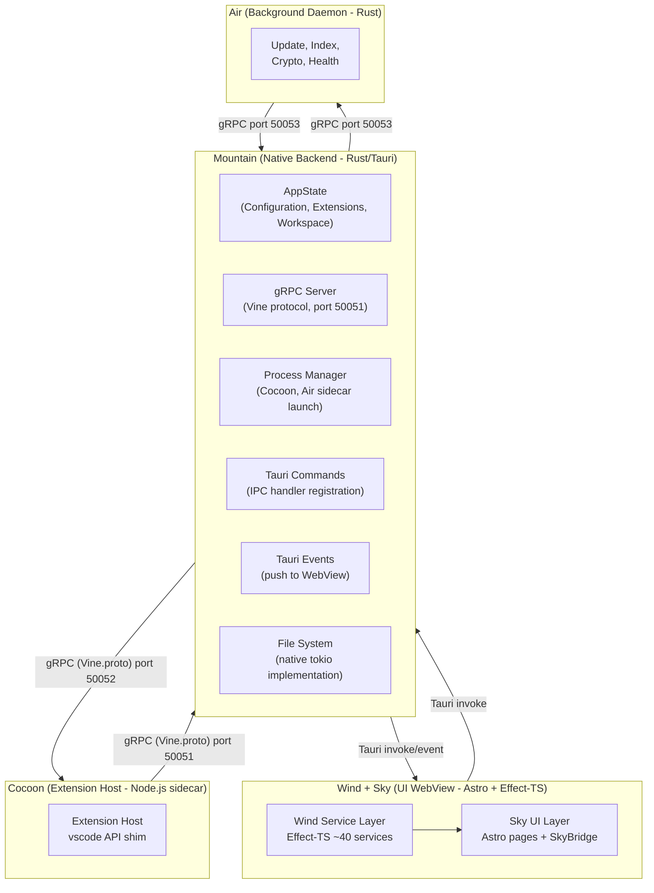
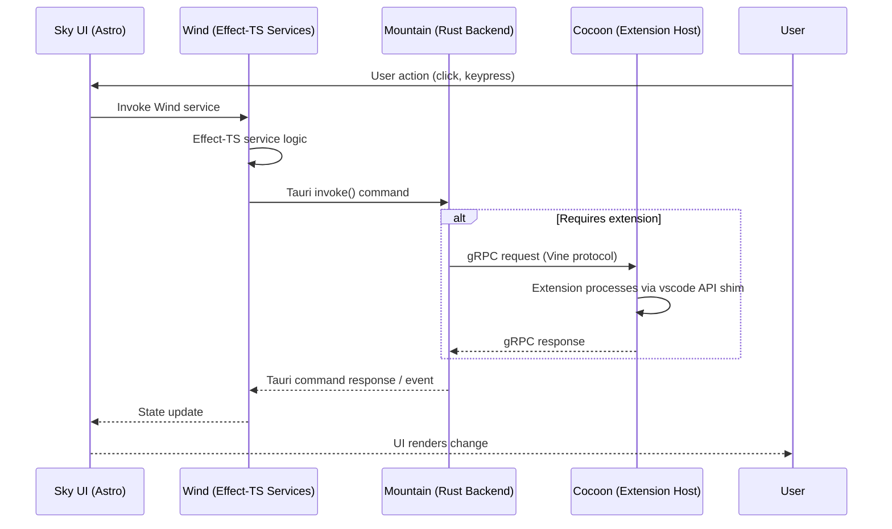
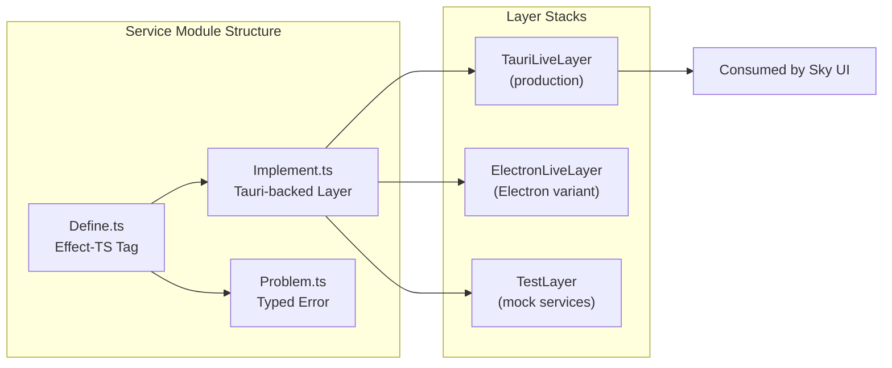
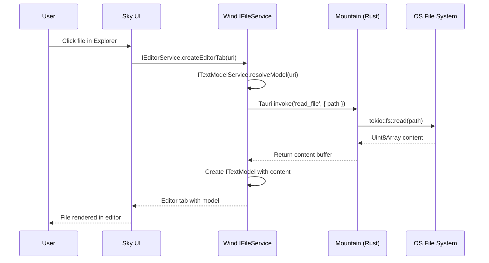
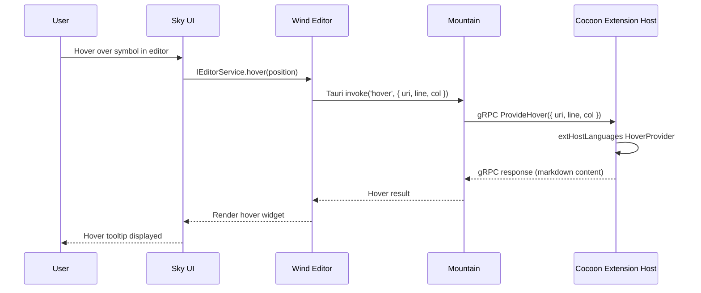
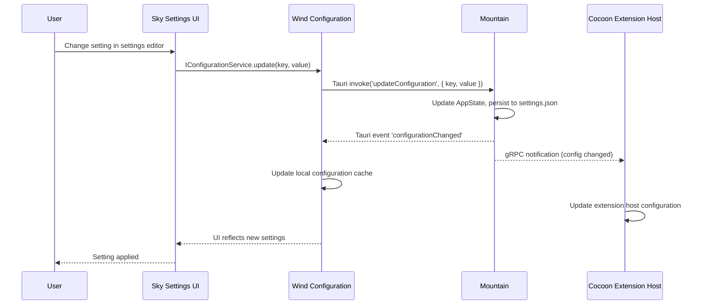

Land operates as a multi-process application. Mountain is the native Rust/Tauri
backend. Cocoon is the Node.js extension host sidecar. Sky and Wind form the UI
layer running inside the Tauri WebView. A fourth optional process, Air, runs as
a persistent background daemon for updates, indexing, and authentication.
Components communicate over three distinct channels: Tauri commands and events,
gRPC (Vine protocol), and SkyBridge custom events.

## Process Model

| Process        | Element        | Language                 | Purpose                                                                    |
| -------------- | -------------- | ------------------------ | -------------------------------------------------------------------------- |
| Native Backend | Mountain       | Rust (Tauri)             | Application lifecycle, OS operations, gRPC server, sidecar orchestration   |
| Extension Host | Cocoon         | TypeScript (Node.js)     | VS Code extension execution, `vscode` API shim                             |
| UI Renderer    | Wind + Sky     | TypeScript (WebView)     | Editor UI rendering, workbench services, Astro page composition            |
| Background     | Air (optional) | Rust                     | Updates, file indexing, cryptographic signing, health monitoring            |



## Component Map

### Rust Components (Native)

| Component  | Crate Type       | Role                                                                                                                                                       |
| ---------- | ---------------- | ---------------------------------------------------------------------------------------------------------------------------------------------------------- |
| Common     | Library          | Abstract trait definitions, ActionEffect system, DTOs, error types. Foundation layer with zero concrete implementations.                                   |
| Echo       | Library          | Bounded work-stealing task scheduler with priority-based scheduling (High/Normal/Low) using lock-free deques.                                               |
| Mountain   | Binary (Tauri)   | Primary native application. Implements every trait from Common. Hosts the gRPC server (Vine protocol), manages AppState, dispatches Tauri commands.        |
| Mist       | Library + Binary | Local DNS server for `*.editor.land` resolution. Resolves all subdomains to 127.0.0.1 for network isolation.                                               |
| Air        | Binary           | Background daemon. Handles update downloads, file indexing, cryptographic signing, health monitoring. Communicates via gRPC on port 50053.                  |
| Rest       | Binary + Library | High-performance TypeScript compiler built on OXC (Oxidation Compiler). 2-3x speed improvement over esbuild's TypeScript loader.                           |
| Grove      | Library + Binary | Native Rust/WASM extension host. Provides a sandboxed WASMtime environment for running WASM-compiled VS Code extensions.                                   |
| SideCar    | Library          | Vendored Node.js binary management. Packages exact binaries per target triple for all supported platforms.                                                  |
| Vine       | Protocol Library | gRPC protocol definitions (Vine.proto). Generated stubs consumed by Mountain, Cocoon, and Air.                                                             |

### TypeScript Components (Web / Node.js)

| Component | Framework             | Role                                                                                                                                                                                                       |
| --------- | --------------------- | ---------------------------------------------------------------------------------------------------------------------------------------------------------------------------------------------------------- |
| Cocoon    | Node.js + ESBuild     | Node.js extension host sidecar. Provides a `vscode` API shim. Bootstrap is lean async - `RPCServer` binds before `MountainConnection` to avoid exhausting Mountain's 30-second connection budget.         |
| Wind      | Effect-TS + Vite      | UI service layer recreating the VS Code workbench environment. ~40 effect services composed into layer stacks. Backed by an eager `ManagedRuntime` (module singleton) for sub-5ms service lookup.          |
| Sky       | Astro + Vite          | UI component layer. Renders the editor interface (editor, sidebar, activity bar, status bar, panels). SkyBridge (~2900 lines) bridges Tauri events to VS Code workbench calls.                             |
| Output    | ESBuild               | Build artifact management. Handles compilation of VS Code platform source. Produces the `@codeeditorland/output` package consumed by Cocoon, Sky, and Wind.                                                |
| Worker    | ESBuild               | Service worker. Provides asset caching, offline support, and dynamic CSS loading.                                                                                                                          |

## IPC Architecture

### Inter-Process Communication Matrix

| Source        | Sink          | Protocol              | Transport        | Port  |
| ------------- | ------------- | --------------------- | ---------------- | ----- |
| Mountain      | Cocoon        | gRPC (Vine.proto)     | TCP (localhost)  | 50052 |
| Cocoon        | Mountain      | gRPC (Vine.proto)     | TCP (localhost)  | 50051 |
| Mountain      | Air           | gRPC                  | TCP (localhost)  | 50053 |
| Wind/Sky      | Mountain      | Tauri Commands        | IPC (in-process) | N/A   |
| Mountain      | Wind/Sky      | Tauri Events          | IPC (in-process) | N/A   |
| Cocoon exts   | Mountain      | gRPC (via Cocoon)     | TCP (localhost)  | 50051 |

### Request Flow for UI Operations



### Protocol Layers

Land's IPC uses three distinct protocol layers:

1. **Tauri Commands (request-response):** Wind invokes Mountain handlers
   through `@tauri-apps/api` `invoke()`. All commands are dispatched through
   the single Tauri command `MountainIPCInvoke` with `{ method, params }`.
   Used for: file read/write, configuration get/set, dialog open, terminal
   operations.

2. **Tauri Events (push from Mountain):** Mountain emits events that Wind
   listens to via `@tauri-apps/api/event`. Used for: configuration change
   notifications, extension activation signals, terminal output streaming,
   file system watcher notifications.

3. **gRPC (bidirectional):** Mountain and Cocoon communicate via protocol
   buffers over gRPC. Service contracts are defined in `Vine.proto`.
   Used for: extension host initialization, command execution, language
   feature requests (hover, completion, definition), webview panel
   communication.

## TierIPC Routing

The `TierIPC` environment variable controls how Wind and Output route IPC calls
at runtime. No rebuild is required to switch tiers.

| Value          | Behavior                                                                                       |
| -------------- | ---------------------------------------------------------------------------------------------- |
| `Mountain`     | All IPC calls route to Mountain's Tauri backend. Default.                                      |
| `NodeDeferred` | Mountain first; falls back to Cocoon via `cocoon:request` bridge on miss or `undefined` return |
| `Node`         | All calls bypass Mountain and route directly to Cocoon via `cocoon:request`                    |

Per-subsystem tier variables (`TierTerminal`, `TierSCM`, `TierDebug`,
`TierLanguageFeatures`, `TierAuth`, `TierTasks`) override the global `TierIPC`
for individual channel prefixes. For example, `TierTasks=Node` and
`TierAuth=Node` are the defaults even when `TierIPC=Mountain`, because those
handlers live in Cocoon's extension host. The active tier for each subsystem is
logged at boot by `Mountain/Source/LandFixTier.rs`.

## Service Layer Design

### Common Trait Architecture (Rust)

The `Common` crate defines application capabilities as abstract async traits.
`Mountain` implements every trait with concrete Rust implementations. Cocoon and
Wind never implement these traits directly - they call Mountain's implementations
through IPC.

```
Common::Interface
    +-- FileSystem (read, write, watch, stat, mkdir, readdir)
    +-- Configuration (get, set, has, inspect, onDidChange)
    +-- Terminal (create, write, resize, onData)
    +-- Clipboard (read, write, readText, writeText)
    +-- Dialog (open, save, message)
    +-- Window (show, focus, maximize, minimize, close)
    +-- ExtensionManagement (scan, install, uninstall, list)
    +-- Process (spawn, kill, onExit)
    +-- Storage (get, set, delete, list, onDidChange)
    +-- SecretStorage (get, set, delete, onDidChange)
    +-- Search (search, findInFile, replace)
```

### Wind Effect-TS Service Architecture (UI)

Wind recreates the VS Code workbench service architecture using Effect-TS. Each
service follows a consistent module structure with a `Define.ts` (Effect-TS
tag), an `Implement.ts` (Tauri-backed Layer), and a `Problem.ts` (typed error
type).



Services compose into layer stacks:

| Layer              | Purpose                                                |
| ------------------ | ------------------------------------------------------ |
| TauriLiveLayer     | Used in Tauri WebView for development and production   |
| ElectronLiveLayer  | Used for the Electron workbench variant                |
| TestLayer          | Mock implementations for the extension test runner     |

The `TauriLiveLayer` is backed by an eager `ManagedRuntime` stored in a
`globalThis.__CEL_WIND_RUNTIME__` singleton, ensuring the first Effect dispatch
does not pay a startup penalty.

### Cocoon Bootstrap Stage Order

Cocoon's bootstrap is plain `async`/`await` with no Effect-TS runtime overhead.
Stages run in this fixed order:

| # | Stage               | What it does                                                                   |
| - | ------------------- | ------------------------------------------------------------------------------ |
| 1 | Environment         | Validates Node version, platform, architecture                                 |
| 2 | Configuration       | Resolves `MOUNTAIN_GRPC_PORT` (50051) and `COCOON_GRPC_PORT` (50052) from env  |
| 3 | RPCServer           | Binds Cocoon's own gRPC server on port 50052 **before** connecting to Mountain |
| 4 | ModuleInterceptor   | Installs the VS Code module shim                                                |
| 5 | MountainConnection  | Connects to Mountain gRPC at port 50051 with exponential-backoff retry         |
| 6 | Extensions          | Activates all enabled extensions (concurrency 8, topological order)             |
| 7 | HealthCheck         | Verifies all services are operational                                           |

The critical constraint: RPCServer (stage 3) must bind before MountainConnection
(stage 5). Mountain allows a 30-second gRPC connection budget; reversing the
order causes Mountain to time out before Cocoon has a listening socket, silently
preventing extension activation.

## Data Flow Patterns

### File Open



### Language Feature (Hover)



### Extension API Call (workspace.applyEdit)

```
Extension calls vscode.workspace.applyEdit(edit)
  --> Cocoon vscode shim serializes WorkspaceEdit
  --> Cocoon: gRPC ApplyEdit --> Mountain
  --> Mountain: emits sky:workspace:applyEdit Tauri event
  --> SkyBridge: calls IBulkEditService.apply(edit)
  --> Monaco model updated
  --> Wind ITextModelService fires onDidChangeTextDocument
```

### Configuration Change



## Component Dependency Direction

Dependencies flow strictly in one direction:

```
Common  (Rust traits, DTOs - no dependencies)
  |
  v
Mountain  (implements Common traits, owns Vine gRPC server)
  |
  +----gRPC---> Cocoon  (consumes Mountain via gRPC, no direct Rust dependency)
  |
  +----Tauri IPC---> Wind  (consumes Mountain via Tauri invoke/event)
                       |
                       v
                     Sky  (consumes Wind services, renders UI)
```

Output is a build-time dependency of Cocoon and Sky. It provides the compiled
VS Code platform package `@codeeditorland/output`.

## Ports Reference

| Port  | Process             | Protocol          | Purpose                              |
| ----- | ------------------- | ----------------- | ------------------------------------ |
| 50051 | Mountain (server)   | gRPC (Vine.proto) | Cocoon → Mountain calls              |
| 50052 | Cocoon (server)     | gRPC (Vine.proto) | Mountain → Cocoon push notifications |
| 50053 | Mountain / Air      | gRPC              | Background daemon IPC                |
| N/A   | Mountain / Wind+Sky | Tauri IPC         | UI ↔ backend commands and events     |

All gRPC listeners bind to `[::1]` (localhost only) - no remote connections are
accepted.

## Related Pages

- [Project Structure](/Doc/project-structure) - element map and source paths
- [Configuration](/Doc/configuration) - tier flags and environment variables
- [Mountain](/Doc/mountain) - native backend deep reference
- [Cocoon](/Doc/cocoon) - extension host deep reference
- [Quickstart](/Doc/quickstart) - build and run
