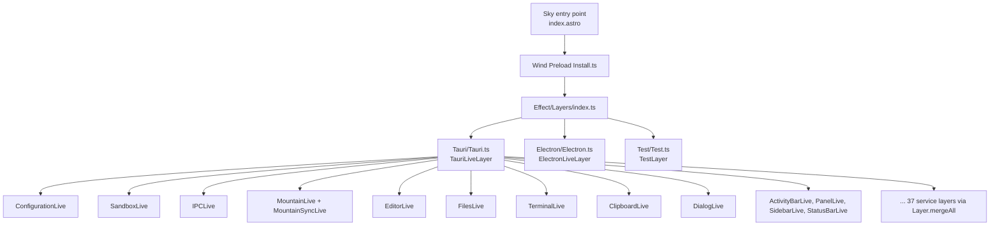
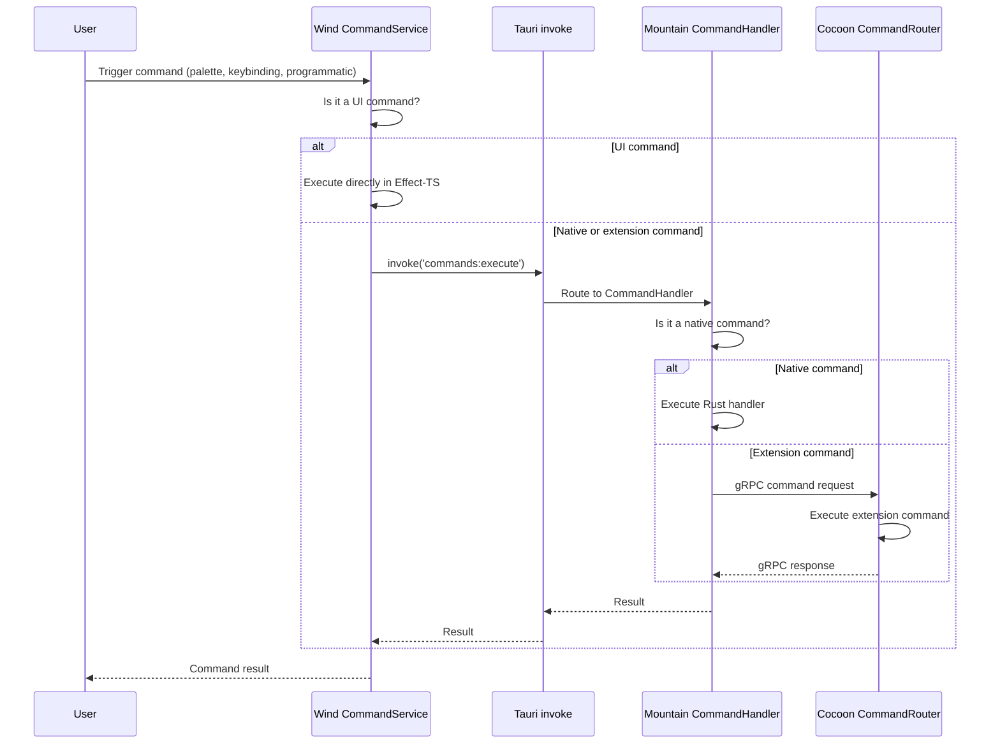

Cocoon is the `Node.js` extension host sidecar for `Land`. We run VS Code
extensions in a supervised `Node.js` process and provide a `vscode` API shim
via `Effect-TS`. That shim translates extension API calls into declarative
`Effect`s. `Effect`s are either handled in-process or dispatched to `Mountain`
via `gRPC` for native execution.

## Overview 📋

`Cocoon` is a `TypeScript` application built with `Effect-TS`.

- We replicate the VS Code Extension Host API.
- We communicate with `Mountain` via `gRPC` (`Vine` protocol) on port 50052.
- We are spawned and supervised by `Mountain`'s `ProcessManagement` module.

| Attribute    | Value                                                                                                               |
| ------------ | ------------------------------------------------------------------------------------------------------------------- |
| Language     | `TypeScript` (`Effect-TS` v3.21)                                                                                    |
| Runtime      | `Node.js` (managed by `SideCar`)                                                                                    |
| IPC          | `gRPC` (`Vine` protocol)                                                                                            |
| Dependencies | `effect`, `@effect/platform`, `@effect/platform-node`, `@grpc/grpc-js`, `@codeeditorland/output`, `google-protobuf` |
| Managed by   | `Mountain` `ProcessManagement/CocoonManagement.rs`                                                                  |

## Architecture 🏗️

### Module Map 🗺️

| Path                                            | Purpose                                        |
| ----------------------------------------------- | ---------------------------------------------- |
| `Source/Bootstrap/Implementation/CocoonMain.ts` | Entry point; initialization prelude            |
| `Source/PatchProcess/`                          | Process hardening, signal handling, log piping |
| `Source/Core/ExtensionHost.ts`                  | Extension activation and lifecycle             |
| `Source/Core/RequireInterceptor.ts`             | Require() patching for VS Code module loading  |
| `Source/Core/ApiFactory.ts`                     | Constructs vscode.\* API objects per extension |
| `Source/Services/Commands.ts`                   | Command registration and execution             |
| `Source/Services/Window.ts`                     | Window and editor management                   |
| `Source/Services/Workspace.ts`                  | Workspace and file system operations           |
| `Source/Services/Configuration.ts`              | Configuration read/write                       |
| `Source/Services/gRPC/Client.ts`                | gRPC client for Mountain communication         |
| `Source/ModuleInterceptor/`                     | ESM and CommonJS module interception           |
| `Source/TypeConverter/`                         | Type conversion between extensions and gRPC    |
| `Source/Telemetry/`                             | PostHog + OTLP telemetry                       |
| `Source/IPC/`                                   | Internal message channel system                |
| `Source/WebviewPanel/`                          | Webview panel lifecycle management             |
| `Source/Generated/`                             | Proto-generated TypeScript types               |

### Workbench Architecture Role 🏗️

In the broader `Land` workbench, Cocoon replaces the VS Code Electron main
process's extension host responsibilities. The architecture comparison across
the three layers:

| Aspect            | VS Code (Electron)           | Land Equivalent                       |
| ----------------- | ---------------------------- | ------------------------------------- |
| Main process      | Electron Main                | `Mountain` (`Rust`)                   |
| Renderer process  | Electron Renderer            | `Wind` (`Tauri` WebView)              |
| IPC mechanism     | Electron ipcRenderer/ipcMain | `Tauri` invoke/event + `gRPC` (Vine)  |
| Preload           | electron preload.js          | `Wind` `Preload.ts`                   |
| Extension host    | Child Node process           | `Cocoon` (Node sidecar via `gRPC`)    |
| File system       | Node.js fs module            | `Mountain` native `Rust` fs (Track B) |
| Native dialogs    | Electron dialog API          | `Mountain` via `Tauri` dialog plugin  |
| Window management | Electron BrowserWindow       | `Tauri` Window                        |

## Service Composition Patterns 🧩

Cocoon's internal services follow the same `Effect-TS` Layer composition
patterns used throughout `Wind` and `Mountain`.

### Layer Stack Architecture

Each service in Cocoon is composed through `Effect-TS` Layers. The broader
`Wind` layer stack defines three workbench variants that determine which
services are wired to Cocoon versus resolved locally:



### Layer Composition

Individual services use `Layer.succeed` to wrap a concrete implementation,
matching the pattern used in Cocoon's own internal providers:

```typescript
// Individual service pattern (shared across Wind and Cocoon):
export const LiveEditorServiceLayer = Layer.succeed(
	EditorTag,
	makeEditorService(),
);

// Tauri layer - Layer.mergeAll: flat composition
export const TauriLiveLayer = Layer.mergeAll(
	SandboxLive,
	ConfigurationWithSyncLive,
	EditorLive,
	FilesLive,
	TerminalLive,
	// ... all ~37 service layers
);
```

`Effect-TS`'s compile-time dependency tracking ensures that no service can be
used without its dependencies being satisfied by the Layer stack. A missing
dependency produces a `TypeScript` type error.

### ManagedRuntime

Cocoon and `Wind` both rely on `Effect-TS`'s `ManagedRuntime` to bridge the
Effect system with imperative call sites (such as VS Code extension API entry
points):

```typescript
// From Wind/Source/Effect/LandWorkbench/LandWorkbenchRuntime.ts

// Initialized eagerly via IIFE at module load time, stored on
// globalThis.__CEL_WIND_RUNTIME__ so multiple Sky chunks that import
// this module share a single runtime instance.
export const LandWorkbenchRuntime: ManagedRuntime<...> = ...;

// Service lookups are sub-5ms after initialization.
// LandWorkbenchRuntime.Dispose() tears down the runtime and clears
// the global slot (used on window unload).
```

Cocoon mirrors this pattern to ensure that extension API calls (e.g.,
`vscode.commands.registerCommand`) resolve through the Effect system
without runtime overhead.

## Workbench Variants 🚀

Cocoon participates in several workbench variants that select the extension
host and IPC backend at build time:

| Variant             | Cocoon Role                                    | Build Profile (shorthand) |
| ------------------- | ---------------------------------------------- | ------------------------- |
| **Browser**         | No Cocoon (70-80% API coverage via stock Node) | `debug`                   |
| **Mountain**        | Full Cocoon via gRPC (80-90%)                  | `debug-mountain`          |
| **Electron**        | Full Cocoon, Electron IPC backend (95%+)       | `debug-electron`          |
| **Cocoon Headless** | Cocoon subprocess only, no Wind/Workbench UI   | `debug-cocoon-headless`   |
| **Mountain Only**   | No Cocoon (core services, no extension host)   | `debug-mountain-only`     |
| **Kernel**          | No Cocoon, no Wind, no built-ins               | `debug-kernel`            |

### Variant Selection

`Sky`'s `index.astro` entry point selects the active variant at build time via
environment variables:

```typescript
const Bundle = process.env["Bundle"] === "true";
const Mountain = process.env["Mountain"] === "true";
const Electron = process.env["Electron"] === "true";
const BrowserProxy = process.env["BrowserProxy"] === "true";

const WorkbenchType =
	Electron || Mountain
		? "Electron"
		: BrowserProxy
			? "BrowserProxy"
			: "Browser";
```

When `Mountain` or `Electron` is selected, Cocoon is spawned as the extension
host process. In `Browser` mode, Cocoon is omitted and the workbench runs with
a simulated extension host. Unused variants are tree-shaken by `Vite`.

## Command Dispatch Architecture 🎮

Cocoon is the extension command execution layer in Land's three-layer command
system:

```
Command Registration:
    Wind (UI commands)      -- editor actions, palette commands
    Mountain (native)       -- Tauri command handlers, file ops, window mgmt
    Cocoon (extensions)     -- vscode.commands.registerCommand from extensions
```

### Command Execution Flow

Commands flow through all three layers depending on origin:



### Command Categories

| Category        | Registered In | Examples                                                                     |
| --------------- | ------------- | ---------------------------------------------------------------------------- |
| Native editor   | `Wind`        | `cursorMove`, `type`, `replacePreviousChar`                                  |
| Window/UI       | `Mountain`    | `workbench.action.toggleSidebar`, `workbench.action.terminal.toggleTerminal` |
| File operations | `Mountain`    | `workbench.action.files.save`, `workbench.action.files.openFile`             |
| Extension       | `Cocoon`      | `editor.action.formatDocument`, `git.commit`                                 |

## TierIPC Routing 🌐

Cocoon is reachable from the `Wind` layer through `TierIPC`, a routing system
that decides which IPC backend handles each channel. The `TierIPC` env var
(loaded from `.env.Land` via `turbo.json` `globalEnv`) selects the routing
mode at runtime, with per-subsystem overrides.

### Routing Modes

| Value          | Behaviour                                                                                        |
| -------------- | ------------------------------------------------------------------------------------------------ |
| `Mountain`     | Default. All `channel.call()` invocations route to Mountain via Tauri `MountainIPCInvoke`.       |
| `NodeDeferred` | Mountain first; if Mountain returns `undefined` or has no handler, falls through to Cocoon gRPC. |
| `Node`         | All calls bypass Mountain and go directly to Cocoon via the `cocoon:request` gRPC bridge.        |

### Per-Subsystem Tier Variables

Cocoon handles extension-facing channels that default to Mountain but can be
routed directly:

| Variable               | Default    | Channels governed                                   | Cocoon Interaction                       |
| ---------------------- | ---------- | --------------------------------------------------- | ---------------------------------------- |
| `TierTerminal`         | `Mountain` | `terminal`, `localPty`                              | Cocoon's terminal forwarder (if enabled) |
| `TierSCM`              | `Mountain` | `git` (localGit)                                    | Extension Git integration calls          |
| `TierDebug`            | `Mountain` | `extensionHostStarter`, `extensionhostdebugservice` | Debugger extension API calls             |
| `TierLanguageFeatures` | `Mountain` | `language`, `languages`                             | Language feature providers               |
| `TierSearch`           | `Mountain` | `search`                                            | Search provider via extension            |
| `TierTasks`            | `Node`     | `tasks`                                             | Task execution (typically Cocoon-routed) |
| `TierAuth`             | `Node`     | `auth`                                              | Authentication providers                 |
| `TierStorage`          | `Mountain` | `storage`                                           | Extension storage APIs                   |
| `TierModel`            | `Mountain` | `model`, `textFile`, `file`                         | Document model operations                |
| `TierEncryption`       | `Mountain` | `encryption`                                        | Encryption provider calls                |
| `TierWebSocket`        | `Disabled` | Mist WebSocket transport (Phase 6, not yet active)  | Future WebSocket extension transport     |

## Editor Service Architecture ✏️

The editor service in `Wind` integrates the VS Code CodeEditor widget (based on
Monaco) with `Mountain`'s native capabilities and Cocoon's extension providers.

### Text Model Flow

```
User opens file
    |
    v
Wind EditorService
    |
    +---> TextModelService resolves URI
    +---> IFileService.readFile() via Tauri -> Mountain
    +---> Content returned as Uint8Array
    +---> TextModel created with content
    +---> Language mode detected from file extension
    +---> Editor widget instantiated with TextModel
    |
    v
Editor renders in Sky UI
```

### Extension Provider Integration

Language features (hover, completion, definition) requested through Cocoon's
extension host flow back to the Wind editor service:

```
Extension registers HoverProvider (vscode.languages.registerHoverProvider)
    |
    v
Cocoon LanguagesProvider stores provider reference
    |
    v
User hovers over symbol in editor
    |
    v
Wind EditorService detects hover intent
    |
    v
Wind -> Tauri -> Mountain -> Cocoon (via gRPC: languages:provideHover)
    |
    v
Cocoon resolves HoverProvider.ProvideHover() in extension context
    |
    v
Result flows back: Cocoon -> Mountain -> Tauri -> Wind -> Monaco editor
    |
    v
Hover tooltip rendered in Sky UI
```

## VS Code API Coverage Strategy 🔬

Cocoon is the primary vehicle for VS Code API coverage in Land. The strategy
uses a dual-track routing system.

### Track A: Stock Node (Maximum Compatibility)

Cocoon loads unmodified VS Code `extHost*.ts` source files from
`@codeeditorland/output`. The `ExtHostContext`/`MainContext` RPC glue that
normally runs in Electron's main process is shimmed by Cocoon to work over
`gRPC`.

Coverage: All APIs that the stock implementation handles in-process are
immediately compatible.

### Track B: Rust Native (Performance)

For I/O-heavy APIs, the Cocoon `vscode` shim routes operations through `gRPC`
to `Mountain` for native `Rust` execution. This provides:

- Faster filesystem operations (native syscalls vs Node.js fs)
- Direct OS integration (clipboard, dialogs, keychain)
- Native terminal PTY (`portable-pty` crate vs `node-pty`)
- Zero-copy buffer handling

### Dual-Track Routing

| Track               | Implementation                   | Latency    | When Used                                  |
| ------------------- | -------------------------------- | ---------- | ------------------------------------------ |
| **A - Stock Node**  | Unmodified VS Code `extHost*.ts` | In-process | Default for all APIs                       |
| **B - Rust Native** | gRPC `ActionEffect` to Mountain  | ~1ms       | I/O-heavy APIs (fs, terminal, search, git) |

### Track Distribution by API

| API                             | Default Track | Rationale                       |
| ------------------------------- | ------------- | ------------------------------- |
| `commands.registerCommand`      | A             | In-process bookkeeping          |
| `commands.executeCommand`       | A             | In-process dispatch             |
| `window.showInformationMessage` | A             | In-process dialog               |
| `workspace.openTextDocument`    | A             | Content in memory               |
| `workspace.fs.readFile`         | B             | Native file I/O (faster)        |
| `workspace.findFiles`           | B             | Native search (ripgrep)         |
| `window.createWebviewPanel`     | B             | Mountain owns webview lifecycle |
| `env.clipboard`                 | B             | Native clipboard access         |

### Coverage Matrix

The authoritative coverage matrix is at
`Documentation/GitHub/VSCode-API-Coverage-Matrix.md`. Status symbols:

| Status        | Meaning                                               |
| ------------- | ----------------------------------------------------- |
| Working       | Activation + feature render path confirmed end-to-end |
| Partial       | RPC wired but UI render gap, or missing sub-method    |
| Stubbed       | Registration accepted but no effect                   |
| Not attempted | No implementation started                             |
| Lifted        | Pure-function stateless implementation already landed |

## Startup Sequence 🚀

```
1. Node.js process starts (bootstrap-fork.js)
2. PatchProcess/index.ts pipes logs, handles SIGTERM/SIGINT,
   monitors parent process
3. IpcProvider starts gRPC client, connects to Mountain on
   port 50052, sends $initialHandshake, waits for init request
4. globalThis.__LandTiers populated from esbuild identifiers,
   environment variables, or hard-coded defaults
5. RequireInterceptor patches require() for VS Code bundle
   loading, maps electron-less requires to Tauri equivalents
6. Mountain sends Initialize gRPC request with InitData
   (workspace, manifests, configuration snapshot)
7. InitDataLayer created from payload
8. FullAppInitialization Effect resolves ExtensionHostProvider
   and activates startup extensions
```

## VS Code API Shim 📦

We construct VS Code API objects for each extension via `ApiFactory.ts`.

### API Namespace Providers 📋

| Namespace             | Provider            | Track                       |
| --------------------- | ------------------- | --------------------------- |
| `vscode.commands`     | CommandsProvider    | A + S (Stock + Sky-direct)  |
| `vscode.window`       | WindowProvider      | A (Stock Node)              |
| `vscode.workspace`    | WorkspaceProvider   | A + B (Stock + Rust-native) |
| `vscode.languages`    | LanguagesProvider   | A (Stock Node)              |
| `vscode.env`          | EnvironmentProvider | A (Stock Node)              |
| `vscode.extensions`   | ExtensionsProvider  | A (Stock Node)              |
| `vscode.workspace.fs` | FileSystemProvider  | B (Rust-native via gRPC)    |
| `vscode.tasks`        | TasksProvider       | A (Stock Node)              |
| `vscode.debug`        | DebugProvider       | A + B                       |
| `vscode.tests`        | TestsProvider       | A (Stock Node)              |
| `vscode.Notebook*`    | NotebookProvider    | A (Stock Node)              |
| `vscode.WebviewPanel` | WebviewProvider     | B (Mountain-backed)         |

## Service Providers 🔌

Each service is an `Effect-TS` `Layer`:

| Service               | Module                      | Key Methods                                                                             |
| --------------------- | --------------------------- | --------------------------------------------------------------------------------------- |
| CommandsProvider      | `Services/Commands.ts`      | `registerCommand`, `executeCommand`, `getCommands`                                      |
| WindowProvider        | `Services/Window.ts`        | `createWebviewPanel`, `showTextDocument`, `activeTextEditor`, `showInformationMessage`  |
| WorkspaceProvider     | `Services/Workspace.ts`     | `workspaceFolders`, `openTextDocument`, `findFiles`, `applyEdit`, `getConfiguration`    |
| LanguagesProvider     | `Services/Language/`        | `registerHoverProvider`, `registerCompletionProvider`, `registerDefinitionProvider`     |
| ConfigurationProvider | `Services/Configuration.ts` | `get`, `has`, `inspect`, `update`, `onDidChange`                                        |
| WebviewProvider       | `Services/WebviewPanel/`    | `createWebviewPanel`, `postMessage`, `onDidReceiveMessage`                              |
| FileSystemProvider    | `Services/File/`            | `readFile`, `writeFile`, `stat`, `readDirectory`, `createDirectory`, `delete`, `rename` |

## gRPC Communication 🌐

We communicate with `Mountain` via the `Vine` `gRPC` protocol.

| Feature      | Implementation                                |
| ------------ | --------------------------------------------- |
| Connection   | Unary gRPC calls + bidirectional streaming    |
| Heartbeat    | 5-second interval via `Heartbeat` RPC         |
| Reconnection | Automatic on disconnect (exponential backoff) |
| Timeout      | 30-second request timeout                     |
| Backpressure | gRPC flow control                             |

## RequireInterceptor 🪝

The `RequireInterceptor` patches `Node.js`'s `require()` to enable VS Code
module loading.

### Interception Rules 📋

| Module Pattern            | Replacement                        | Behavior                                |
| ------------------------- | ---------------------------------- | --------------------------------------- |
| `electron`                | (empty stub)                       | No-op module with expected method stubs |
| `original-fs`             | `fs`                               | Redirect to Node.js standard library    |
| `keytar`                  | Custom stub                        | OS keychain via Mountain gRPC           |
| `spdlog`                  | Custom stub                        | No-op logging                           |
| `vscode-windows-registry` | Custom stub                        | No-op (macOS-only)                      |
| `./extHost*.js`           | Load from `@codeeditorland/output` | VS Code stock source                    |
| `./mainThread*.js`        | Load from `@codeeditorland/output` | VS Code stock source                    |
| `vscode`                  | `ApiFactory` construct             | Extension-specific API surface          |

## Extension Lifecycle 🔄

```
1. Mountain scans extension directories, sends manifests in InitData
2. RequireInterceptor loads extension's main module, calls activate()
3. Extension registers commands, providers via vscode.* API calls
4. API calls dispatch through providers -- in-process (Track A)
   or via gRPC to Mountain (Track B)
5. Mountain sends DeactivateExtension request, subscriptions
   disposed, module unloaded
```

## Dual-Track Routing 🛤️

| Track               | Implementation                   | Latency    | When Used                                  |
| ------------------- | -------------------------------- | ---------- | ------------------------------------------ |
| **A - Stock Node**  | Unmodified VS Code `extHost*.ts` | In-process | Default for all APIs                       |
| **B - Rust Native** | gRPC `ActionEffect` to Mountain  | ~1ms       | I/O-heavy APIs (fs, terminal, search, git) |

### Track Distribution by API 📊

| API                             | Default Track | Rationale                       |
| ------------------------------- | ------------- | ------------------------------- |
| `commands.registerCommand`      | A             | In-process bookkeeping          |
| `commands.executeCommand`       | A             | In-process dispatch             |
| `window.showInformationMessage` | A             | In-process dialog               |
| `workspace.openTextDocument`    | A             | Content in memory               |
| `workspace.fs.readFile`         | B             | Native file I/O (faster)        |
| `workspace.findFiles`           | B             | Native search (ripgrep)         |
| `window.createWebviewPanel`     | B             | Mountain owns webview lifecycle |
| `env.clipboard`                 | B             | Native clipboard access         |

## Related Documentation 📖

- [Mountain](/Doc/mountain) - `gRPC` server and `ProcessManagement`
- [Wind](/Doc/wind) - Frontend service layer (parallel API surface)
- [Sky](/Doc/sky) - Web frontend and workbench variants
- [Output](/Doc/output) - Compiled platform code consumer
- [Vine](/Doc/vine) - `gRPC` protocol definitions
- [Polyfills](/Doc/polyfills) - Initialization prelude
- [EditorCore](/Doc/cocoon) - VS Code API coverage strategy
- [VSCode-API-Coverage-Matrix](/Doc/vscode-api-coverage-matrix) - Comprehensive
  API status

## Funding 💎

**Project Maintainers:** Source Open
([Source/Open@Editor.Land](mailto:Source/Open@Editor.Land)) |
[GitHub Repository](https://github.com/CodeEditorLand/Cocoon) |
[Report an Issue](https://github.com/CodeEditorLand/Cocoon/issues)


---

## See Also

- [🟠 Low-Level Shim](/doc/low-level-shim) - Engine-level prototype hooks
- [🔵 Coverage / Telemetry](/doc/coverage) - Application-level service routing
