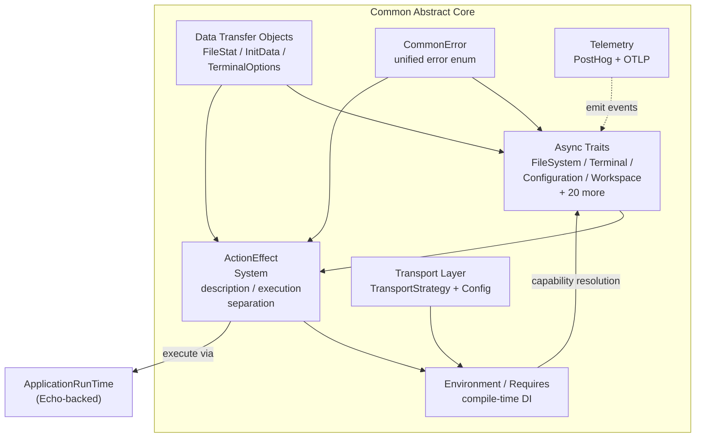

# Common: Abstract Core Library 🧑🏻‍🏭

`Common` is the architectural foundation of `Land`'s native `Rust` backend. `Common` is a pure abstract library that defines:

- Every application capability as async traits
- The `ActionEffect` declarative system
- Data Transfer Objects (`DTO`s)
- A universal error type

It contains no concrete implementations.

---

## Table of Contents

1. [Overview](#overview)
2. [Architecture Principles](#architecture-principles)
3. [Trait Architecture](#trait-architecture)
4. [ActionEffect System](#actioneffect-system)
5. [Environment and Dependency Injection](#environment-and-dependency-injection)
6. [Data Transfer Objects](#data-transfer-objects)
7. [CommonError](#commonerror)
8. [Transport Layer](#transport-layer)
9. [Telemetry Module](#telemetry-module)
10. [Service Domain Map](#service-domain-map)
11. [Related Documentation](#related-documentation)

---



## Overview 📋

`Common` defines the architectural language of the entire native platform:

- Every service interface, data contract, and communication pattern originates here
- `Mountain`, `Air`, `Echo`, `Mist`, `Rest`, `SideCar`, and `Grove` all depend on `Common`'s definitions

| Attribute    | Value                                                                           |
| ------------ | ------------------------------------------------------------------------------- |
| Language     | `Rust` (edition 2024)                                                           |
| Crate type   | Library (no binary)                                                             |
| Dependencies | `tauri`, `async-trait`, `serde`, `thiserror`, `url`, `prometheus`, `posthog-rs` |
| Consumers    | `Mountain`, `Air`, `Echo`, `Mist`, `Rest`, `SideCar`, `Grove`                   |

---

## Architecture Principles 📐

| Principle                    | Description                                                                               | Key Components                             |
| ---------------------------- | ----------------------------------------------------------------------------------------- | ------------------------------------------ |
| **Pure Abstraction**         | Every application capability is an abstract `async trait` with no concrete implementation | All `*Provider.rs` and `*Manager.rs` files |
| **Declarative Effects**      | Operations are `ActionEffect` values separating description from execution                | `Effect/` module                           |
| **Trait-Based DI**           | Compile-time dependency injection via `Environment` and `Requires` traits                 | `Environment/` module                      |
| **Universal Error Handling** | Single `CommonError` enum covering all failure scenarios                                  | `Error/CommonError.rs`                     |
| **Contract-First Design**    | DTOs and errors defined before implementations                                            | `DTO/`, `Error/` modules                   |
| **Minimal Dependencies**     | Independent from `Tauri`, `gRPC`, or any specific application logic                       | `Cargo.toml`                               |

---

## Trait Architecture 📋

Every application capability is defined as an async trait:

```rust
#[async_trait]
pub trait FileSystem: Send + Sync {
    async fn read_file(&self, path: &Path) -> Result<Vec<u8>, CommonError>;
    async fn write_file(&self, path: &Path, content: &[u8]) -> Result<(), CommonError>;
    async fn stat(&self, path: &Path) -> Result<FileStat, CommonError>;
    async fn read_dir(&self, path: &Path) -> Result<Vec<DirEntry>, CommonError>;
    async fn create_dir(&self, path: &Path) -> Result<(), CommonError>;
    async fn remove_file(&self, path: &Path) -> Result<(), CommonError>;
    async fn rename(&self, from: &Path, to: &Path) -> Result<(), CommonError>;
    async fn copy(&self, from: &Path, to: &Path) -> Result<(), CommonError>;
    async fn watch(&self, path: &Path) -> Result<FileWatcher, CommonError>;
}
```

### Defined Service Traits 📋

| Module                     | Trait                                   | Domain          | Methods                                                           |
| -------------------------- | --------------------------------------- | --------------- | ----------------------------------------------------------------- |
| `FileSystem/`              | `FileSystemReader` + `FileSystemWriter` | File operations | read, write, stat, readdir, mkdir, remove, rename, copy, watch    |
| `Configuration/`           | `ConfigurationProvider`                 | Settings        | get, set, has, inspect, onDidChange, keys                         |
| `Terminal/`                | `TerminalProvider`                      | PTY             | create, write, resize, onData, onExit, list                       |
| `UserInterface/`           | `UserInterfaceProvider`                 | Dialogs         | open, save, message, input, quickPick                             |
| `Document/`                | `DocumentProvider`                      | Text documents  | open, save, saveAs, applyChanges                                  |
| `ExtensionManagement/`     | `ExtensionManagementService`            | Extensions      | scan, install, uninstall, list, getManifest                       |
| `Search/`                  | `SearchProvider`                        | Search          | search, findInFile, replace                                       |
| `Secret/`                  | `SecretProvider`                        | Keychain        | get, set, delete, onDidChange                                     |
| `Storage/`                 | `StorageProvider`                       | KV storage      | get, set, delete, list, clear                                     |
| `Workspace/`               | `WorkspaceProvider`                     | Workspace       | getWorkspaceFolder, findFiles, applyEdit                          |
| `LanguageFeature/`         | `LanguageFeatureProviderRegistry`       | Language        | hover, completion, definition, references, codeAction, formatting |
| `Command/`                 | `CommandExecutor`                       | Commands        | execute, register, unregister, getAll                             |
| `Debug/`                   | `DebugService`                          | Debugging       | start, stop, step, breakpoints                                    |
| `Testing/`                 | `TestController`                        | Testing         | run, discover, results                                            |
| `SourceControlManagement/` | `SourceControlManagementProvider`       | SCM             | status, commit, push, pull, diff                                  |
| `Synchronization/`         | `SynchronizationProvider`               | Sync            | push, pull, merge, resolve                                        |
| `IPC/`                     | `IPCProvider`                           | Communication   | send, receive, proxy                                              |
| `Webview/`                 | `WebviewProvider`                       | Webviews        | create, sendMessage, dispose                                      |
| `TreeView/`                | `TreeViewProvider`                      | Tree views      | getChildren, getParent, resolveItem                               |
| `StatusBar/`               | `StatusBarProvider`                     | Status bar      | setItem, updateItem, removeItem                                   |
| `Diagnostic/`              | `DiagnosticManager`                     | Diagnostics     | set, clear, getAll                                                |
| `Keybinding/`              | `KeybindingProvider`                    | Keybindings     | resolve, onDidChange                                              |

---

## ActionEffect System ⚡

The `ActionEffect` system treats operations as data structures rather than direct function calls. This declarative approach enables:

- **Composition** -- Combine effects sequentially or in parallel
- **Testing** -- Effects are data, easy to mock and assert
- **Controlled execution** -- Effects are executed by a runtime

### Type Signature 📝

```rust
pub struct ActionEffect<TCapability, TError, TOutput> {
    pub Function: Arc<
        dyn Fn(TCapability)
            -> Pin<Box<dyn Future<Output = Result<TOutput, TError>> + Send>>
            + Send
            + Sync,
    >,
}
```

- **TCapability**: The environment/capability type required for execution
- **TError**: The error type that may result
- **TOutput**: The successful result type

### Effect Composition 🔄

```rust
// Sequential composition
let sequential = effect1.and_then(|result1| effect2(result1));

// Parallel composition
let parallel = effect1.zip(effect2);

// Error recovery
let resilient = effect.fallback(backup_effect);

// Mapping
let mapped = effect.map(|result| transform(result));
```

### Execution ▶️

```rust
// Effects are executed by ApplicationRunTime
let runtime = ApplicationRunTime::new(environment);
let result: Result<Vec<u8>, CommonError> = runtime
    .execute_effect(ActionEffect::ReadFile { path: "/tmp/test.txt" })
    .await;
```

---

## Environment and Dependency Injection 🧩

`Common` implements compile-time dependency injection through the `Environment` and `Requires` traits:

```rust
// A component declares what capabilities it requires
pub trait Requires<C> {
    type Error;
    async fn run(self, env: &C) -> Result<Self::Output, Self::Error>;
}

// An environment provides concrete implementations
pub trait Environment {
    type FileSystem: FileSystem;
    type Configuration: ConfigurationProvider;
    type Terminal: TerminalProvider;
    // ... one associated type per capability
}
```

### Capability Resolution Flow 🗺️

```
ActionEffect<C, E, T>
    |
    v
ApplicationRunTime
    |
    v
Environment Provider
    |  - Resolves concrete capability C
    |  - Environment::FileSystem -> MountainFileSystem
    |  - Environment::Terminal -> MountainTerminal
    |
    v
Concrete Capability (e.g., Mountain's FileSystem impl)
    |
    v
Effect executed with concrete implementation
```

---

## Data Transfer Objects 📦

`Common` defines all `DTO`s shared across components:

| DTO                   | Module                | Fields                                   | Used By                  |
| --------------------- | --------------------- | ---------------------------------------- | ------------------------ |
| `FileStat`            | `FileSystem/DTO`      | path, type, size, mtime, permissions     | All file ops             |
| `InitData`            | `Workspace`           | workspace info, extensions, config       | Mountain->Cocoon startup |
| `TerminalOptions`     | `Terminal`            | name, shellPath, cwd, env, cols, rows    | Terminal creation        |
| `ExtensionManifest`   | `ExtensionManagement` | id, version, publisher, activationEvents | Extension mgmt           |
| `ConfigurationTarget` | `Configuration`       | Global, Workspace, WorkspaceFolder       | Config ops               |
| `SearchOptions`       | `Search`              | pattern, include, exclude, maxResults    | Search ops               |
| `WorkspaceEditDTO`    | `DTO/`                | edits, fileCreates, fileDeletes          | Workspace edits          |
| `TransportConfig`     | `Transport`           | timeout, retry config                    | Transport configuration  |

---

## CommonError ⚠️

A single error type covering all failure modes across every service domain:

```rust
pub enum CommonError {
    NotFound(String),
    PermissionDenied(String),
    IoError(std::io::Error),
    ParseError(String),
    ProtocolError(String),
    Timeout(String),
    Unsupported(String),
    Internal(String),
    Cancelled,
}
```

---

## Transport Layer 🔗

`Common` provides a transport-agnostic communication interface:

```rust
pub trait TransportStrategy: Send + Sync {
    type Error: std::error::Error + Send + Sync + 'static;
    async fn connect(&self) -> Result<(), Self::Error>;
    async fn send(&self, request: &[u8]) -> Result<Vec<u8>, Self::Error>;
    async fn close(&self) -> Result<(), Self::Error>;
    fn is_connected(&self) -> bool;
    fn transport_type(&self) -> TransportType;
}
```

`Common` defines the trait surface and `TransportConfig`; concrete transports (`gRPCTransport`, `IPCTransport`, `WASMTransport`, `MistTransport`) live in `Grove`.

---

## Telemetry Module 📡

`Common`'s telemetry module provides a dual-pipe emit surface:

| Pipe    | Crate           | Configuration                                  |
| ------- | --------------- | ---------------------------------------------- |
| PostHog | `posthog-rs`    | `TELEMETRY_POSTHOG_KEY`, `TELEMETRY_DISABLE`   |
| OTLP    | `opentelemetry` | `TELEMETRY_OTLP_ENDPOINT`, `TELEMETRY_DISABLE` |

- Honors the `Disable=true` build-time flag to completely remove telemetry from the binary

---

## Service Domain Map 🗺️

```
Common/
+-- Command/            - Command execution and registration
+-- Configuration/      - Settings and configuration management
+-- CustomEditor/       - Custom (webview-based) editor support
+-- Debug/              - Debugging session management
+-- Diagnostic/         - Diagnostics and problem markers
+-- Document/           - Text document management
+-- DTO/                - Shared data transfer objects
+-- Effect/             - ActionEffect system
+-- Environment/        - DI traits (Environment, Requires)
+-- Error/              - CommonError enum
+-- ExtensionManagement/ - Extension lifecycle
+-- FileSystem/         - File and directory operations
+-- IPC/                - Inter-process communication
+-- Keybinding/         - Keyboard shortcut resolution
+-- LanguageFeature/    - Language intelligence (hover, completion, etc.)
+-- Output/             - Output channel management
+-- Search/             - File and text search
+-- Secret/             - OS keychain-backed secrets
+-- SourceControlManagement/ - Git and SCM integration
+-- StatusBar/          - Status bar item management
+-- Storage/            - Key-value storage
+-- Synchronization/    - User data synchronization
+-- Telemetry/          - PostHog + OTLP telemetry
+-- Terminal/           - PTY terminal management
+-- Testing/            - Test controller
+-- Transport/          - Agnostic communication layer
+-- TreeView/           - Tree data provider
+-- UserInterface/      - Dialogs, messages, quick pick
+-- Webview/            - Webview panel management
+-- Workspace/          - Workspace and folder management
```

---

## Related Documentation 📖

- [Mountain](/Doc/mountain) -- Trait implementations
- [Echo](/Doc/echo) -- Task scheduler integration
- [Air](/Doc/air) -- Background daemon (`Common` consumer)
- [RustInfrastructure](/Doc/architecture) -- `Rust` backend components

## Funding 💎

Common is developed as part of the CodeEditorLand project, funded through the NGI0 Commons Fund, a grant programme of the European Commission's Next Generation Internet initiative.

---

**Project Maintainers:** Source Open ([Source/Open@Editor.Land](mailto:Source/Open@Editor.Land)) | [GitHub Repository](https://github.com/CodeEditorLand/Common) | [Report an Issue](https://github.com/CodeEditorLand/Common/issues)
