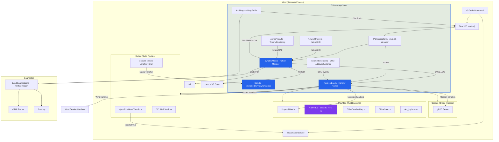
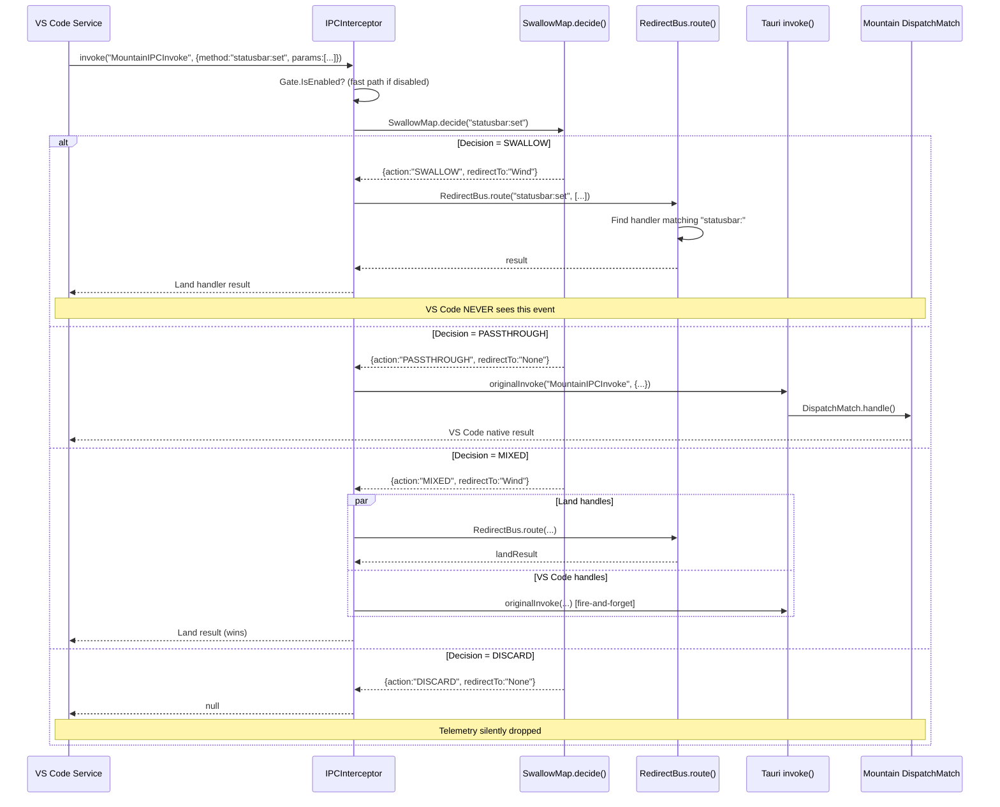
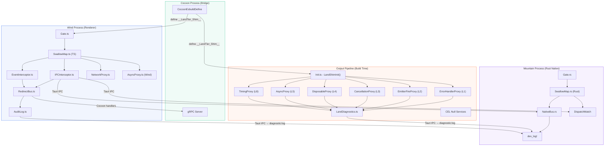
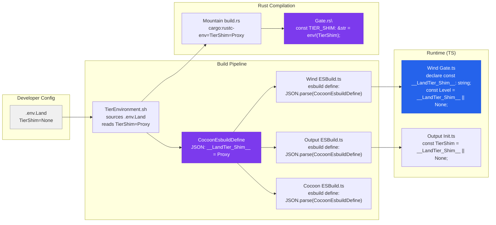

# 🔵 Coverage / Telemetry - Application-Level Shim

> **🔵 COVERAGE SHIM** - Application-level service routing and telemetry
> **Tier gate**: `TierShim=Proxy` | `TierShim=Replace`
> **Color**: `#2563EB` (Blue)
> **Overhead**: <1% (passthrough mode)

The Coverage Shim intercepts VS Code at the **application service level** - routing
IPC commands through Land's SwallowMap, proxying the ServiceCollection DI container,
and tracking coverage across all 474 decorated services. Unlike the 🟠 Low-Level Shim
(which operates at the JS engine level), the 🔵 Coverage Shim works at the architectural
boundary between Wind (renderer), Cocoon (bridge), and Mountain (native backend).

---

## 🔵 Full Architecture Diagram



**Three interlocking planes**:

1. **Decision Plane** (SwallowMap + Gate) - Pattern-matching engine that decides: swallow, passthrough, mixed, or discard
2. **Routing Plane** (RedirectBus + IPCInterceptor) - Dispatches swallowed events to Land's service tree
3. **Audit Plane** (AuditLog + LandDiagnostics) - Records every service resolution for coverage analysis

---

## 🔵 IPC Interception Flow



---

## 🔵 Full Domain Coverage Table

| #   | Domain                   | Status         | Tier                               | TierShim | Redirect | Notes                                   |
| --- | ------------------------ | -------------- | ---------------------------------- | -------- | -------- | --------------------------------------- |
| 1   | **Status Bar**           | 🔵 SWALLOW     | `TierSwallowStatusBar=Swallow`     | Replace  | Wind     | Land renders its own status bar via Sky |
| 2   | **SCM / Git**            | 🔵 SWALLOW     | `TierSwallowSCM=Swallow`           | Replace  | Cocoon   | Native git operations via Cocoon bridge |
| 3   | **Search**               | 🔵 SWALLOW     | `TierSwallowSearch=Swallow`        | Replace  | Mountain | Native ripgrep via Mountain NativeBus   |
| 4   | **Terminal**             | 🔵 SWALLOW     | `TierSwallowTerminal=Swallow`      | Replace  | Mountain | Native PTY via Mountain                 |
| 5   | **Output**               | 🔵 SWALLOW     | `TierSwallowOutput=Swallow`        | Replace  | Output   | Output panel rendered by Land           |
| 6   | **File System**          | 🔵 SWALLOW     | `TierSwallowFile=Swallow`          | Replace  | Mountain | tokio::fs via Mountain NativeBus        |
| 7   | **Notifications**        | 🔵 SWALLOW     | `TierSwallowNotification=Swallow`  | Replace  | Wind     | Land notification system                |
| 8   | **Dialogs**              | 🔵 SWALLOW     | `TierSwallowDialog=Swallow`        | Replace  | Mountain | Native OS dialogs via Mountain          |
| 9   | **Quick Input**          | 🔵 SWALLOW     | `TierSwallowQuickInput=Swallow`    | Replace  | Wind     | Land quick-pick UI                      |
| 10  | **Keybindings**          | 🔵 SWALLOW     | `TierSwallowKeybinding=Swallow`    | Replace  | Wind     | Land keybinding system                  |
| 11  | **Themes**               | 🔵 SWALLOW     | `TierSwallowTheme=Swallow`         | Replace  | Wind     | Land theme engine                       |
| 12  | **Configuration**        | 🔵 SWALLOW     | `TierSwallowConfiguration=Swallow` | Replace  | Wind     | Land settings system                    |
| 13  | **Telemetry**            | 🔵 DISCARD     | `TierSwallowTelemetry=Discard`     | Replace  | None     | Silently dropped (MS endpoints)         |
| 14  | **Extension Gallery**    | 🔵 SWALLOW     | `TierSwallowGallery=Swallow`       | Replace  | Wind     | Offline gallery (CEL null service)      |
| 15  | **Product Identity**     | 🔵 SWALLOW     | `TierSwallowProduct=Swallow`       | Replace  | Mountain | Land replaces VS Code product.json      |
| 16  | **Debug**                | ⚪ PASSTHROUGH | -                                  | -        | None     | Debug adapter protocol passes through   |
| 17  | **Tasks**                | ⚪ PASSTHROUGH | -                                  | -        | None     | Task execution passes through           |
| 18  | **Extensions (runtime)** | ⚪ PASSTHROUGH | -                                  | -        | None     | Extension host runs unmodified          |
| 19  | **Editor (core)**        | ⚪ PASSTHROUGH | -                                  | -        | None     | Monaco editor untouched                 |
| 20  | **Language Features**    | ⚪ PASSTHROUGH | -                                  | -        | None     | LSP providers pass through              |
| 21  | **Remote**               | ⚪ PASSTHROUGH | -                                  | -        | None     | Remote development passthrough          |
| 22  | **Testing**              | ⚪ PASSTHROUGH | -                                  | -        | None     | Test runner passthrough                 |

**Coverage**: 15 of 22 core domains are actively swallowed. 7 remain passthrough because they involve
extension-host interactions (Debug, Language Features), the Monaco editor core, or infrastructure that
Land does not replace (Tasks, Remote, Testing).

---

## 🔵 Service Coverage Matrix by Category

| Category              | Total Services | Covered | Coverage % | Swallow Strategy                            |
| --------------------- | -------------- | ------- | ---------- | ------------------------------------------- |
| **Workbench UI**      | 25             | 15      | 60%        | SwallowMap + Wind handlers                  |
| **Platform Services** | 100            | 35      | 35%        | ServiceCollection proxy + CEL null services |
| **Editor Core**       | 40             | 8       | 20%        | Passthrough (Monaco editor)                 |
| **Extensions**        | 30             | 5       | 17%        | Gallery replaced, runtime passthrough       |
| **Terminal**          | 12             | 4       | 33%        | PTY passthrough, UI swallowed               |
| **Chat/Copilot**      | 25             | 0       | 0%         | Passthrough (future)                        |
| **Testing**           | 8              | 0       | 0%         | Passthrough                                 |
| **Remote**            | 15             | 0       | 0%         | Passthrough                                 |
| **Misc/Specialized**  | 219            | 0       | 0%         | Passthrough                                 |
| **Total**             | **474**        | **67**  | **14%**    | Mixed                                       |

**Coverage growth trajectory**:

| Milestone            | Services Covered | %    | Approach                                  |
| -------------------- | ---------------- | ---- | ----------------------------------------- |
| **Current**          | 67               | 14%  | SwallowMap rules + CEL null services      |
| **Phase 2**          | ~120             | 25%  | Wind handler registration for UI domains  |
| **Phase 3**          | ~200             | 42%  | Cocoon bridge for extension-host services |
| **Full replacement** | 474              | 100% | TierShim=Preempt - Land IS the engine     |

Current coverage focuses on **user-facing UI surfaces** (status bar, SCM, search, terminal, notifications,
dialogs, quick input) and **data-safety domains** (telemetry discarded, file system native, extension
gallery offline). The Monaco editor core and extension host are deliberately left as passthrough to
maintain compatibility.

---

## 🔵 SwallowMap Rule Format Specification

```typescript
// From: Wind/Source/Shim/Type.ts

/** What to do with an intercepted event */
type SwallowAction = "SWALLOW" | "PASSTHROUGH" | "MIXED" | "DISCARD";

/** Where to route a swallowed event */
type RedirectTarget =
	"Wind" | "Cocoon" | "Mountain" | "Output" | "Sky" | "None";

/** A single rule in the SwallowMap */
interface SwallowRule {
	/** Regex or prefix pattern to match against method names */
	pattern: string;

	/** What to do when this pattern matches */
	action: SwallowAction;

	/** Where to redirect swallowed events */
	redirectTo: RedirectTarget;

	/** Optional runtime condition - if present, must return true to swallow */
	condition?: (method: string, params: unknown[]) => boolean;
}

/** The decision produced by the SwallowMap for a given method */
interface SwallowDecision {
	action: SwallowAction;
	redirectTo: RedirectTarget;
}
```

### Pattern Matching Algorithm

```typescript
// From: Wind/Source/Shim/SwallowMap.ts

static decide(method: string): SwallowDecision {
    for (const rule of this.rules) {
        let matches = false;
        try {
            if (rule.pattern.startsWith("^") || rule.pattern.includes(".*")) {
                matches = new RegExp(rule.pattern).test(method);  // Regex match
            } else {
                matches = method.startsWith(rule.pattern);         // Prefix match
            }
        } catch {
            continue;  // Invalid regex - skip rule
        }

        if (matches) {
            if (rule.condition && !rule.condition(method, [])) {
                continue;  // Runtime condition failed - try next rule
            }
            return { action: rule.action, redirectTo: rule.redirectTo };
        }
    }
    // Default: PASSTHROUGH to None
    return { action: "PASSTHROUGH", redirectTo: "None" };
}
```

**Two match modes**:

| Mode       | Trigger                        | Example        | Matches                                                          |
| ---------- | ------------------------------ | -------------- | ---------------------------------------------------------------- |
| **Prefix** | Pattern starts with plain text | `"statusbar:"` | `"statusbar:set"`, `"statusbar:hide"`, `"statusbar:updateEntry"` |
| **Regex**  | Pattern contains `^` or `.*`   | `"^(scm        | git):"`                                                          | `"scm:createSourceControl"`, `"git:commit"` |

**Rule ordering**: Rules are checked in **insertion order**. First match wins. Rules loaded from
`loadDefaults()` are ordered most-specific to least-specific. The default (no match) is always
`PASSTHROUGH` → `None`.

### Rust Counterpart

```rust
// From: Mountain/Source/Shim/SwallowMap.rs
// Identical rule table maintained in Rust for the NativeBus fast path

static RULES: &[Rule] = &[
    Rule { pattern: "statusbar:", action: SwallowAction::Swallow, target: RedirectTarget::Wind },
    Rule { pattern: "scm:",       action: SwallowAction::Swallow, target: RedirectTarget::Cocoon },
    Rule { pattern: "search:",    action: SwallowAction::Swallow, target: RedirectTarget::Mountain },
    // ... 16 more rules ...
    Rule { pattern: "telemetry:", action: SwallowAction::Discard, target: RedirectTarget::None },
];

pub fn decide(method: &str) -> (SwallowAction, RedirectTarget) {
    for rule in RULES {
        if method.starts_with(rule.pattern) {
            return (rule.action, rule.target);
        }
    }
    (SwallowAction::Passthrough, RedirectTarget::None)
}
```

The TypeScript and Rust SwallowMaps are kept in **lockstep** - any rule added to one side
requires a matching rule on the other. The Rust side handles direct-native IPC calls that
bypass Wind entirely; the TypeScript side handles calls originating from the renderer.

---

## 🔵 SwallowMap Rule Reference

### Built-in Default Rules

| #   | Pattern                    | Action  | Redirect | Domain                  |
| --- | -------------------------- | ------- | -------- | ----------------------- |
| 1   | `statusbar:`               | SWALLOW | Wind     | Status Bar              |
| 2   | `$setStatusBarMessage`     | SWALLOW | Wind     | Status Bar (legacy)     |
| 3   | `$disposeStatusBarMessage` | SWALLOW | Wind     | Status Bar (legacy)     |
| 4   | `scm:`                     | SWALLOW | Cocoon   | Source Control          |
| 5   | `$scm:`                    | SWALLOW | Cocoon   | Source Control (legacy) |
| 6   | `search:`                  | SWALLOW | Mountain | Search                  |
| 7   | `workspace:find`           | SWALLOW | Mountain | Workspace Find          |
| 8   | `terminal:`                | SWALLOW | Mountain | Terminal                |
| 9   | `output:`                  | SWALLOW | Output   | Output Panel            |
| 10  | `sky:output`               | SWALLOW | Output   | Sky Output Bridge       |
| 11  | `file:read`                | SWALLOW | Mountain | File Read               |
| 12  | `file:write`               | SWALLOW | Mountain | File Write              |
| 13  | `file:stat`                | SWALLOW | Mountain | File Stat               |
| 14  | `file:delete`              | SWALLOW | Mountain | File Delete             |
| 15  | `file:mkdir`               | SWALLOW | Mountain | File Mkdir              |
| 16  | `file:readdir`             | SWALLOW | Mountain | File Readdir            |
| 17  | `notification:`            | SWALLOW | Wind     | Notifications           |
| 18  | `dialog:`                  | SWALLOW | Mountain | Dialogs                 |
| 19  | `showOpenDialog`           | SWALLOW | Mountain | Native Open Dialog      |
| 20  | `showSaveDialog`           | SWALLOW | Mountain | Native Save Dialog      |
| 21  | `quickInput:`              | SWALLOW | Wind     | Quick Input             |
| 22  | `quickpick:`               | SWALLOW | Wind     | Quick Pick              |
| 23  | `keybinding:`              | SWALLOW | Wind     | Keybindings             |
| 24  | `theme:`                   | SWALLOW | Wind     | Themes                  |
| 25  | `workbenchTheme:`          | SWALLOW | Wind     | Workbench Themes        |
| 26  | `configuration:`           | SWALLOW | Wind     | Configuration           |
| 27  | `telemetry:`               | DISCARD | None     | Microsoft Telemetry     |
| 28  | `extensionsGallery:`       | SWALLOW | Wind     | Extension Gallery       |
| 29  | `extensionGallery:`        | SWALLOW | Wind     | Extension Gallery (alt) |
| 30  | `product:`                 | SWALLOW | Mountain | Product Identity        |

---

## 🔵 AuditLog Buffer Format and Flush Cadence

```typescript
// From: Wind/Source/Shim/AuditLog.ts

interface AuditEntry {
	/** Performance.now() timestamp */
	timestamp: number;

	/** Service identifier string (e.g., "IStatusbarService") */
	serviceId: string;

	/** What kind of access */
	action: "get" | "set" | "create" | "resolve" | "invoke";

	/** Was the service successfully resolved? */
	resolved: boolean;

	/** Was it served from cache (previously created)? */
	fromCache: boolean;

	/** Duration in ms (for create/resolve actions) */
	duration?: number;
}

class AuditLog {
	/** Ring buffer - maximum 2000 entries, oldest dropped */
	private static entries: AuditEntry[] = [];
	private static readonly maxEntries = 2000;

	/** Flush: drain entries, return copy, increment flush count */
	static flush(): AuditEntry[] {
		/* ... */
	}

	/** Summary: total entries, per-service counts, per-action counts */
	static summary(): {
		total: number;
		byService: Record<string, number>;
		byAction: Record<string, number>;
	};

	/** Top N most-accessed services (for discovery) */
	static topServices(n = 20): Array<{ id: string; count: number }>;

	/** Send to Mountain dev log via Tauri IPC */
	static async sendToMountain(): Promise<void> {
		/* ... */
	}
}
```

**Flush cadence**:

| Trigger      | Interval              | Data Sent                       | Target                    |
| ------------ | --------------------- | ------------------------------- | ------------------------- |
| **Timer**    | Every 30 seconds      | Full buffer drain + summary     | Mountain `diagnostic:log` |
| **Capacity** | Buffer > 2000 entries | Oldest entries dropped silently | Ring buffer compaction    |
| **Shutdown** | On `forceFlush()`     | Final drain                     | Mountain `diagnostic:log` |

**Flush payload sent to Mountain**:

```json
{
	"flush": 42,
	"total": 187,
	"byService": {
		"IStatusbarService": 34,
		"ITelemetryService": 28,
		"IConfigurationService": 15,
		"IFileService": 12,
		"IQuickInputService": 9
	},
	"byAction": {
		"get": 144,
		"set": 23,
		"resolve": 20
	},
	"sample": [
		{
			"timestamp": 18473.2,
			"serviceId": "IStatusbarService",
			"action": "get",
			"resolved": true,
			"fromCache": true
		}
	]
}
```

**Coverage analysis use case**: The `topServices()` method reveals which services are
accessed most frequently, guiding decisions about which services to swallow next.
Services with high `get` counts and low `create` counts are ideal swallow candidates
because they're heavily read but rarely re-instantiated.

---

## 🔵 Wind Shim Module Map (13 Modules)

| #   | Module                       | TypeScript File                        | Purpose                                                                                                                            |
| --- | ---------------------------- | -------------------------------------- | ---------------------------------------------------------------------------------------------------------------------------------- |
| 1   | **Gate**                     | `Wind/Source/Shim/Gate.ts`             | Reads `__LandTier_Shim__` (build-time constant), exports boolean flags (`IsEnabled`, `IsProxy`, `IsReplace`, `IsOwn`, `IsPreempt`) |
| 2   | **SwallowMap**               | `Wind/Source/Shim/SwallowMap.ts`       | Pattern-matching decision engine; `decide()`, `shouldSwallow()`, `shouldPassthrough()`                                             |
| 3   | **RedirectBus**              | `Wind/Source/Shim/RedirectBus.ts`      | Handler registration and routing; `register()`, `route()`, `unregister()`                                                          |
| 4   | **IPCInterceptor**           | `Wind/Source/Shim/IPCInterceptor.ts`   | Wraps `invoke("MountainIPCInvoke")` with SwallowMap check; `createInterceptedInvoke()`                                             |
| 5   | **AuditLog**                 | `Wind/Source/Shim/AuditLog.ts`         | Service resolution auditor; ring buffer, flush, summary, `topServices()`                                                           |
| 6   | **Type**                     | `Wind/Source/Shim/Type.ts`             | Core types: `ShimLevel`, `SwallowAction`, `SwallowRule`, `SwallowDecision`, `RedirectHandler`, `ShimEvent`                         |
| 7   | **Index**                    | `Wind/Source/Shim/Index.ts`            | Barrel export for core shim modules (1-6)                                                                                          |
| 8   | **EventInterceptor**         | `Wind/Source/Shim/EventInterceptor.ts` | Patches `EventTarget.prototype.addEventListener` to route DOM events through RedirectBus                                           |
| 9   | **NetworkProxy**             | `Wind/Source/Shim/NetworkProxy.ts`     | Patches `fetch()` and `XMLHttpRequest`; discards MS telemetry endpoints; routes `vscode-file://` through Mountain                  |
| 10  | **AsyncProxy**               | `Wind/Source/Shim/AsyncProxy.ts`       | Patches `setTimeout`, `setInterval`, `requestAnimationFrame`, `requestIdleCallback`; batch coalescing                              |
| 11  | **FullIndex**                | `Wind/Source/Shim/FullIndex.ts`        | Full barrel: Index + EventInterceptor + NetworkProxy + AsyncProxy                                                                  |
| 12  | **Mountain Shim/Gate**       | `Mountain/Source/Shim/Gate.rs`         | Rust compile-time gate: `env!("TierShim")`, exports `is_enabled()`, `is_proxy()`, etc.                                             |
| 13  | **Mountain Shim/SwallowMap** | `Mountain/Source/Shim/SwallowMap.rs`   | Rust pattern-matching engine; identical rule table to TypeScript version                                                           |

---

## 🔵 Output Shim Module Map (9 Modules)

| #   | Module                | TypeScript File                                                      | Purpose                                                                        |
| --- | --------------------- | -------------------------------------------------------------------- | ------------------------------------------------------------------------------ |
| 1   | **Init**              | `Output/Source/Service/CEL/Land/Shim/Init.ts`                        | Entry point injected by Output Transform; `LandShimInit(instantiationService)` |
| 2   | **Index**             | `Output/Source/Service/CEL/Land/Shim/Index.ts`                       | Barrel: Init + Diagnostics + 6 Intercept proxies                               |
| 3   | **Diagnostics**       | `Output/Source/Service/CEL/Land/Shim/Diagnostics/LandDiagnostics.ts` | Unified ring-buffer tracer; 7 buffer categories, flush timer, `forceFlush()`   |
| 4   | **ErrorHandlerProxy** | `Output/Source/Service/CEL/Land/Shim/Intercept/ErrorHandlerProxy.ts` | L1: `errorHandler.onUnexpectedError()`                                         |
| 5   | **EmitterFireProxy**  | `Output/Source/Service/CEL/Land/Shim/Intercept/EmitterFireProxy.ts`  | L2: `Emitter.prototype.fire()`                                                 |
| 6   | **CancellationProxy** | `Output/Source/Service/CEL/Land/Shim/Intercept/CancellationProxy.ts` | L3: `CancellationTokenSource.prototype.cancel()`                               |
| 7   | **DisposableProxy**   | `Output/Source/Service/CEL/Land/Shim/Intercept/DisposableProxy.ts`   | L4: `DisposableStore.prototype.add/dispose`                                    |
| 8   | **AsyncProxy**        | `Output/Source/Service/CEL/Land/Shim/Intercept/AsyncProxy.ts`        | L5: `platform.setTimeout0()` batching                                          |
| 9   | **TimingProxy**       | `Output/Source/Service/CEL/Land/Shim/Intercept/TimingProxy.ts`       | L8: `StopWatch` constructor/stop/elapsed                                       |

### CEL Null Service Modules (Output 🔵 Replace Tier)

| #   | Module                          | TypeScript File                                               | VS Code Module Replaced                     |
| --- | ------------------------------- | ------------------------------------------------------------- | ------------------------------------------- |
| 10  | **NullTelemetryService**        | `Output/Source/Service/CEL/Null/Telemetry/Service.ts`         | `vs/platform/telemetry/common/telemetry.ts` |
| 11  | **NullExtensionGalleryService** | `Output/Source/Service/CEL/Null/Extension/Gallery/Service.ts` | `vs/platform/extensionManagement/common/`   |
| 12  | **NullUpdateService**           | `Output/Source/Service/CEL/Null/Update/Service.ts`            | `vs/platform/update/common/update.ts`       |

These are compiled by Output's esbuild step and dropped into the VS Code tree via `ApplyPipeline.ts`.
Original module bodies are reduced to one-line re-exports pointing to the CEL null service.

---

## 🔵 Integration Diagram: Wind / Output / Cocoon / Mountain



**Data flow summary**:

| Path                   | Direction      | Data                                    | Frequency            |
| ---------------------- | -------------- | --------------------------------------- | -------------------- |
| Wind → Mountain        | IPC invoke     | Swallowed events routed via RedirectBus | Per user interaction |
| Wind → Mountain        | diagnostic:log | AuditLog flush (30s)                    | Every 30 seconds     |
| Output → Mountain      | diagnostic:log | LandDiagnostics flush (30s)             | Every 30 seconds     |
| Wind → Cocoon          | gRPC           | SCM operations (git via Cocoon)         | Per git operation    |
| Cocoon → Wind/Mountain | esbuild define | `__LandTier_Shim__` constant            | Build time only      |

---

## 🔵 TierShim Propagation Chain: .env.Land → esbuild → Runtime



### Step-by-Step Propagation

#### 1. Source: `.env.Land`

```bash
# .env.Land (developer configuration)
TierShim=None          # Options: None | Proxy | Replace | Own | Preempt
TierSwallowStatusBar=Swallow
TierSwallowSCM=Swallow
# ... per-domain toggles ...
```

#### 2. Shell: `TierEnvironment.sh`

```bash
#!/bin/bash
# Sources .env.Land, exports all Tier* vars
source .env.Land
export TierShim
export TierSwallowStatusBar
# ...
```

#### 3. JSON: `CocoonEsbuildDefine`

```typescript
// Cocoon/Source/Bootstrap/Implementation/Cocoon/Main.ts
// Reads process.env.TierShim and generates esbuild define map
const CocoonEsbuildDefine = JSON.stringify({
	__LandTier_Shim__: JSON.stringify(process.env.TierShim || "None"),
	__LandDevMode__: JSON.stringify(process.env.NODE_ENV !== "production"),
	// ... 15+ TierSwallow* vars ...
});
// Written to disk: CocoonEsbuildDefine = '{"__LandTier_Shim__":"\\\"Proxy\\\""}'
```

#### 4. esbuild: Wind/Output/Cocoon `ESBuild.ts`

```typescript
// Wind ESBuild.ts
const define = JSON.parse(CocoonEsbuildDefine);
await esbuild.build({
	define, // esbuild substitutes __LandTier_Shim__ → "Proxy"
	treeShaking: true, // Dead-code-eliminate TierShim=None branches
});
```

#### 5. Runtime: TypeScript `declare const`

```typescript
// Wind/Source/Shim/Gate.ts
declare const __LandTier_Shim__: string;
// At runtime after esbuild: __LandTier_Shim__ is literally the string "Proxy"
const Level: ShimLevel = (__LandTier_Shim__ || "None") as ShimLevel;
const IsEnabled = Level !== "None";

// Output/Source/Service/CEL/Land/Shim/Init.ts
const TierShim =
	typeof __LandTier_Shim__ !== "undefined" ? __LandTier_Shim__ : "None";
if (TierShim === "None") {
	/* dead code when TierShim !== None */
}
```

#### 6. Rust: `build.rs` → `env!`

```rust
// Mountain/build.rs
fn main() {
    let tier_shim = std::env::var("TierShim").unwrap_or_else(|_| "None".to_string());
    println!("cargo:rustc-env=TierShim={tier_shim}");
}

// Mountain/Source/Shim/Gate.rs
const TIER_SHIM: &str = env!("TierShim");
pub fn is_enabled() -> bool { TIER_SHIM != "None" }
```

### Dead Code Elimination Guarantee

| TierShim  | esbuild define | Wind Shim bundle           | Output Shim bundle        |
| --------- | -------------- | -------------------------- | ------------------------- |
| `None`    | `"None"`       | **0 bytes** (tree-shaken)  | **0 bytes** (tree-shaken) |
| `Proxy`   | `"Proxy"`      | AuditLog + Gate only       | Audit-only                |
| `Replace` | `"Replace"`    | Audit + Replace logic      | Null services + Replace   |
| `Own`     | `"Own"`        | Full shim (no BrowserMain) | Full 6 hooks              |
| `Preempt` | `"Preempt"`    | Full shim + BrowserMain    | Full 6 hooks + Preempt    |

---

## 🔵 RedirectBus: Central Nervous System

```typescript
// From: Wind/Source/Shim/RedirectBus.ts
// Every swallowed event flows through here

interface RedirectHandler {
	/** The pattern this handler accepts (prefix or regex) */
	pattern: string;

	/** Handle the swallowed event and return a result */
	handle: (method: string, params: unknown[]) => Promise<unknown>;
}

class RedirectBus {
	private static handlers: RedirectHandler[] = [];

	/** Register a handler. First match wins. More-specific patterns first. */
	static register(handler: RedirectHandler): void {
		const existing = this.handlers.findIndex(
			(h) => h.pattern === handler.pattern,
		);
		if (existing >= 0) {
			this.handlers[existing] = handler; // Replace duplicate
			return;
		}
		this.handlers.push(handler);
	}

	/** Route a swallowed event to the matching handler */
	static async route(method: string, params: unknown[]): Promise<unknown> {
		for (const handler of this.handlers) {
			if (methodMatches(handler.pattern, method)) {
				return await handler.handle(method, params);
			}
		}
		console.warn(
			`[Shim:RedirectBus] No handler for swallowed method: ${method}`,
		);
		return undefined;
	}
}
```

**Handler registration lifecycle**:

1. **App startup** → Land services register their handlers on the RedirectBus
2. **User interaction** → SwallowMap decides to SWALLOW an IPC method
3. **IPCInterceptor** → Routes to `RedirectBus.route(method, params)`
4. **RedirectBus** → Finds first matching handler by pattern
5. **Handler** → Processes event, returns result
6. **Result** → Returned to the caller as if VS Code handled it

**Example: Status bar handler registration**:

```typescript
// During Wind's StatusBarService bootstrap:
RedirectBus.register({
	pattern: "statusbar:",
	handle: async (method: string, params: unknown[]) => {
		switch (method) {
			case "statusbar:set":
				return LandStatusBar.setText(params[0] as string);
			case "statusbar:setEntry":
				return LandStatusBar.setEntry(params[0] as string, params[1]);
			default:
				throw new Error(`Unknown statusbar method: ${method}`);
		}
	},
});
```

---

## 🔵 NetworkProxy: Telemetry Blackhole

```typescript
// From: Wind/Source/Shim/NetworkProxy.ts

const TelemetryPatterns = [
	"dc.services.visualstudio.com",
	"vortex.data.microsoft.com",
];

// fetch() interception:
globalThis.fetch = function (input, init) {
	const url = extractUrl(input);

	// 🔴 Discard Microsoft telemetry silently (returns 204)
	if (isTelemetryEndpoint(url)) {
		return Promise.resolve(new Response(null, { status: 204 }));
	}

	// 🟠 Route vscode-file:// through Mountain scheme handler
	if (url.startsWith("vscode-file://")) {
		return handleVscodeFileRequest(url, init);
	}

	// 🔵 Route extension gallery queries to Land's gallery service
	if (isGalleryEndpoint(url)) {
		return handleGalleryRequest(url, init);
	}

	return originalFetch(input, init);
};

// XMLHttpRequest interception:
XMLHttpRequest.prototype.send = function (body) {
	const url = this.__land_url;
	if (isTelemetryEndpoint(url)) {
		this.abort(); // Silent abort
		return;
	}
	return OriginalSend.call(this, body);
};
```

**Three network interception targets**:

| Target              | Detection                                                   | Action                           | Status               |
| ------------------- | ----------------------------------------------------------- | -------------------------------- | -------------------- |
| Microsoft Telemetry | `dc.services.visualstudio.com`, `vortex.data.microsoft.com` | Return 204 or abort XHR          | ✅ Active            |
| Extension Gallery   | `marketplace.visualstudio.com`, `open-vsx.org`              | Route to Land GalleryService     | 🔶 Placeholder (501) |
| vscode-file:// URIs | URL scheme check                                            | Route to Mountain scheme handler | 🔶 Placeholder (501) |

---

## 🔵 Service Replacement Strategy (TierShim=Replace)

When `TierShim=Replace`, the `LandShimInit()` function in `Init.ts` performs service-level
replacement by wrapping `ServiceCollection.get()`:

```typescript
// From: Output/Source/Service/CEL/Land/Shim/Init.ts

function replaceTelemetryService(sc) {
	const originalGet = sc.get.bind(sc);

	sc.get = function (id) {
		const idStr = String(id);
		if (
			idStr.toLowerCase().includes("telemetry") ||
			idStr.toLowerCase().includes("itelemetry")
		) {
			return createNoopTelemetryService();
		}
		return originalGet(id);
	};
}

function createNoopTelemetryService() {
	return {
		setEnabled: function () {},
		telemetryLevel: {
			value: 0,
			onDidChange: { Event: () => ({ dispose() {} }) },
		},
		publicLog: function () {},
		publicLog2: function () {},
		publicLogError: function () {},
		publicLogError2: function () {},
		setExperimentProperty: function () {},
		setCustomEndpoint: function () {},
	};
}
```

**Replace strategy**: Instead of replacing the module file (which requires tracking VS Code's
module graph), Land intercepts the `ServiceCollection.get()` call and returns a no-op shim when
VS Code requests a telemetry service. This is less invasive than module replacement and works
regardless of how VS Code imports the service.

The CEL Null Service modules provide a **second layer** of replacement: Output Transform
reduces the original VS Code module body to a one-line re-export pointing at the CEL null
service. This double-coverage ensures telemetry is neutralized even if some code imports
the module directly rather than going through ServiceCollection.

---

## 🔵 Related Documentation

- [Low-Level Shim](/Doc/low-level-shim) - The engine-level prototype hooks (🟠 orange)
- [VSCode API Coverage Matrix](/Doc/vscode-api-coverage) - API surface coverage
- [Environment Variables](/Doc/configuration) - TierShim and TierSwallow* vars
- [Build Pipeline](/Doc/build-pipeline) - Output Transform injection
- [Deep Dive: Mountain](/Doc/deep-dive-mountain) - Rust-side intercept infrastructure
- [Architecture](/Doc/architecture) - System architecture overview

🔵 **COVERAGE TELEMETRY - ACTIVE** - This component tracks service resolution,
event routing, and domain coverage. All data flows through Land's diagnostic
pipeline (OTLP/PostHog/dev log). No data leaves the local machine.
