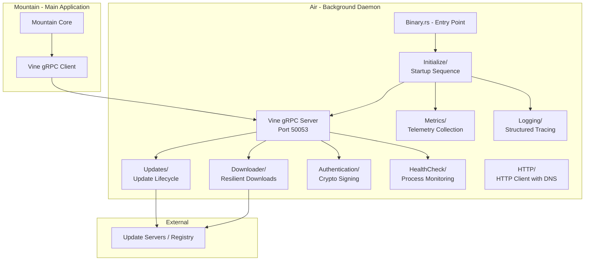
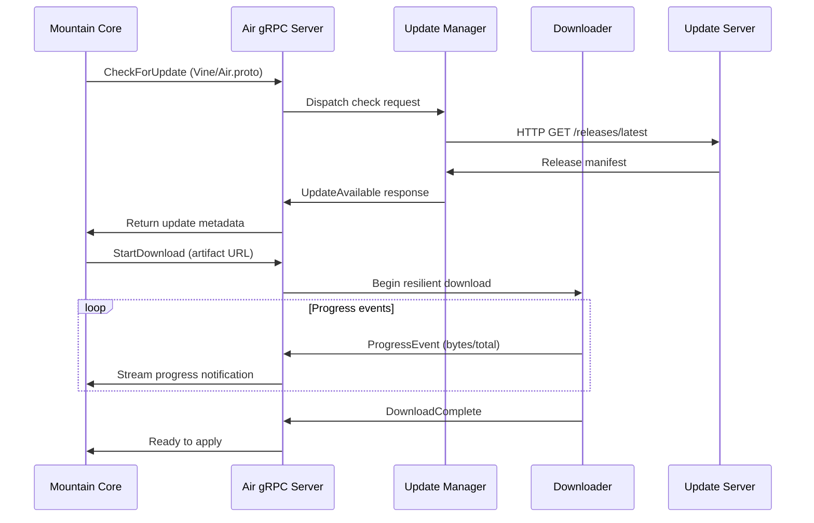

Air is a standalone Rust binary structured around a central gRPC server that
receives task delegation from Mountain. It runs as a persistent sidecar process
alongside Mountain, offloading resource-intensive operations so the editor
remains responsive. Internal modules handle distinct responsibilities: updates,
downloads, authentication, and health monitoring.

## Key Modules

| Path                     | Description                                                    |
| :----------------------- | :------------------------------------------------------------- |
| `Source/Binary.rs`       | Binary entry point; bootstraps Tokio runtime and starts daemon |
| `Source/Initialize/`     | Startup sequence: config loading, server binding, state init   |
| `Source/Vine/`           | gRPC server implementation using tonic; routes incoming calls  |
| `Source/Updates/`        | Update lifecycle: check, download, verify, apply patches       |
| `Source/Downloader/`     | Resilient download manager with pause, resume, and retry       |
| `Source/Authentication/` | Cryptographic signing of binaries and secure token storage     |
| `Source/HTTP/`           | HTTP client configured to use Mist local DNS resolver          |
| `Source/HealthCheck/`    | Self-monitoring and watchdog for process health                |
| `Source/Metrics/`        | Telemetry collection and reporting to Mountain                 |
| `Source/Logging/`        | Structured tracing output via the `tracing` crate              |
| `Source/CLI/`            | Command-line argument parsing for daemon startup options       |
| `Source/Resilience/`     | Retry logic and circuit breakers for network operations        |
| `Source/Security/`       | Signature verification and secure storage utilities            |
| `Source/Configuration/`  | Runtime configuration loading and hot-reload support           |
| `Source/Library.rs`      | Library root exposing the public API for integration tests     |

## Data Flow

The following sequence shows how Mountain delegates an update task to Air and
receives progress notifications.

**Port allocation:**

- Air listens on `[::1]:50053` (reserved for the Air daemon).
- Cocoon uses `[::1]:50052` (the VS Code extension host).

## Integration Points

| Connecting Element | Direction     | Mechanism                | Description                                                            |
| :----------------- | :------------ | :----------------------- | :--------------------------------------------------------------------- |
| **Mountain**       | Bidirectional | gRPC over Vine/Air.proto | Mountain delegates tasks; Air streams progress events back             |
| **Mist**           | Inbound       | Local DNS resolver       | Air configures its HTTP client to use Mist's DNS for secure resolution |
| **Vine**           | Inbound       | Protocol definition      | Air.proto defines service contracts; tonic generates Rust server stubs |

## Configuration

| Parameter                | Source                          | Description                                    |
| :----------------------- | :------------------------------ | :--------------------------------------------- |
| Bind address             | CLI flag / environment          | Default `[::1]:50053`; overridable for testing |
| Update server URL        | Configuration file              | Base URL for checking and downloading updates  |
| Download cache directory | Configuration file              | Where partial downloads are stored for resume  |
| Health check interval    | Configuration file              | Frequency of self-monitoring checks            |
| Log level                | `RUST_LOG` environment variable | Tracing filter for structured log output       |

Air is spawned automatically by Mountain at startup. Mountain detects whether an
Air process is already running before spawning a new instance.

## Related Documentation

- [Air overview](/Doc/air)
- [Vine protocol](/Doc/vine)
- [Mountain deep dive](/Doc/deep-dive-mountain)
  Related: [Architecture](/Doc/architecture/)
