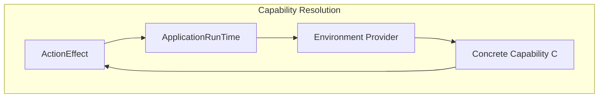
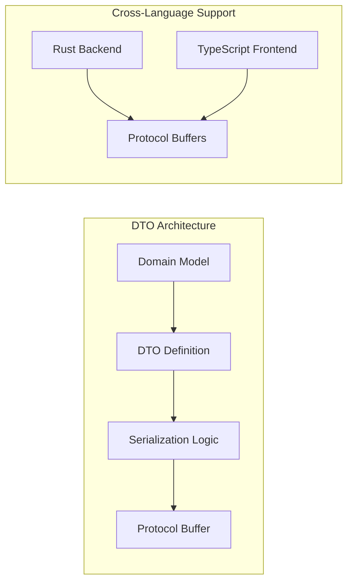
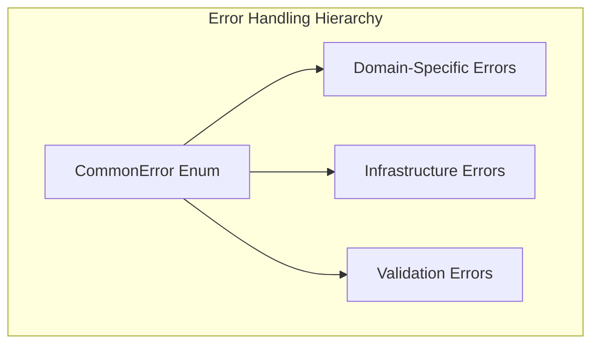
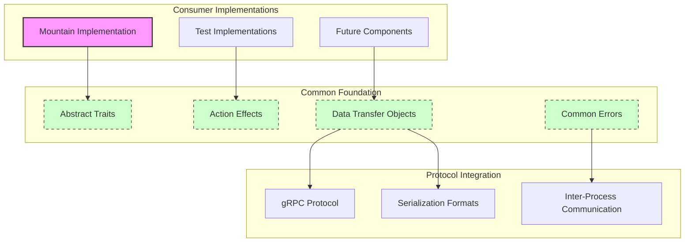
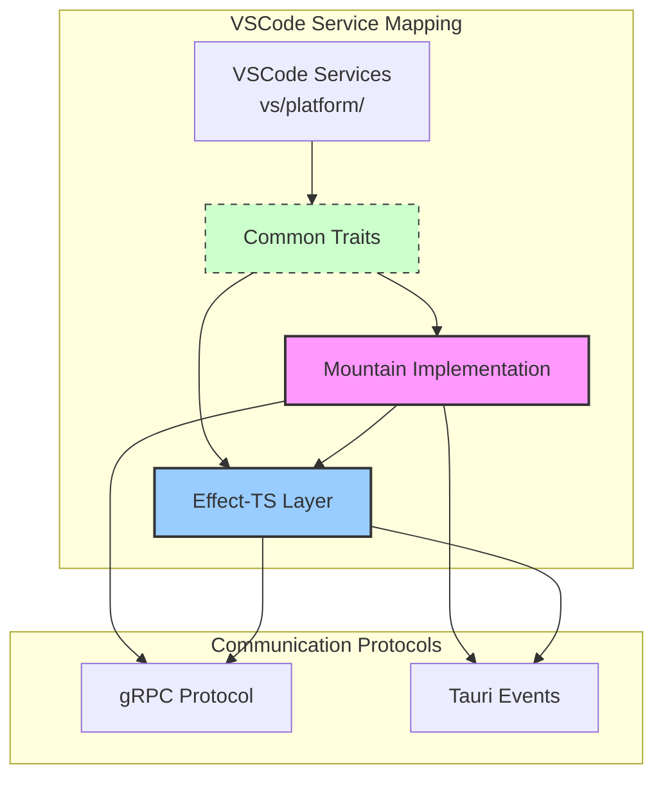
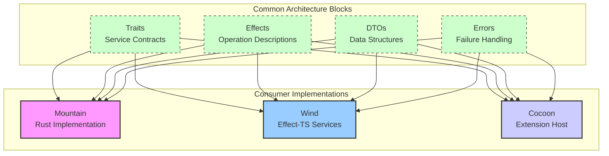

Common defines the abstract architectural patterns, service contracts, and data
structures that enable type-safe, testable service implementations across Rust
and TypeScript boundaries — providing the technical foundation for
lifting VSCode services into the Land platform.

Common uses **Rust edition 2024** with a minimum supported Rust version (MSRV)
of **1.95.0**. It is a pure library crate with no binary targets and no concrete
I/O — all platform-specific logic lives in Mountain.

---

## Core Architecture Principles

| Principle                    | Description                                                                                                                                          | Key Components Involved                    |
| :--------------------------- | :--------------------------------------------------------------------------------------------------------------------------------------------------- | :----------------------------------------- |
| **Pure Abstraction**         | Define every application capability as abstract `async trait`s without any concrete implementation logic, enforcing strict architectural boundaries. | All `*Provider.rs` and `*Manager.rs` files |
| **Declarative Effects**      | Represent every operation as an `ActionEffect` value, separating operation description from execution for maximum composability and testability.     | `Effect/*`, all effect constructor files   |
| **Trait-Based DI**           | Implement a clean, compile-time dependency injection system using the `Environment` and `Requires` traits for explicit capability declaration.       | `Environment/*`                            |
| **Universal Error Handling** | Provide a single, exhaustive `CommonError` enum that covers all possible failure scenarios across the entire native project.                       | `Error/`                                   |
| **Contract-First Design**    | Define all data structures (`DTO/*`) and error types (`Error/*`) first, establishing a stable contract for all other components.                     | `DTO/`, `Error/`                           |
| **Minimal Dependencies**     | Maintain minimal dependencies and complete independence from Tauri, gRPC, or any specific application logic, ensuring clean separation.              | `Cargo.toml`                               |

---

## ActionEffect System

The `ActionEffect` system implements declarative programming patterns where
operations are described as values rather than executed immediately.

### Type Signature

`ActionEffect<C, E, T>` describes:

- **C**: The capability type required for execution
- **E**: The error type that may result from execution
- **T**: The successful result type

```rust
pub struct ActionEffect<TCapability, TError, TOutput> {
    pub Function: Arc
        <dyn Fn(TCapability)
            -> Pin<Box<dyn Future<Output = Result<TOutput, TError>> + Send>>
            + Send
            + Sync>,
}
```

The `Arc` wrapper makes effects cheap to clone and share across async boundaries
without copying the closure.

### Why Declarative Effects Over Imperative Code

The traditional approach to async operations in Rust is direct: a function
receives a concrete dependency and awaits it immediately. This is simple but
creates two problems for a large codebase.

First, testing requires a real dependency or a hand-written mock that replicates
its entire interface. Second, composing operations — run A then B if A succeeds,
or run A and B in parallel — requires explicit async coordination at each call
site.

Common's `ActionEffect` system treats operations as data. An effect constructor
returns a description of what should happen; it does not perform any I/O. The
`ApplicationRunTime` receives the description, resolves the required capability
from its environment, and executes it.

```rust
// Imperative approach: I/O happens immediately, hard to compose
async fn read(fs: &impl FileSystemReader, path: PathBuf) -> Result<Vec<u8>, CommonError> {
    fs.read_file(&path).await
}

// Declarative approach: no I/O until the runtime executes it
let effect = FileSystem::ReadFile(PathBuf::from("/path/to/file"));
// effect is a value; execution happens later via runtime.Run(effect).await
```

### Composition Methods

Effects can be composed using standard operations:

| Method            | Behavior                                                              |
| ----------------- | --------------------------------------------------------------------- |
| `and_then(f)`     | Sequential: run self, pass result to `f`, run resulting effect        |
| `zip(other)`      | Parallel: run self and other concurrently, collect both results       |
| `fallback(other)` | Error recovery: run self; if it fails, run other                      |
| `map(f)`          | Transform the success value without changing capability or error type |
| `map_err(f)`      | Transform the error value                                             |

### Performance Characteristics: Effect Execution Overhead

**Measured Overhead:**

- **Effect Creation:** ~10 ns (heap allocation)
- **Capability Resolution:** ~5 ns (trait method lookup)
- **Execution Wrapper:** ~2 ns (future boxing)
- **Total Overhead:** ~17 ns per effect

---

## Environment and Dependency Injection

The `Environment` trait system implements capability-based architecture for
clean dependency management:



### Concrete Capability Resolution

For any `ActionEffect<C, E, T>`, the runtime provides `C` through these steps:

1. **Effect Declaration:** Effects explicitly declare required capabilities
2. **Environment Implementation:** Concrete environments implement required traits
3. **Runtime Resolution:** ApplicationRunTime resolves and provides capabilities
4. **Execution:** Effect executes with provided capability

### Trait Architecture

Every service capability is defined as an `async trait` (via the `async_trait`
crate for object-safety). Each trait declares the minimal surface needed for
that domain — no helper methods, no default implementations with hidden
behavior, no cross-domain coupling.

```rust
#[async_trait]
pub trait FileSystemReader: Send + Sync {
    async fn read_file(&self, path: &Path) -> Result<Vec<u8>, CommonError>;
    async fn write_file(&self, path: &Path, content: &[u8]) -> Result<(), CommonError>;
    async fn stat(&self, path: &Path) -> Result<FileStat, CommonError>;
    async fn read_dir(&self, path: &Path) -> Result<Vec<DirEntry>, CommonError>;
    async fn create_dir(&self, path: &Path) -> Result<(), CommonError>;
    async fn remove_file(&self, path: &Path) -> Result<(), CommonError>;
    async fn rename(&self, from: &Path, to: &Path) -> Result<(), CommonError>;
    async fn copy(&self, from: &Path, to: &Path) -> Result<(), CommonError>;
    async fn watch(&self, path: &Path) -> Result<FileWatcher, CommonError>;
}
```

Mountain implements each trait in a corresponding file under
`Element/Mountain/Source/Environment/`. Tests implement the same traits with
in-memory or panic-on-call stubs. The trait implementation is in Mountain; the
trait definition is in Common. Common never imports from Mountain. This one-way
dependency is enforced by the workspace `Cargo.toml`.

### How Mountain Implements a Common Trait

```rust
// In Mountain/Source/Environment/FileSystemProvider.rs
use CommonLibrary::FileSystem::{FileSystemReader, FileSystemWriter};

#[async_trait]
impl FileSystemReader for MountainEnvironment {
    async fn read_file(&self, path: &Path) -> Result<Vec<u8>, CommonError> {
        tokio::fs::read(path).await.map_err(|e| CommonError::IoError(e))
    }
    // ...
}
```

### Dependency Injection at Compile Time

Common's DI system works at compile time through associated types. The
`Environment` trait declares one associated type per capability:

```rust
pub trait Environment {
    type FileSystem: FileSystemReader + FileSystemWriter;
    type Configuration: ConfigurationProvider;
    type Terminal: TerminalProvider;
    // one associated type per service domain
}
```

The `Requires<C>` trait lets an effect declare what capability it needs without
naming a concrete type:

```rust
pub trait Requires<C> {
    type Output;
    type Error;
    async fn run(self, capability: &C) -> Result<Self::Output, Self::Error>;
}
```

`ApplicationRunTime` connects the two: given an environment, it resolves the
concrete capability for a given `TCapability` type parameter and calls the
effect's function. No runtime type lookup, no `Any` downcasting — the resolution
is a zero-cost type-level dispatch.

### Capability Resolution Flow

```
ActionEffect<FileSystemReader, CommonError, Vec<u8>>
  -> ApplicationRunTime::Run(effect)
  -> Environment::FileSystem (resolves to MountainFileSystem in production,
                               MockFileSystem in tests)
  -> effect.Function(capability).await
  -> Result<Vec<u8>, CommonError>
```

### Concrete Dependency Injection Architecture

```rust
// Service trait definition
#[async_trait]
pub trait FileSystemReader: Send + Sync {
    async fn ReadFile(&self, path: &PathBuf) -> Result<Vec<u8>, CommonError>;
}

// Effect requiring the trait
pub fn ReadFile_effect(path: PathBuf)
    -> ActionEffect<Arc<dyn FileSystemReader>, CommonError, Vec<u8>>
{
    ActionEffect::new(move |fs: Arc<dyn FileSystemReader>| {
        Box::pin(async move { fs.ReadFile(&path).await })
    })
}
```

### Type Safety Implementation

The type system prevents runtime capability errors through:

1. **Trait Bounds:** Effects require specific trait implementations
2. **Environment Constraints:** Runtime environments must satisfy trait bounds
3. **Compile-Time Verification:** Invalid compositions fail to compile
4. **Runtime Safety:** Successful compilation guarantees capability availability

---

## DTO Library Structure

The Data Transfer Object system provides type-safe serialization for IPC
communication. Common's `DTO/` module re-exports structs from each service
domain's `DTO/` subdirectory. All DTOs are:

- `#[derive(Debug, Clone, PartialEq, serde::Serialize, serde::Deserialize)]`
- Named in PascalCase matching the Land naming convention
- Field-compatible with the corresponding protobuf message fields in
  `Vine.proto`



### Key DTOs

| DTO                   | Module                | Primary Fields                                      |
| --------------------- | --------------------- | --------------------------------------------------- |
| `FileStat`            | `FileSystem/DTO`      | `path`, `file_type`, `size`, `mtime`, `permissions` |
| `InitData`            | `Workspace`           | Workspace path, extension manifests, configuration  |
| `TerminalOptions`     | `Terminal`            | `name`, `shell_path`, `cwd`, `env`, `cols`, `rows`  |
| `ExtensionManifest`   | `ExtensionManagement` | `id`, `version`, `publisher`, `activation_events`   |
| `ConfigurationTarget` | `Configuration`       | `Global`, `Workspace`, `WorkspaceFolder` enum       |
| `SearchOptions`       | `Search`              | `pattern`, `include`, `exclude`, `max_results`      |
| `WorkspaceEditDTO`    | `DTO/`                | `edits`, `file_creates`, `file_deletes`             |
| `TransportConfig`     | `Transport`           | `timeout_ms`, `retry_count`, `retry_backoff_ms`     |

---

## CommonError Variants and Usage

The `CommonError` enum provides comprehensive error handling:



```rust
pub enum CommonError {
    NotFound(String),          // resource does not exist at the given path or ID
    PermissionDenied(String),  // OS refused the operation
    IoError(std::io::Error),   // raw I/O failure from tokio::fs or std::fs
    ParseError(String),        // deserialization or schema validation failure
    ProtocolError(String),     // gRPC or IPC framing/decoding failure
    Timeout(String),           // operation exceeded its deadline
    Unsupported(String),       // capability not available on this platform
    Internal(String),          // programming error; should not occur in normal operation
    Cancelled,                 // caller cancelled the operation
}
```

Every `async trait` method returns `Result<T, CommonError>`. Mountain maps
platform errors at the implementation boundary:

```rust
tokio::fs::read(path).await
    .map_err(|e| match e.kind() {
        ErrorKind::NotFound => CommonError::NotFound(path.display().to_string()),
        ErrorKind::PermissionDenied => CommonError::PermissionDenied(path.display().to_string()),
        _ => CommonError::IoError(e),
    })
```

This means callers in effects and tests never need to match against
`std::io::Error` kinds — they match against `CommonError` variants.

### Error Recovery Patterns

- **Automatic Retry:** Retry operations with exponential backoff
- **Graceful Fallback:** Provide alternative implementations on failure
- **User Notification:** Inform users of errors when appropriate
- **Logging:** Comprehensive error logging for debugging

---

## How Common Enables Testability

Because Common contains no concrete logic, any component that depends only on
Common traits can be tested with lightweight in-memory implementations. A test
for Mountain's file-open effect needs:

1. A struct that implements `FileSystemReader` by reading from a
   `HashMap<PathBuf, Vec<u8>>`
2. An `ApplicationRunTime` constructed with that struct as the environment
3. The effect under test

No Tauri process, no real file system, no spawned Cocoon. The test runs in
milliseconds and is fully deterministic.

```rust
struct MockFileSystem {
    files: HashMap<PathBuf, Vec<u8>>,
}

#[async_trait]
impl FileSystemReader for MockFileSystem {
    async fn read_file(&self, path: &Path) -> Result<Vec<u8>, CommonError> {
        self.files.get(path)
            .cloned()
            .ok_or_else(|| CommonError::NotFound(path.display().to_string()))
    }
    // other methods: unimplemented!() or Ok(Default::default())
}
```

This pattern is used throughout Mountain's test suite. The `src/tests/`
directories in each Mountain service module contain mock implementations of the
Common traits they depend on.

### Testing Strategies

- **Unit Tests:** Isolated service testing with mocked dependencies
- **Integration Tests:** Full system testing with real implementations
- **Property Tests:** Verify effect properties across input ranges

---

## Ecosystem Integration Mapping



---

## VSCode Service Lifting Patterns

Common provides the foundation for lifting VSCode services through abstract
interfaces, effect constructors, and DTO definitions.

### Service Interface Definition

```rust
// VSCode service interface lifted to Common
#[async_trait]
pub trait WorkspaceService: Send + Sync {
    async fn get_workspace_folders(&self) -> Result<Vec<WorkspaceFolder>, CommonError>;
    async fn UpdateWorkspaceFolders(&self, folders: Vec<WorkspaceFolder>) -> Result<(), CommonError>;
}
```

### Effect Constructor Patterns

```rust
// Effect constructor for VSCode service operations
pub fn get_workspace_folders_effect()
    -> ActionEffect<Arc<dyn WorkspaceService>, CommonError, Vec<WorkspaceFolder>>
{
    ActionEffect::new(move |service: Arc<dyn WorkspaceService>| {
        Box::pin(async move { service.get_workspace_folders().await })
    })
}
```

### DTO Definition for VSCode Types

```rust
// VSCode WorkspaceFolder lifted to Common DTO
#[derive(Serialize, Deserialize, Clone, Debug)]
pub struct WorkspaceFolderDTO {
    pub uri: String,
    pub name: String,
    pub index: u32,
}
```

### File System Service Lifting

```rust
// VSCode file system service interface
#[async_trait]
pub trait FileSystemService: Send + Sync {
    async fn ReadFile(&self, uri: &str) -> Result<Vec<u8>, CommonError>;
    async fn WriteFile(&self, uri: &str, content: &[u8]) -> Result<(), CommonError>;
    async fn stat(&self, uri: &str) -> Result<FileStat, CommonError>;
}

// File system effect constructors
pub fn ReadFile_effect(uri: String)
    -> ActionEffect<Arc<dyn FileSystemService>, CommonError, Vec<u8>>
{
    ActionEffect::new(move |fs: Arc<dyn FileSystemService>| {
        Box::pin(async move { fs.ReadFile(&uri).await })
    })
}
```

### Configuration Service Lifting

```rust
// VSCode configuration service interface
#[async_trait]
pub trait ConfigurationService: Send + Sync {
    async fn GetConfiguration(&self, section: Option<&str>) -> Result<Value, CommonError>;
    async fn UpdateConfiguration(&self, key: &str, value: Value) -> Result<(), CommonError>;
}

// Configuration effect constructors
pub fn GetConfiguration_effect(section: Option<String>)
    -> ActionEffect<Arc<dyn ConfigurationService>, CommonError, Value>
{
    ActionEffect::new(move |config: Arc<dyn ConfigurationService>| {
        Box::pin(async move { config.GetConfiguration(section.as_deref()).await })
    })
}
```

### Service Lifting Architecture



### Service Migration Table

| VSCode Service          | Common Trait           | Mountain Implementation | Effect-TS Layer        |
| :---------------------- | :--------------------- | :---------------------- | :--------------------- |
| `IFileService`          | `FileSystemService`    | `MountainFileSystem`    | `FileService`          |
| `IWorkspaceService`     | `WorkspaceService`     | `MountainWorkspace`     | `WorkspaceService`     |
| `IConfigurationService` | `ConfigurationService` | `MountainConfiguration` | `ConfigurationService` |
| `ICommandService`       | `CommandService`       | `MountainCommand`       | `CommandService`       |
| `IDocumentService`      | `DocumentProvider`     | `MountainDocument`      | `DocumentService`      |

### Component Block Map



---

## Transport Layer

Common defines the transport-agnostic communication interface used by Air,
Grove, and future Rust sidecars:

```rust
pub trait TransportStrategy: Send + Sync {
    type Error: std::error::Error + Send + Sync + 'static;
    async fn connect(&self) -> Result<(), Self::Error>;
    async fn send(&self, request: &[u8]) -> Result<Vec<u8>, Self::Error>;
    async fn close(&self) -> Result<(), Self::Error>;
    fn is_connected(&self) -> bool;
    fn transport_type(&self) -> TransportType;
}
```

Concrete transport implementations (`gRPCTransport`, `IPCTransport`,
`WASMTransport`) live in the Grove crate, not in Common. Common owns only the
trait surface and the `TransportConfig` DTO. This keeps Common free of tonic,
tokio-tungstenite, and wasmtime dependencies.

---

## Telemetry Module

Common's `Telemetry/` module provides a dual-pipe emit surface shared across all
Rust sidecars:

| Pipe    | Crate           | Controlled By                                  |
| ------- | --------------- | ---------------------------------------------- |
| PostHog | `posthog-rs`    | `TELEMETRY_POSTHOG_KEY` environment variable   |
| OTLP    | `opentelemetry` | `TELEMETRY_OTLP_ENDPOINT` environment variable |

Both pipes honor the `Disable=true` build-time flag, which the Maintain build
pipeline sets to completely strip telemetry from production binaries when the
flag is present. Neither pipe is enabled in debug builds by default.

---

## Performance Optimization Strategies

### 1. Zero-Cost Abstractions

- **Inline Optimization:** Effect constructors marked `#[inline]` for direct
  embedding
- **Generic Specialization:** Monomorphization creates specialized versions
- **Stack Allocation:** Small effects avoid heap allocation

### 2. Memory Management Optimization

- **Arena Allocation:** Related effects use arena allocation for locality
- **Object Pooling:** Frequently used effect types are pooled
- **Cache-Friendly Layout:** Data structures optimized for CPU cache

### 3. Concurrency Optimization

- **Send + Sync Bounds:** Effects designed for seamless cross-thread usage
- **Atomic Reference Counting:** Efficient `Arc` usage with minimal overhead
- **Lock-Free Patterns:** Internal data structures use lock-free algorithms

---

## Development Guidelines

### Adding New Services

When adding new services to `Common`, follow these concrete patterns:

1. **Define Service Interface:** Create Rust trait matching VSCode service
   interface
2. **Implement Effect Constructors:** Create ActionEffect constructors for
   service operations
3. **Define DTOs:** Create serializable DTOs for cross-language communication
4. **Define Errors:** Add appropriate error variants to CommonError

### Custom Effect Creation

```rust
use Common::FileSystem;
use Common::Effect::ActionEffect;
use std::sync::Arc;

// Advanced effect composition
let complex_effect = FileSystem::ReadFile(path.clone())
    .and_then(|content| FileSystem::WriteFile(other_path, content))
    .map(|_| println!("File operation completed successfully"));

// Effect with custom error handling
let resilient_effect = FileSystem::ReadFile(path)
    .recover_with(|error| {
        log::warn!("File read failed: {}", error);
        ActionEffect::pure(Vec::new()) // Fallback to empty content
    });
```

### Performance Monitoring Integration

```rust
// Monitor effect execution performance
let monitored_effect = effect
    .with_execution_timing()
    .with_resource_usage_tracking();

// Real-time metrics collection
let metrics = {
    executions_per_second: u64,
    average_latency_ms: f64,
    error_rate: f64
};
```

---

## Related Documentation

- [Common overview](https://Editor.Land/Doc/common)
- [Mountain deep dive](https://Editor.Land/Doc/deep-dive-mountain)
- [Echo deep dive](https://Editor.Land/Doc/deep-dive-echo)
- [Source Code](https://github.com/CodeEditorLand/Common)
