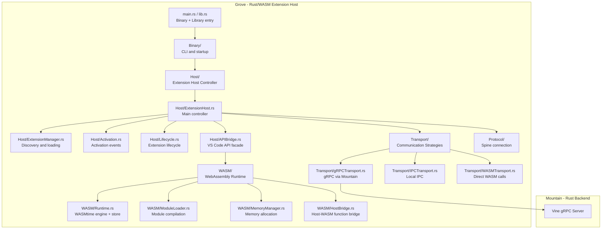
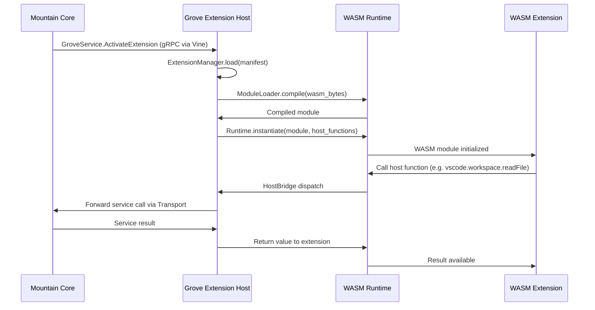

# Grove - Deep Dive

Grove provides the technical foundation Rust/WASM
extension host within the Land project. **Grove** provides a native, sandboxed
environment for running VS Code extensions compiled to WebAssembly or native
Rust, complementing the Node.js-based Cocoon host.

---

## Architecture

Grove is organized into five layers: the extension host controller that manages
the lifecycle, the WASM runtime that provides sandboxed execution, the VS Code
API bridge that presents the standard extension API, the transport layer that
communicates with Mountain, and shared utility modules.

---

## Key Modules

| Path                                 | Description                                                                       |
| :----------------------------------- | :-------------------------------------------------------------------------------- |
| `Source/lib.rs`                      | Library root; exports public API for integration and testing                      |
| `Source/main.rs`                     | Binary entry point; parses CLI and starts the extension host                      |
| `Source/Binary/`                     | CLI argument handling and standalone vs connected mode selection                  |
| `Source/Host/ExtensionHost.rs`       | Main controller: coordinates extension loading, activation, and service provision |
| `Source/Host/ExtensionManager.rs`    | Extension discovery, manifest parsing, and loading                                |
| `Source/Host/Activation.rs`          | Activation event processing (`onLanguage`, `onCommand`, etc.)                     |
| `Source/Host/Lifecycle.rs`           | Extension activate/deactivate lifecycle management                                |
| `Source/Host/APIBridge.rs`           | VS Code API facade implementation for Rust/WASM extensions                        |
| `Source/WASM/Runtime.rs`             | WASMtime engine and store management with memory limits                           |
| `Source/WASM/ModuleLoader.rs`        | WASM module compilation, caching, and instantiation                               |
| `Source/WASM/MemoryManager.rs`       | WASM linear memory allocation and bounds enforcement                              |
| `Source/WASM/HostBridge.rs`          | Host function exports to WASM modules                                             |
| `Source/WASM/FunctionExport.rs`      | Registered host functions available to extension WASM code                        |
| `Source/Transport/Strategy.rs`       | Transport strategy trait for pluggable communication                              |
| `Source/Transport/gRPCTransport.rs`  | gRPC communication with Mountain via `tonic`                                      |
| `Source/Transport/IPCTransport.rs`   | Unix/Windows IPC transport for same-host communication                            |
| `Source/Transport/WASMTransport.rs`  | Direct in-process WASM function call transport                                    |
| `Source/Protocol/SpineConnection.rs` | Spine protocol client for extension host coordination                             |

---

## Data Flow

---

## Integration Points

| Connecting Element | Direction     | Mechanism          | Description                                                                       |
| :----------------- | :------------ | :----------------- | :-------------------------------------------------------------------------------- |
| **Mountain**       | Bidirectional | gRPC via Vine      | Mountain activates extensions; Grove forwards API calls back to Mountain          |
| **Cocoon**         | Sibling       | Shared API surface | Grove implements the same VS Code API surface as Cocoon for extension portability |

---

## Configuration

| Option            | CLI Flag / Feature | Default          | Description                                                  |
| :---------------- | :----------------- | :--------------- | :----------------------------------------------------------- |
| Standalone mode   | `--standalone`     | off              | Run without Mountain connection for testing                  |
| Extension path    | `--extension`      | unset            | Load a specific extension directly                           |
| Transport         | feature flag       | gRPC             | Select `grpc`, `ipc`, or `wasm` transport via Cargo features |
| Memory limit      | runtime config     | platform default | Per-extension WASM memory ceiling enforced by WASMtime       |
| WASM build target | `wasm32-wasi`      | native           | Extensions must target `wasm32-wasi` for WASM mode           |

### Cargo features

| Feature | Description                                    |
| :------ | :--------------------------------------------- |
| `grpc`  | gRPC transport support (included in `default`) |
| `wasm`  | WASMtime WASM runtime (included in `default`)  |
| `ipc`   | Unix/Windows IPC transport (Unix only)         |
| `all`   | All features enabled                           |
