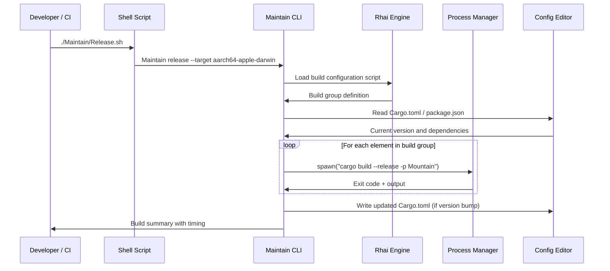

Maintain is the build orchestrator for Land. It covers the internals of
the Maintain Rust binary: its architecture, module layout, data flow,
integration with other Land elements, and configuration options.

---

## 🏗 Architecture

Maintain is a Rust binary and library. The CLI layer accepts subcommands and
delegates to the Rhai scripting engine or direct build functions. Configuration
editing is performed through `toml_edit` and `json5` for structured, non-lossy
modifications to project configuration files.

```mermaid
graph TB
    subgraph "Maintain Build System"
        LibraryRS["Source/Library.rs<br/>Entry point"]
        CLI["Source/Build/CLI.rs<br/>Command-line interface (clap)"]
        Constant["Source/Build/Constant.rs<br/>Build constants"]
        Definition["Source/Build/Definition.rs<br/>Build group definitions"]
        FnRS["Source/Build/Fn.rs<br/>Build function dispatch"]
        Error["Source/Build/Error.rs<br/>Error types"]
        Logger["Source/Build/Logger.rs<br/>Colored terminal output"]
        Process["Source/Build/Process.rs<br/>Child process management"]
        TomlEdit["Source/Build/TomlEdit.rs<br/>Cargo.toml editor"]
        JsonEdit["Source/Build/JsonEdit.rs<br/>JSON5 editor"]
        Pascalize["Source/Build/Pascalize.rs<br/>PascalCase naming utilities"]
        GetTauri["Source/Build/GetTauriTargetTriple.rs<br/>Platform detection"]
        EnvResolve["Source/Build/EnvironmentResolver.rs<br/>Environment variable resolution"]
    end

    subgraph "Rhai Scripting"
        ConfigLoader["Source/Build/Rhai/ConfigLoader.rs<br/>Configuration file loading"]
        ScriptRunner["Source/Build/Rhai/ScriptRunner.rs<br/>Script execution engine"]
        RhaiEnvResolve["Source/Build/Rhai/EnvironmentResolver.rs<br/>Environment in scripts"]
    end

    subgraph "Shell Scripts"
        DebugSh["Debug.sh<br/>Debug build entry"]
        DevMountain["Dev-Mountain.sh<br/>Mountain development mode"]
        ReleaseSh["Release.sh<br/>Release build entry"]
        ProfileSh["Profile.sh<br/>Performance profiling"]
        DebugAll["Debug/All.sh"]
        DebugBuild["Debug/Build.sh"]
        DebugRun["Debug/Run.sh"]
        DebugWind["Debug/Wind.sh"]
    end

    LibraryRS --> CLI
    CLI --> FnRS
    CLI --> ConfigLoader
    CLI --> ScriptRunner
    FnRS --> Process
    FnRS --> TomlEdit
    FnRS --> JsonEdit
    ScriptRunner --> RhaiEnvResolve
    ConfigLoader --> ScriptRunner
    DebugSh --> CLI
    DevMountain --> CLI
    ReleaseSh --> CLI
```

---

## 🔌 Key Modules

| Path                                       | Description                                                                  |
| :----------------------------------------- | :--------------------------------------------------------------------------- |
| `Source/Library.rs`                        | Binary entry point; wires together CLI, logging, and error handling          |
| `Source/Build/CLI.rs`                      | `clap`-based CLI with subcommands: debug, release, profile, dev              |
| `Source/Build/Definition.rs`               | Build group definitions: which elements to build, in what order              |
| `Source/Build/Fn.rs`                       | Core build function dispatch: clean, compile, link, post-process             |
| `Source/Build/Process.rs`                  | Child process spawning with stdout/stderr capture and exit code handling     |
| `Source/Build/TomlEdit.rs`                 | Non-lossy TOML editing for `Cargo.toml` version bumps and dependency changes |
| `Source/Build/JsonEdit.rs`                 | JSON5-aware configuration editing for `package.json` and `.json5` files      |
| `Source/Build/Pascalize.rs`                | PascalCase ↔ words conversion utilities for naming convention enforcement    |
| `Source/Build/GetTauriTargetTriple.rs`     | Detects current Rust target triple for SideCar binary selection              |
| `Source/Build/EnvironmentResolver.rs`      | Resolves environment variables with fallbacks for build-time configuration   |
| `Source/Build/Logger.rs`                   | Colored terminal output using the `colored` crate                            |
| `Source/Build/Error.rs`                    | Unified error type for build failures                                        |
| `Source/Build/Rhai/ConfigLoader.rs`        | Loads and parses Rhai build configuration scripts                            |
| `Source/Build/Rhai/ScriptRunner.rs`        | Executes Rhai scripts within the build context with Land API bindings        |
| `Source/Build/Rhai/EnvironmentResolver.rs` | Exposes environment variable resolution to Rhai scripts                      |

---

## 🔄 Data Flow

---

## 🔗 Integration Points

| Connecting Element | Direction     | Mechanism                            | Description                                                         |
| :----------------- | :------------ | :----------------------------------- | :------------------------------------------------------------------ |
| **Mountain**       | Build target  | `cargo build` subprocess             | Maintain compiles Mountain as part of the debug/release build group |
| **Air**            | Build target  | `cargo build` subprocess             | Air daemon compiled alongside Mountain                              |
| **Echo**           | Build target  | `cargo build` subprocess             | Echo scheduler compiled as a dependency of Mountain                 |
| **Rest**           | Build target  | `cargo build` subprocess             | Rest compiler binary built for use by Output                        |
| **SideCar**        | Build target  | `cargo build` subprocess             | SideCar Download tool compiled and run as part of setup             |
| **Output**         | Build trigger | `pnpm run prepublishOnly` subprocess | Maintain triggers TypeScript builds via pnpm                        |
| **Wind / Sky**     | Build trigger | `pnpm run prepublishOnly` subprocess | Frontend packages built through Turborepo via Maintain              |

---

## 🛠 Configuration

| Option         | CLI Flag                       | Description                                              |
| :------------- | :----------------------------- | :------------------------------------------------------- |
| Build mode     | `debug` / `release` subcommand | Controls `--release` flag and optimization level         |
| Target triple  | `--target`                     | Rust target triple for cross-compilation                 |
| Element filter | `--element`                    | Build only a specific element rather than the full group |
| Script path    | `--script`                     | Override the default Rhai build configuration script     |
| Verbosity      | `--verbose`                    | Enable detailed subprocess output logging                |

### Shell script entry points

| Script            | Purpose                                      |
| :---------------- | :------------------------------------------- |
| `Debug.sh`        | Full debug build of all elements             |
| `Dev-Mountain.sh` | Hot-reload development mode for Mountain     |
| `Release.sh`      | Optimized release build with all elements    |
| `Profile.sh`      | Release build with profiling instrumentation |
| `Debug/All.sh`    | Debug all components including frontend      |
| `Debug/Wind.sh`   | Debug Wind TypeScript service layer only     |

---

## 📖 Related Documentation

- [Maintain element overview](https://Editor.Land/Doc/maintain)
- [Mountain deep dive](https://Editor.Land/Doc/deep-dive-mountain)
- [Architecture overview](https://Editor.Land/Doc/architecture)
