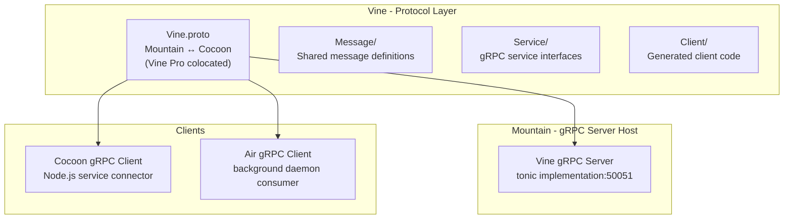
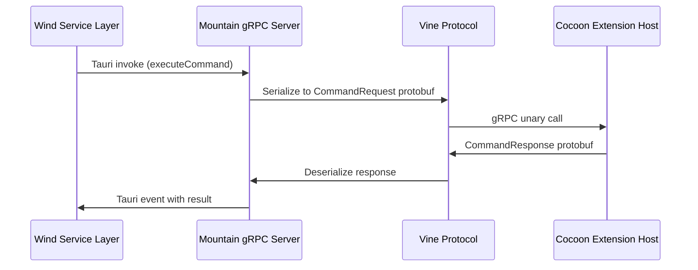

Vine provides the technical foundation gRPC protocol layer
within the Land project. **Vine** defines the strongly-typed inter-process
communication contracts used between Mountain and Cocoon, with Air as an
additional gRPC consumer. The `.proto` files are the canonical source of truth;
all Rust and TypeScript implementations are generated from them.

---

## Architecture

Vine is a contract-first protocol layer. The `.proto` file is the source of
truth; generated Rust code via `prost-build`/`tonic` is shared by Mountain, Air,
and Cocoon.



---

## Key Modules

| Path                    | Description                                                              |
| :---------------------- | :----------------------------------------------------------------------- |
| `Proto/Vine.proto`      | Canonical protocol schema (only schema shipped)                          |
| `Source/Library.rs`     | Crate root: port constants, protocol version, constants                  |
| `Source/Host.rs`        | `VineHost` + `IPCProvider` embedder seam                                 |
| `Source/Generated/`     | prost-built types + tonic clients/servers from `Proto/Vine.proto`        |
| `Source/Client/`        | Connection helpers, request/notification dispatch, sidecar health checks |
| `Source/Server/`        | Bind helpers + notification handler tree                                 |
| `Source/Multiplexer.rs` | Bidirectional streaming envelope multiplexer (`LAND_VINE_STREAMING=1`)   |
| `Source/Error.rs`       | Canonical `VineError` variants                                           |

The protocol implementation spans Mountain's `Source/RPC/Vine/` (server), Air's
Vine client modules, and Cocoon's `Source/Effect/RPCServer.ts` (client). The
Vine Element owns the schema and shared Rust types.

---

## Port Allocation

All gRPC listeners bind to `[::1]` (loopback only). No remote connections are
accepted.

| Service       | Element    | Port    | Transport | Direction                          |
| ------------- | ---------- | ------- | --------- | ---------------------------------- |
| Mountain Vine | `Mountain` | `50051` | TCP       | Cocoon → Mountain (gRPC server)    |
| Cocoon Vine   | `Cocoon`   | `50052` | TCP       | Mountain → Cocoon (gRPC server)    |
| Air Vine      | `Air`      | `50053` | TCP       | Mountain → Air (background daemon) |

---

## Proto File Structure

Three proto files make up the Vine protocol family. All use `syntax = "proto3"`
and the `Vine` package namespace.

| File          | Location                             | Defines                                     |
| ------------- | ------------------------------------ | ------------------------------------------- |
| `Vine.proto`  | `Element/Mountain/Proto/Vine.proto`  | Core Mountain↔Cocoon services               |
| `Spine.proto` | `Element/Mountain/Proto/Spine.proto` | Extension host action/response coordination |
| `Air.proto`   | `Element/Air/Proto/Air.proto`        | Mountain↔Air background daemon services     |

The proto files are compiled separately for each consumer. Mountain's `build.rs`
compiles `Vine.proto` and `Spine.proto` into Rust types. A separate `protoc`
invocation generates TypeScript stubs committed to Cocoon's source tree.

---

## MountainService RPC Definitions

`MountainService` is the gRPC service implemented by Mountain's tonic server.
Cocoon connects as a client and calls these RPCs when extensions need native
capabilities.

```protobuf
service MountainService {
    rpc ProcessCocoonRequest(GenericRequest) returns (GenericResponse);
    rpc SendCocoonNotification(GenericNotification) returns (Empty);
    rpc CancelOperation(CancelOperationRequest) returns (Empty);
    rpc OpenChannelFromCocoon(stream Envelope) returns (stream Envelope);
}
```

`ProcessCocoonRequest` and `SendCocoonNotification` carry a `method` string and
a `params` bytes field containing JSON-encoded arguments. This generic envelope
lets the Mountain IPC dispatcher (`WindServiceHandlers/mod.rs`) route to the
correct handler without requiring a new RPC for every method. New IPC methods
can be added by registering a handler in `mod.rs` without touching the proto
file.

`OpenChannelFromCocoon` is a bidirectional streaming RPC. It replaces the older
pattern of opening a new unary connection per request for high-frequency
callers. Both sides write `Envelope` messages to the stream; each envelope
carries a correlation ID so responses can be matched to outstanding requests on
the same stream.

### Rust tonic Server Implementation

Mountain's gRPC server lives in `Element/Mountain/Source/Vine/Server/`. The
tonic `#[async_trait]` implementation dispatches each RPC:

```rust
#[tonic::async_trait]
impl MountainService for MountainVineServiceImpl {
    async fn process_cocoon_request(
        &self,
        request: Request<GenericRequest>,
    ) -> Result<Response<GenericResponse>, Status> {
        let req = request.into_inner();
        // Dispatch to WindServiceHandlers based on req.method
        let result = self.dispatch(&req.method, &req.params).await
            .map_err(|e| Status::internal(e.to_string()))?;
        Ok(Response::new(GenericResponse { result, success: true, error: String::new() }))
    }
    // ...
}
```

The dispatcher in `WindServiceHandlers/mod.rs` matches the `method` string
against registered handlers and calls the appropriate Rust function. Each
handler lives in its own atomic file under the `WindServiceHandlers/` directory.

---

## CocoonService RPC Definitions

`CocoonService` is implemented by Cocoon's gRPC server. Mountain connects as a
client and calls these RPCs to drive the extension host.

```protobuf
service CocoonService {
    rpc ProcessMountainRequest(GenericRequest) returns (GenericResponse);
    rpc SendMountainNotification(GenericNotification) returns (Empty);
    rpc CancelOperation(CancelOperationRequest) returns (Empty);
    rpc OpenChannelFromMountain(stream Envelope) returns (stream Envelope);
    rpc InitialHandshake(Empty) returns (Empty);
    rpc InitExtensionHost(InitExtensionHostRequest) returns (Empty);
    rpc RegisterCommand(RegisterCommandRequest) returns (Empty);
    rpc ExecuteContributedCommand(ExecuteCommandRequest) returns (ExecuteCommandResponse);
    rpc UnregisterCommand(UnregisterCommandRequest) returns (Empty);
    rpc RegisterHoverProvider(RegisterProviderRequest) returns (Empty);
    rpc ProvideHover(ProvideHoverRequest) returns (ProvideHoverResponse);
    rpc RegisterCompletionItemProvider(RegisterProviderRequest) returns (Empty);
    rpc ProvideCompletionItems(ProvideCompletionItemsRequest) returns (ProvideCompletionItemsResponse);
    rpc RegisterDefinitionProvider(RegisterProviderRequest) returns (Empty);
    rpc ProvideDefinition(ProvideDefinitionRequest) returns (ProvideDefinitionResponse);
    rpc RegisterReferenceProvider(RegisterProviderRequest) returns (Empty);
    rpc ProvideReferences(ProvideReferencesRequest) returns (ProvideReferencesResponse);
    rpc RegisterCodeActionsProvider(RegisterProviderRequest) returns (Empty);
    rpc ProvideCodeActions(ProvideCodeActionsRequest) returns (ProvideCodeActionsResponse);
    rpc RegisterDocumentHighlightProvider(RegisterProviderRequest) returns (Empty);
    rpc ProvideDocumentHighlights(ProvideDocumentHighlightsRequest) returns (ProvideDocumentHighlightsResponse);
    rpc RegisterDocumentSymbolProvider(RegisterProviderRequest) returns (Empty);
    rpc ProvideDocumentSymbols(ProvideDocumentSymbolsRequest) returns (ProvideDocumentSymbolsResponse);
    rpc RegisterWorkspaceSymbolProvider(RegisterProviderRequest) returns (Empty);
    rpc ProvideWorkspaceSymbols(ProvideWorkspaceSymbolsRequest) returns (ProvideWorkspaceSymbolsResponse);
    rpc RegisterInlineCompletionItemProvider(RegisterProviderRequest) returns (Empty);
    rpc ProvideInlineCompletionItems(ProvideInlineCompletionItemsRequest) returns (ProvideInlineCompletionItemsResponse);
}
```

### TypeScript Implementation

Cocoon's gRPC server (`Cocoon/Source/Services/gRPC/Server/Service.ts`) uses
`@grpc/grpc-js` with the generated TypeScript stubs. Each `Provide*` RPC routes
to the language feature provider registry:

```typescript
async provideHover(
    call: ServerUnaryCall<ProvideHoverRequest, ProvideHoverResponse>,
    callback: sendUnaryData<ProvideHoverResponse>,
): Promise<void> {
    const { documentUri, line, column } = call.request;
    const result = await this.languageProviderRegistry
        .invokeProvider("hover", documentUri, { line, character: column });
    callback(null, { markupContent: result?.contents ?? "", ... });
}
```

The `Register*` RPCs store provider registrations in a per-language registry.
When Mountain later calls the corresponding `Provide*` RPC, the registry
dispatches to the registered extension provider.

`ProvideInlineCompletionItems` was added to `CocoonService` as part of the
inline completions pipeline. It follows the same `Register*/Provide*` pattern
and is dispatched through the `LanguageFeatureProviderRegistry` in Cocoon.
Sky's Monaco editor calls `language:provideInlineCompletions` on Mountain,
which routes the request to Cocoon via this RPC.

---

## Bidirectional Streaming Patterns

Vine uses bidirectional streaming for two purposes: multiplexed high-frequency
dispatch and real-time event delivery.

### Multiplexed Dispatch (`OpenChannel*`)

`OpenChannelFromCocoon` and `OpenChannelFromMountain` are bidirectional
streaming RPCs that replace the older one-request-per-connection model. Both
sides write `Envelope` messages:

```protobuf
message Envelope {
    string id = 1;       // correlation ID, UUID v4
    string method = 2;   // IPC method name
    bytes  payload = 3;  // JSON-encoded params or result
    bool   is_reply = 4; // true if this envelope is a response to a prior request
    string error = 5;    // non-empty if is_reply and the call failed
}
```

The sender writes an `Envelope` with a unique `id` and `is_reply = false`. The
receiver processes the request and writes back an `Envelope` with the same `id`
and `is_reply = true`. Both sides maintain a
`HashMap<String, oneshot::Sender<Envelope>>` to route replies to waiting
callers.

This pattern is particularly important for language feature calls, where the
editor may issue dozens of hover and completion requests within a single second.
Opening a new TCP connection per request adds ~0.5 ms of overhead; the streaming
channel amortises that cost to near zero.

### Real-Time Event Delivery (`SendMountainNotification`)

Notifications (document changes, configuration updates, workspace folder
changes) travel via `SendMountainNotification`, which is a unary fire-and-forget
RPC. Mountain calls it without waiting for acknowledgement. Cocoon processes
notifications on a dedicated handler that updates its internal caches
(`__textDocuments`, `__workspaceFolders`, etc.) before dispatching to extension
listeners.

---

## Data Flow

The following diagram shows how a VS Code command travels from Sky/Wind through
the Vine protocol to Cocoon and back.



**Communication patterns supported by Vine:**

- **Unary RPC** - Request/response for commands and queries.
- **Server streaming** - Mountain streams events (terminal output, diagnostics)
  to Cocoon.
- **Client streaming** - Cocoon sends batched registration calls at startup.
- **Bidirectional streaming** - Used by the Spine protocol for real-time
  extension host coordination.

---

## Proto Compilation in build.rs

Mountain's `build.rs` compiles all proto files at build time:

```rust
fn main() {
    tonic_build::configure()
        .build_server(true)
        .build_client(true)
        .compile(
            &["Proto/Vine.proto", "Proto/Spine.proto"],
            &["Proto"],
        )
        .expect("Failed to compile protos");

    // Rerun if any proto file changes
    println!("cargo:rerun-if-changed=Proto/Vine.proto");
    println!("cargo:rerun-if-changed=Proto/Spine.proto");
}
```

`tonic_build` invokes `prost-build` internally. The generated Rust types are
written to `$OUT_DIR/vine.rs` and `$OUT_DIR/spine.rs` and included via
`include!(concat!(env!("OUT_DIR"), "/vine.rs"))` in Mountain's
`Source/Vine/Generated/` module.

The `protoc` binary must be available on `PATH`. In the CI environment, it is
installed by the `prost-build` feature flag that bundles `protoc`. For local
development on macOS, `brew install protobuf` provides it.

---

## URI and Range Message Formats

Vine uses explicit message types for VS Code's URI and Range primitives rather
than encoding them as strings:

```protobuf
message Uri {
    string scheme    = 1;  // "file", "untitled", "git", "output"
    string authority = 2;  // empty for file:// URIs on local files
    string path      = 3;  // POSIX path, percent-encoded
    string query     = 4;
    string fragment  = 5;
}

message Position {
    uint32 line      = 1;  // 0-based line number
    uint32 character = 2;  // 0-based UTF-16 code unit offset
}

message Range {
    Position start = 1;
    Position end   = 2;
}
```

> [!IMPORTANT] All line and character positions in Vine messages are 0-based,
> matching the VS Code Language Server Protocol convention. Mountain's IPC
> handlers that bridge between Vine and the Monaco editor must translate from
> 0-based (Vine) to 1-based (Monaco model) when applying edits, and back to
> 0-based when constructing Vine responses.

---

## How to Add a New RPC

Adding a new RPC requires coordinated changes across the proto file, Mountain,
and Cocoon. The steps below use adding a hypothetical `ProvideInlayHints` RPC as
an example.

**Step 1: Add the message and RPC to `Vine.proto`.**

```protobuf
message ProvideInlayHintsRequest {
    Uri    document_uri = 1;
    Range  visible_range = 2;
}

message ProvideInlayHintsResponse {
    repeated InlayHint hints = 1;
}

// In CocoonService:
rpc ProvideInlayHints(ProvideInlayHintsRequest) returns (ProvideInlayHintsResponse);
```

**Step 2: Regenerate TypeScript stubs** by running `protoc` with the `--ts_out`
flag and committing the updated files in `Cocoon/Source/Generated/`.

**Step 3: Add the Mountain handler.** Create
`Element/Mountain/Source/IPC/WindServiceHandlers/Language/ProvideInlayHints.rs`
implementing the Rust side. Register it in `mod.rs` dispatch table.

**Step 4: Add the Cocoon handler.** In
`Cocoon/Source/Services/gRPC/Server/Service.ts`, implement the
`provideInlayHints` method, routing it through the language provider registry.

**Step 5: Add the Channel enum entry.** Update `Common/Source/IPC/Channel.rs`
(Rust) and `Wind/Source/IPC/Channel.ts` (TypeScript) with the new channel
identifier. These two files must stay in lockstep.

**Step 6: Build both sides.** `cargo build -p Mountain` catches Rust compile
errors; `pnpm run prepublishOnly` catches TypeScript errors in Cocoon.

> [!WARNING] Never remove or rename a proto field without a migration plan.
> Proto3 field numbers are permanent identifiers in the wire format. Removing
> field number 3 and adding a new field at position 3 with a different type
> corrupts any in-flight message. Add new fields with new numbers; mark old
> fields as `reserved` once both sides have been updated.

---

## Air.proto

Air uses a separate proto file with its own `BackgroundServices` gRPC service on
port 50053. The structure mirrors Vine but is scoped to background operations:

```protobuf
service BackgroundServices {
    rpc Connect(ConnectRequest) returns (ConnectResponse);
    rpc Heartbeat(HeartbeatRequest) returns (HeartbeatResponse);
    rpc PerformAction(ActionRequest) returns (ActionResponse);
    rpc CancelAction(CancelRequest) returns (CancelResponse);
    rpc HealthCheck(HealthCheckRequest) returns (HealthCheckResponse);
    rpc GetStatus(StatusRequest) returns (StatusResponse);
}
```

`PerformAction` uses a discriminated `ActionRequest` where the action type field
routes to UpdateService, DownloadService, AuthService, or IndexService inside
Air.

---

## Integration Points

| Connecting Element | Direction       | Mechanism                  | Description                                                        |
| :----------------- | :-------------- | :------------------------- | :----------------------------------------------------------------- |
| **Mountain**       | Server          | tonic gRPC server          | Hosts Vine server on `50051`; handles incoming RPC from Cocoon/Air |
| **Cocoon**         | Client          | Node.js `grpc-js` / Bridge | Connects to Mountain's Vine server                                 |
| **Air**            | Server + Client | tonic gRPC                 | Hosts AirService on `50053`; also connects back to Mountain        |

**Listening addresses:**

| Service       | Address       |
| :------------ | :------------ |
| Mountain Vine | `[::1]:50051` |
| Cocoon Vine   | `[::1]:50052` |
| Air Vine      | `[::1]:50053` |

---

## Configuration

| Parameter | Value                  | Description                                      |
| :-------- | :--------------------- | :----------------------------------------------- |
| Transport | TCP loopback           | `[::1]` only; no external exposure               |
| TLS       | Disabled for local IPC | Mist DNS isolation enforces the network boundary |

---

## Related Documentation

- [Vine overview](/Doc/vine)
- [Mountain deep dive](/Doc/deep-dive-mountain)
- [Cocoon deep dive](/Doc/deep-dive-cocoon)
- [Air deep dive](/Doc/deep-dive-air)
Related: [Architecture](/Doc/architecture/)
