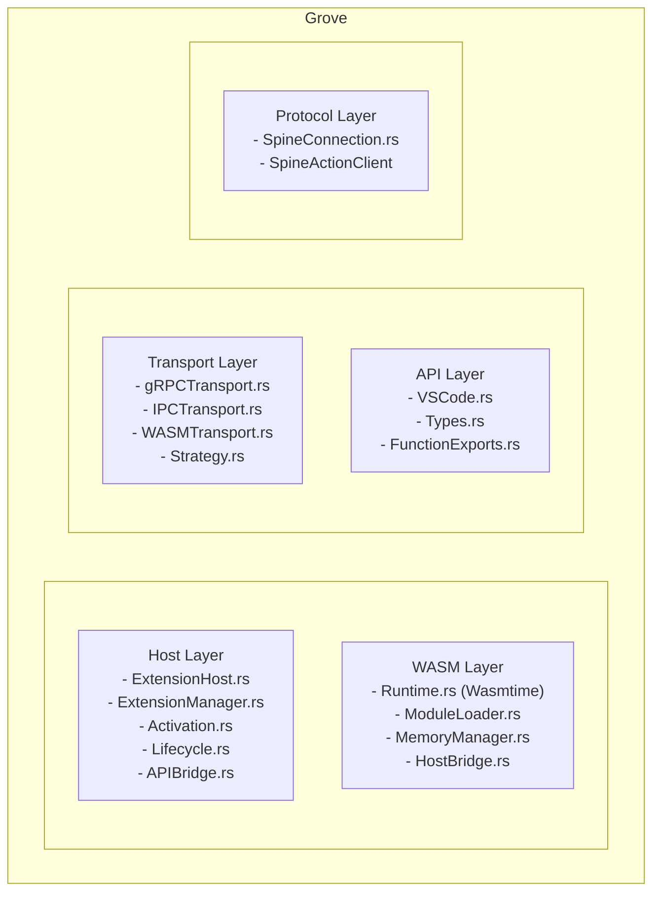

Grove is Land's native Rust and WASM extension host. It provides a sandboxed
environment for running WASM-compiled VS Code extensions via Wasmtime, sharing
the same VS Code API surface as Cocoon. Grove is implemented and available as an
optional build feature; it is not the active extension path for existing VS Code
extensions. Cocoon remains the default host for unmodified extension
compatibility.

## The problem Grove solves

VS Code extensions share a single Node.js process. A malicious or buggy
extension can access any file on disk, make arbitrary network requests, and read
another extension's in-memory state. The extension sandbox in VS Code is a
policy document enforced by trust, not a technical boundary enforced by the
runtime.

Grove makes the sandbox a hardware-enforced boundary. A WASM module running
inside Wasmtime has no access to the host OS by default. It can only call
functions that the host explicitly exports to it. An extension that requests
file access gets exactly the file handles it was granted -- nothing more.

## Overview

| Attribute     | Value                                                      |
| ------------- | ---------------------------------------------------------- |
| Language      | Rust (edition 2021)                                        |
| Crate type    | Library + Binary                                           |
| WASM runtime  | Wasmtime (optional feature)                                |
| Dependencies  | Common, wasmtime, wasmtime-wasi, tonic, prost, clap, serde |
| Feature-gated | Not enabled by default (opt-in: `--features grove`)        |

## Architecture

Grove is organized into five layers:



### Module Map

| Path                                    | Purpose                                |
| --------------------------------------- | -------------------------------------- |
| `Source/Host/ExtensionHost.rs`          | Main extension host controller         |
| `Source/Host/ExtensionManager.rs`       | Extension discovery and loading        |
| `Source/Host/Activation.rs`             | Extension activation logic             |
| `Source/Host/Lifecycle.rs`              | Extension startup/shutdown lifecycle   |
| `Source/Host/APIBridge.rs`              | Bridges WASM API calls to Mountain     |
| `Source/WASM/Runtime.rs`                | Wasmtime engine initialization         |
| `Source/WASM/ModuleLoader.rs`           | WASM module loading and compilation    |
| `Source/WASM/MemoryManager.rs`          | WASM linear memory management          |
| `Source/WASM/HostBridge.rs`             | Host function registration for WASM    |
| `Source/WASM/FunctionExport.rs`         | Exported WASM function wrappers        |
| `Source/Transport/gRPCTransport.rs`     | gRPC-based communication with Mountain |
| `Source/Transport/IPCTransport.rs`      | IPC-based communication                |
| `Source/Transport/WASMTransport.rs`     | Direct WASM host function calls        |
| `Source/Transport/Strategy.rs`          | Transport selection strategy trait     |
| `Source/Transport/CommonAdapter.rs`     | Shared transport utilities             |
| `Source/Protocol/SpcineConnection.rs`   | Spine protocol client connection       |
| `Source/Protocol/SpcineActionClient.rs` | Spine action/response client           |
| `Source/Binary/Main.rs`                 | Binary entry point                     |

## How Grove differs from Cocoon

| Aspect                                | Cocoon                                                         | Grove                                                       |
| :------------------------------------ | :------------------------------------------------------------- | :---------------------------------------------------------- |
| Runtime                               | Node.js (V8)                                                   | Wasmtime (WASM)                                             |
| Language extensions can be written in | TypeScript / JavaScript                                        | Rust (compiled to WASM), or any language with a WASM target |
| Security model                        | Process isolation -- OS boundary, but broad Node.js capability | Capability-based -- no OS access without explicit grant     |
| VS Code API coverage                  | Full `vscode.d.ts`                                             | Planned subset, to be expanded                              |
| Extension compatibility               | Runs unmodified VS Code extensions                             | Requires compilation to `wasm32-wasi` target                |
| Current status                        | Active, default host                                           | Implemented; optional `--features grove` build flag         |

## Transport Strategies

Grove supports three transport strategies for communicating with Mountain:

| Strategy | Tracking          | Latency | Use Case                        |
| -------- | ----------------- | ------- | ------------------------------- |
| **gRPC** | `--features grpc` | ~1ms    | Remote extension host (default) |
| **IPC**  | `--features ipc`  | ~0.1ms  | Same-machine communication      |
| **WASM** | `--features wasm` | ~0.01ms | In-process WASM host functions  |

```rust
pub enum TransportStrategy {
    /// gRPC over TCP (default)
    Grpc(GrpcConfig),
    /// Unix domain socket or named pipe
    Ipc(IpcConfig),
    /// Direct WASM host function calls
    Wasm(WasmConfig),
}
```

The transport strategy is selected at build time via Cargo features. `--features
all` enables all three.

## WASM Runtime

Grove uses Wasmtime as its WebAssembly runtime:

| Component      | Detail                                          |
| -------------- | ----------------------------------------------- |
| Engine         | Wasmtime with Cranelift compiler                |
| WASI           | wasmtime-wasi for sandboxed I/O                 |
| Memory         | Configurable initial/maximum memory pages       |
| Host functions | Registered via HostBridge for VS Code API calls |
| Module cache   | Compiled module caching for faster startup      |

### Sandbox Properties

| Property    | Setting                                    |
| ----------- | ------------------------------------------ |
| File system | WASI virtual filesystem (no host access)   |
| Network     | Proxied through Mountain via gRPC          |
| Process     | No process creation (wasmtime restriction) |
| Memory      | Isolated linear memory per module          |
| CPU         | Bounded by Wasmtime execution limits       |

### Host Function Bridge

The `HostBridge` registers VS Code API functions as WASM imports:

```rust
// HostBridge registers host functions that WASM modules can call
let mut linker = Linker::new(&engine);
linker.func_wrap("vscode", "readFile", |path_ptr: i32, path_len: i32| {
    // Read file through Mountain via gRPC
    let host = HostBridge::current();
    host.read_file(path_ptr, path_len)
})?;
```

## VS Code API Surface

Grove implements a subset of the VS Code API for WASM extensions:

| Namespace          | Support Level | Notes                                             |
| ------------------ | ------------- | ------------------------------------------------- |
| `vscode.commands`  | Full          | registerCommand, executeCommand                   |
| `vscode.window`    | Partial       | showInformationMessage, showInputBox              |
| `vscode.workspace` | Partial       | workspace folders, configuration                  |
| `vscode.languages` | Partial       | registerHoverProvider, registerCompletionProvider |
| `vscode.env`       | Full          | appName, appRoot, language                        |

## Extension Lifecycle

```
1. ExtensionManager discovers WASM extension (.wasm file + package.json)
    |
    v
2. ModuleLoader compiles WASM module with Wasmtime
    |  - Validates module structure
    |  - Creates WASM instance with HostBridge
    |
    v
3. Activation.rs calls extension's activate() export
    |  - Passes VS Code API surface via imports
    |  - Extension registers providers and commands
    |
    v
4. Normal operation:
    |  - Extension API calls routed through HostBridge
    |  - HostBridge dispatches to Mountain via transport layer
    |  - Results returned to WASM extension
    |
    v
5. Lifecycle.rs handles deactivation
    |  - Calls extension's deactivate() export
    |  - Unregisters all providers and commands
    |  - Frees WASM module memory
```

## Feature Gates

Grove's Cargo features control build configuration:

| Feature | Default | Description                                   |
| ------- | ------- | --------------------------------------------- |
| `grpc`  | Yes     | Enable gRPC transport (requires tonic, prost) |
| `wasm`  | Yes     | Enable WASM runtime (requires wasmtime)       |
| `ipc`   | No      | Enable IPC transport                          |
| `all`   | No      | Enable all transport strategies               |

When not enabled, Grove is a compile-time no-op. Mountain links it conditionally:

```toml
# Mountain/Cargo.toml
[features]
grove = ["dep:grove"]
```

## Target use cases

Grove is intended for two categories of extensions:

- **Performance-critical extensions** -- parser integrations, language servers,
  formatters that benefit from near-native execution speed without a JavaScript
  runtime overhead
- **Security-sensitive extensions** -- extensions that handle credentials,
  signing operations, or sensitive file access where users need verifiable
  capability boundaries before installation

Grove is not intended to replace Cocoon for the broad platform of existing VS
Code extensions, which are written in TypeScript and depend on full Node.js
compatibility.

## Current status

> [!NOTE] Grove is implemented and available as an optional Cargo feature
> (`--features grove`). It is not enabled in the default `debug-electron` build
> profile. Cocoon (Node.js) remains the default extension host for unmodified VS
> Code extensions. WASM-targeting extensions can use Grove's Wasmtime sandbox
> today. Full integration with Mountain's extension activation flow and a
> complete VS Code API subset are ongoing work.

## Related Documentation

- [Common](/Doc/common/) - Shared traits and ActionEffect system
- [Mountain](/Doc/mountain/) - Main backend (Grove integration)
- [Cocoon](/Doc/cocoon/) - Primary extension host (Node.js)
- [InterComponentProtocol](/Doc/api-reference/) - gRPC protocol specification
- [RustInfrastructure](/Doc/architecture/) - Rust backend components

---

**Project Maintainers:** Source Open
([Source/Open@Editor.Land](mailto:Source/Open@Editor.Land)) |
[GitHub Repository](https://github.com/CodeEditorLand/Grove)
