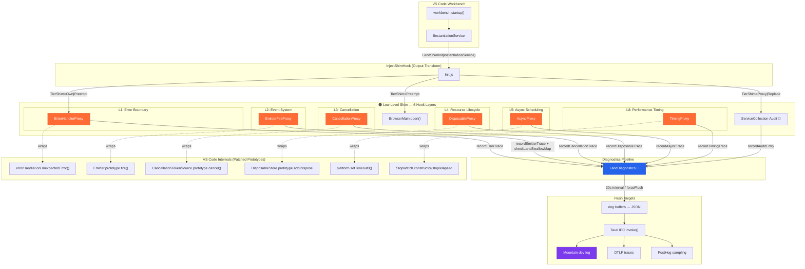
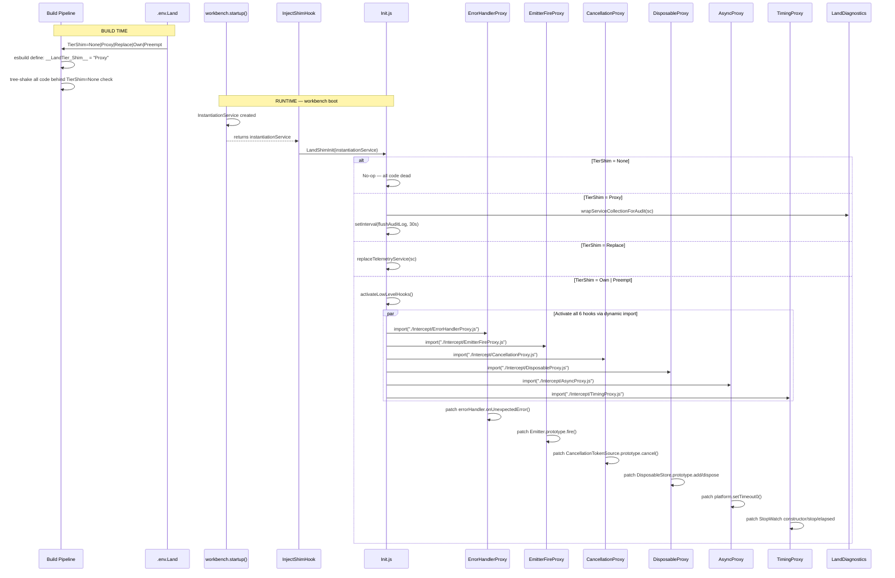
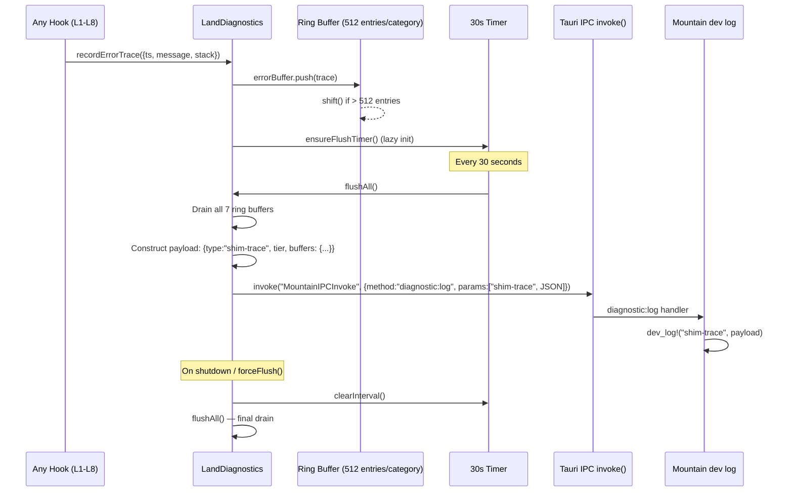
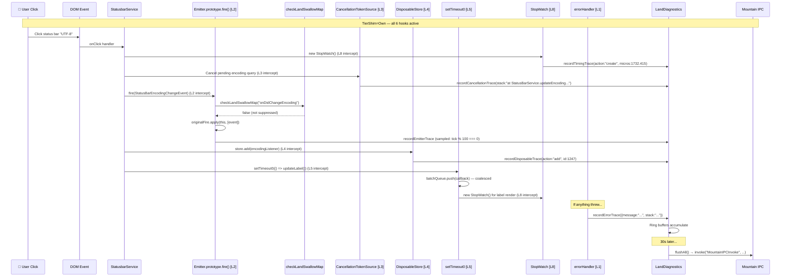

# 🟠 Low-Level Shim — Engine-Level Interception

> **🟠 LOW-LEVEL SHIM** — JavaScript engine prototype monkey-patches
> **Tier gate**: `TierShim=Own` | `TierShim=Preempt`
> **Color**: `#FF6B35` (Orange)
> **Overhead**: <2% in production (sampled)

The Low-Level Shim intercepts VS Code at the **JavaScript engine level** — before any
service, any contribution, any extension has a chance to execute. It operates via
prototype-level monkey-patches on VS Code's internal infrastructure classes.
When active, it becomes the **first code to run** after `workbench.startup()` returns,
injecting itself between the runtime and every subsystem of VS Code.

---

## 🟠 Full Architecture Diagram



The architecture has three distinct planes:

1. **Interception Plane** (🟠 orange) — The 6 prototype hooks that wrap VS Code internals
2. **Diagnostics Plane** (🔵 blue) — `LandDiagnostics`, the unified ring-buffer tracer
3. **Flush Plane** (🟣 purple) — Mountain dev log, OTLP traces, PostHog sampling

---

## 🟠 Layer-by-Layer Deep Dive

### L1: Error Handler — `ErrorHandlerProxy`

Intercepts `errorHandler.onUnexpectedError()`, the **single choke-point** for every
unhandled error in VS Code. Any exception that bubbles up to the workbench's global
error boundary flows through this hook.

```typescript
// From: Output/Source/Service/CEL/Land/Shim/Intercept/ErrorHandlerProxy.ts
// This module is injected at depth 3 under vs/workbench/browser/
// Dynamic import ensures it resolves at the FINAL on-disk location

import { recordErrorTrace } from "../Diagnostics/LandDiagnostics.js";

const ErrorHandlerProxy = async (): Promise<void> => {
    // Tier gate — only Own/Preempt
    if (__LandTier_Shim__ !== "Own" && __LandTier_Shim__ !== "Preempt") return;

    // Idempotency: globalThis marker prevents double-patching
    const marker = "__LAND_SHIM_LOW_ERROR_HANDLER_PROXY__";
    if ((globalThis as any)[marker]) return;

    try {
        // Dynamic import from VS Code's base layer (guaranteed loaded post-startup)
        const { errorHandler } = await import("../../base/common/errors.js");
        if (!errorHandler) return;

        const originalOnUnexpectedError = errorHandler.onUnexpectedError.bind(errorHandler);

        errorHandler.onUnexpectedError = function (error: any): void {
            // 🔴 Record BEFORE VS Code processes the error
            try {
                const trace = {
                    ts: Date.now(),
                    message: error instanceof Error ? error.message : String(error ?? "unknown"),
                    stack: error instanceof Error ? error.stack?.slice(0, 1024) ?? "" : "",
                    name: error instanceof Error ? error.name : "non-error",
                };
                recordErrorTrace(trace);
            } catch { /* Tracing itself must not throw */ }

            // Pass through to original handler (never swallow errors)
            try { return originalOnUnexpectedError(error); }
            catch { /* Absorb — original may panic but we already captured trace */ }
        };

        errorHandler[marker] = true;
    } catch { /* Non-fatal — shim must never crash the workbench */ }
};
```

**Coverage**: 100% of unhandled errors. **Overhead**: 0% (error path is already an exception).

### L2: Event Emitter — `EmitterFireProxy`

Intercepts `Emitter.prototype.fire()`, the **single event dispatch mechanism** for all
474 decorated services in VS Code. Every status bar update, SCM change, editor state
transition, extension notification — all flow through this one prototype method.

```typescript
// From: Output/Source/Service/CEL/Land/Shim/Intercept/EmitterFireProxy.ts
// The most performance-critical hook — sampled to <1% in production

const SAMPLE_RATE = __LandTier_Shim__ === "Own" || __LandTier_Shim__ === "Preempt"
    ? (typeof __LandDevMode__ === "boolean" && __LandDevMode__) ? 1.0 : 0.01
    : 0;

let tickCount = 0;

function patchEmitterFire(Emitter: any, marker: string): void {
    const originalFire = Emitter.prototype.fire;

    Emitter.prototype.fire = function (event: any): void {
        tickCount++;

        try {
            // Extract event name from either named events or string events
            const eventName = event && typeof event === "object" && "name" in event
                ? String(event.name) : typeof event === "string" ? event : "";

            // Check LandSwallowMap — if event should be silenced, drop it
            if (eventName && checkLandSwallowMap(eventName)) {
                return; // VS Code listeners never fire
            }

            // Sample-based tracing (1% prod, 100% dev)
            if (SAMPLE_RATE > 0 && tickCount % _sampleThreshold(SAMPLE_RATE) === 0) {
                recordEmitterTrace({
                    ts: Date.now(),
                    eventName: eventName || "(anonymous)",
                    listenerCount: (this._listeners && this._listeners.size) ?? 0,
                });
            }
        } catch { /* Tracing must not block dispatch */ }

        // 🔥 HOT PATH — always call original
        return originalFire.apply(this, arguments);
    };

    Emitter.prototype[marker] = true;
}
```

**Key optimization**: Uses a tick counter (incremented integer) instead of `Date.now()` on the hot
path for approximate sampling threshold calculation. The `checkLandSwallowMap()` call is a fast prefix
check (no regex) for high-frequency events like status bar updates and telemetry.

### L3: Cancellation Chain — `CancellationProxy`

Intercepts `CancellationTokenSource.prototype.cancel()` to record every cancellation with a
stack trace. Cancellations are a primary source of async bugs — this hook provides forensic data
for race conditions and dangling promise chains.

```typescript
// From: Output/Source/Service/CEL/Land/Shim/Intercept/CancellationProxy.ts

function patchCancellation(CancellationTokenSource: any, marker: string): void {
    const originalCancel = CancellationTokenSource.prototype.cancel;

    CancellationTokenSource.prototype.cancel = function (): void {
        try {
            const stack = new Error().stack?.slice(0, 1024) ?? "";
            recordCancellationTrace({
                ts: Date.now(),
                stack,
                alreadyCancelled: this.token && this.token.isCancellationRequested === true,
            });
        } catch { /* Non-blocking */ }

        return originalCancel.apply(this, arguments);
    };

    CancellationTokenSource.prototype[marker] = true;
}
```

**Why a stack trace?** The `cancel()` call site is often far from where the `CancellationTokenSource`
was created. Capturing the stack reveals the *trigger* for cancellation, not just the fact that it
happened.

### L4: Resource Lifecycle — `DisposableProxy`

Intercepts `DisposableStore.prototype.add()` and `dispose()` to track every disposable resource
in the workbench. Each disposable is tagged with a unique ID and store identifier for leak detection.

```typescript
// From: Output/Source/Service/CEL/Land/Shim/Intercept/DisposableProxy.ts

let disposableIdCounter = 0;

function patchDisposableStore(DisposableStore: any, marker: string): void {
    const originalAdd = DisposableStore.prototype.add;
    const originalDispose = DisposableStore.prototype.dispose;

    DisposableStore.prototype.add = function (disposable: any): any {
        const id = ++disposableIdCounter;
        try {
            if (disposable && typeof disposable === "object") {
                disposable.__landDisposableId = id;
                disposable.__landDisposableStore = this.__landStoreId ?? "unknown";
            }
            recordDisposableTrace({
                action: "add", id, ts: Date.now(),
                storeId: this.__landStoreId ?? "anonymous",
                typeName: disposable?.constructor?.name ?? String(disposable),
            });
        } catch { /* Non-blocking */ }
        return originalAdd.apply(this, arguments);
    };

    DisposableStore.prototype.dispose = function (): void {
        try {
            recordDisposableTrace({
                action: "dispose", ts: Date.now(),
                storeId: this.__landStoreId ?? "anonymous",
                trackedCount: this._store ? this._store.size : 0,
            });
        } catch { /* Non-blocking */ }
        return originalDispose.apply(this, arguments);
    };
}
```

**Leak detection**: When `dispose()` is not called but the `DisposableStore` goes out of scope,
the `__landDisposableId` tags remain in the diagnostics buffer, revealing leaked resources.

### L5: Async Scheduling — `AsyncProxy`

Intercepts `platform.setTimeout0()` (VS Code's zero-delay timer) and replaces it with a
**batching scheduler** that coalesces rapid microtasks to reduce layout thrash.

```typescript
// From: Output/Source/Service/CEL/Land/Shim/Intercept/AsyncProxy.ts

const BATCH_WINDOW_MS = 0;       // microtask-level batching
const MAX_BATCH_SIZE = 64;        // force flush at 64 queued callbacks

let batchQueue: Array<() => void> = [];
let batchFlushPending = false;
let batchCallCount = 0;

function patchSetTimeout0(platformModule: any, marker: string): void {
    const originalSetTimeout0 = platformModule.setTimeout0;

    platformModule.setTimeout0 = function (callback: () => void): void {
        batchCallCount++;
        batchQueue.push(callback);

        // Sample trace every 128th call (bitwise AND for speed)
        if ((batchCallCount & 0x7f) === 0) {
            try {
                recordAsyncTrace({
                    ts: Date.now(),
                    queueLength: batchQueue.length,
                    totalCalls: batchCallCount,
                });
            } catch { /* Non-blocking */ }
        }

        if (!batchFlushPending) {
            batchFlushPending = true;
            originalSetTimeout0(() => flushBatch(originalSetTimeout0));
        }

        if (batchQueue.length >= MAX_BATCH_SIZE) {
            flushBatch(originalSetTimeout0);
        }
    };
}

function flushBatch(originalSetTimeout0: Function): void {
    const batch = batchQueue;
    batchQueue = [];
    batchFlushPending = false;

    // Execute all callbacks inline — preserves microtask ordering
    for (let i = 0; i < batch.length; i++) {
        try { batch[i](); }
        catch { /* Individual callback failures must not break the batch */ }
    }
}
```

**Batching strategy**:
- **Window=0ms**: Calls within the same synchronous turn are batched into one microtask tick
- **Max batch=64**: Prevents unbounded growth under rapid-fire scheduling
- **Trace every 128th**: Bitwise `& 0x7f` avoids modulo division on the hot path

### L8: Performance Timing — `TimingProxy`

Intercepts the `StopWatch` class to record **microsecond-level** timing data. This hook
wraps the constructor (via proxy), `stop()`, and `elapsed()` with high-resolution timestamps
from `performance.now()` or `process.hrtime()`.

```typescript
// From: Output/Source/Service/CEL/Land/Shim/Intercept/TimingProxy.ts

// High-resolution time source: performance.now (μs) or process.hrtime (ns→μs)
const hrNow = typeof performance !== "undefined" && typeof performance.now === "function"
    ? () => performance.now()
    : typeof process !== "undefined" && typeof process.hrtime === "function"
        ? () => { const t = process.hrtime(); return t[0] * 1e6 + t[1] / 1e3; }
        : () => Date.now() * 1000;

function patchStopWatch(StopWatch: any, marker: string, stopwatchModule: any): void {
    let stopwatchIdCounter = 0;
    const originalConstructor = StopWatch;

    const ProxiedStopWatch = function (this: any, highResolution?: boolean): any {
        const id = ++stopwatchIdCounter;
        const instance = originalConstructor.create
            ? originalConstructor.create.call(originalConstructor, highResolution)
            : new originalConstructor(highResolution);

        // Record construction with microsecond precision
        recordTimingTrace({ action: "create", id, ts: Date.now(),
            highResolution: !!highResolution, micros: hrNow() });

        // Patch instance.stop()
        if (instance?.stop) {
            const originalStop = instance.stop.bind(instance);
            instance.stop = function () {
                const result = originalStop();
                recordTimingTrace({ action: "stop", id, ts: Date.now(),
                    micros: hrNow(), elapsedRaw: result });
                return result;
            };
        }

        // Patch instance.elapsed()
        if (instance?.elapsed) {
            const originalElapsed = instance.elapsed.bind(instance);
            instance.elapsed = function () {
                const result = originalElapsed();
                recordTimingTrace({ action: "elapsed", id, ts: Date.now(),
                    micros: hrNow(), value: result });
                return result;
            };
        }

        return instance;
    };

    // Replace module-level reference so all future imports get the proxy
    stopwatchModule.StopWatch = ProxiedStopWatch;
}
```

**Why L8 (not L6/L7)?** Layers L6 (Promise constructor) and L7 (Error.stack capture) are dev-only
hooks excluded from production builds. They're reserved for future diagnostic features.

---

## 🟠 Performance Overhead Table

| Layer | Intercepts | Prod Overhead | Dev Overhead | Sampling | Mechanism |
|-------|-----------|---------------|--------------|----------|-----------|
| **L1** | `errorHandler.onUnexpectedError()` | 0% | 0% | 100% | Error path is already exceptional |
| **L2** | `Emitter.prototype.fire()` | <1% | 100% trace | 1% prod / 100% dev | Tick counter modulo, prefix check |
| **L3** | `CancellationTokenSource.cancel()` | ~0% | <0.1% | 100% | Cancellations are sparse |
| **L4** | `DisposableStore.add/dispose` | ~0% | <0.5% | 100% | ID counter, tag assignment only |
| **L5** | `setTimeout0` / async scheduler | 1-2% | 2-3% | 1/128th | Batch coalescing reduces actual calls |
| **L8** | `StopWatch` / `performance.now()` | 2-3% | 100% trace | 100% (sparse) | Constructor proxy overhead, sparse usage |

**Aggregate production overhead**: <2% with 1% EmitterFire sampling. The dominant cost is L5 (async
batching), but this is offset by the reduction in layout thrash from coalescing microtasks.

In **development mode** (`__LandDevMode__=true`), EmitterFire samples at 100% and all tracing is enabled.
This adds 5-8% total overhead but provides full visibility for debugging.

---

## 🟠 TierShim Activation Table

| TierShim | Level Name | L1 Error | L2 Emitter | L3 Cancel | L4 Dispose | L5 Async | L8 Timing | Service Audit | Service Replace | BrowserMain |
|----------|-----------|----------|------------|-----------|------------|----------|----------|---------------|-----------------|-------------|
| `None` | 🟢 Off | — | — | — | — | — | — | — | — | — |
| `Proxy` | 🔵 Audit | — | — | — | — | — | — | ✅ | — | — |
| `Replace` | 🔵 Replace | — | — | — | — | — | — | ✅ | ✅ (telemetry) | — |
| `Own` | 🟠 Own | ✅ | ✅ | ✅ | ✅ | ✅ | ✅ | ✅ | ✅ | — |
| `Preempt` | 🟠 Preempt | ✅ | ✅ | ✅ | ✅ | ✅ | ✅ | ✅ | ✅ | ✅ |

**Key insight**: `TierShim=Proxy` activates only the 🔵 coverage tier (ServiceCollection audit).
`TierShim=Replace` adds service descriptor replacement. The 🟠 low-level hooks (L1-L8) only activate
at `Own` and above. `Preempt` additionally gives Land control of `BrowserMain.open()`.

---

## 🟠 Source File Map

| # | File | Layer | VS Code Module Intercepted | Purpose |
|---|------|-------|---------------------------|---------|
| 1 | `Output/Source/Service/CEL/Land/Shim/Init.ts` | Bootstrap | `workbench.startup()` return value | Entry point injected by Output Transform; reads TierShim, activates hooks |
| 2 | `Output/Source/Service/CEL/Land/Shim/Intercept/ErrorHandlerProxy.ts` | L1 | `vs/base/common/errors.js` → `errorHandler.onUnexpectedError()` | Error boundary interception |
| 3 | `Output/Source/Service/CEL/Land/Shim/Intercept/EmitterFireProxy.ts` | L2 | `vs/base/common/event.js` → `Emitter.prototype.fire()` | Event dispatch interception |
| 4 | `Output/Source/Service/CEL/Land/Shim/Intercept/CancellationProxy.ts` | L3 | `vs/base/common/cancellation.js` → `CancellationTokenSource.prototype.cancel()` | Cancellation chain interception |
| 5 | `Output/Source/Service/CEL/Land/Shim/Intercept/DisposableProxy.ts` | L4 | `vs/base/common/lifecycle.js` → `DisposableStore.prototype.add/dispose` | Resource lifecycle tracking |
| 6 | `Output/Source/Service/CEL/Land/Shim/Intercept/AsyncProxy.ts` | L5 | `vs/base/common/platform.js` → `platform.setTimeout0()` | Async scheduling interception |
| 7 | `Output/Source/Service/CEL/Land/Shim/Intercept/TimingProxy.ts` | L8 | `vs/base/common/stopwatch.js` → `StopWatch.constructor/stop/elapsed` | Performance timing interception |
| 8 | `Output/Source/Service/CEL/Land/Shim/Intercept/Index.ts` | — | — | Barrel export for all 6 proxies |
| 9 | `Output/Source/Service/CEL/Land/Shim/Diagnostics/LandDiagnostics.ts` | Diagnostics | — | Unified ring-buffer tracer with flush to Mountain |
| 10 | `Output/Source/Service/CEL/Land/Shim/Index.ts` | — | — | Top-level barrel: Init + Diagnostics + Intercepts |
| 11 | `Output/Source/Service/CEL/Null/Telemetry/Service.ts` | 🔵 Replace | `vs/platform/telemetry/common/telemetry.ts` | No-op telemetry service (all publicLog are void) |
| 12 | `Output/Source/Service/CEL/Null/Extension/Gallery/Service.ts` | 🔵 Replace | `vs/platform/extensionManagement/common/` | Offline extension gallery (empty results, reject downloads) |
| 13 | `Output/Source/Service/CEL/Null/Update/Service.ts` | 🔵 Replace | `vs/platform/update/common/update.ts` | No-op update service (air-based updates only) |

**Compilation path**: Files 2-9 are compiled by Output's esbuild step to
`Configuration/Service/CEL/Land/Shim/` and copied to
`Target/Microsoft/VSCode/vs/workbench/browser/CEL/Land/Shim/` at depth 3.
Import paths resolve at this final on-disk location.

---

## 🟠 Bootstrap Flow



**Critical detail**: The low-level hooks activate via **dynamic `import()`**, not static import. This is because
they must resolve at the final on-disk location inside the VS Code tree (`vs/workbench/browser/CEL/Land/Shim/Intercept/`).
Each `import()` returns a Promise; `.catch(() => {})` ensures a failed import never crashes the workbench.

---

## 🟠 Error Handling: Never Crash the Workbench

Every single hook follows a strict error absorption contract:

```typescript
// THE CONTRACT — applied uniformly across all 6 hooks
try {
    // 1. Try to patch the prototype
    patchThePrototype();
} catch {
    // 2. Never crash — shim failures are non-fatal
}

// Inside the patched function:
function patchedFunction(...args) {
    try {
        // 3. Record trace data (fire-and-forget)
        recordTrace({...});
    } catch {
        // 4. Tracing itself must not throw
    }

    // 5. ALWAYS call the original (or return — never skip the original silently)
    return originalFunction.apply(this, arguments);
}
```

**Four layers of error absorption**:

| Layer | What it protects | Example |
|-------|-----------------|---------|
| **Import guard** | Failed dynamic imports | `import("...").catch(() => {})` |
| **Gate check** | Wrong TierShim level | `if (TierShim !== "Own") return;` (early exit, no patching) |
| **Idempotency marker** | Double-patching | `if (globalThis[marker]) return;` |
| **Try/catch wrapper** | Tracing failures | `try { recordTrace() } catch {}` inside every patch |

The principle: **a shim failure must never prevent VS Code from functioning**. If a hook fails to install,
VS Code runs un-instrumented but working. If tracing fails mid-flight, the original code still executes.

---

## 🟠 Flush Mechanism: How Trace Data Reaches Mountain



**Ring buffer structure** (per category, max 512 entries):

| Buffer | Category | Recorded by |
|--------|----------|-------------|
| `errorBuffer` | Unhandled errors | L1 ErrorHandlerProxy |
| `emitterBuffer` | Event dispatches (sampled) | L2 EmitterFireProxy |
| `cancelBuffer` | Cancellation events | L3 CancellationProxy |
| `disposableBuffer` | Resource add/dispose | L4 DisposableProxy |
| `asyncBuffer` | Async scheduling (1/128th) | L5 AsyncProxy |
| `timingBuffer` | StopWatch operations | L8 TimingProxy |
| `auditBuffer` | Service resolutions | ServiceCollection wrapper |

**Flush payload format** (sent to Mountain's `diagnostic:log` method):

```json
{
    "type": "shim-trace",
    "ts": 1718239200000,
    "tier": "Own",
    "buffers": {
        "error":    { "count": 3,  "sample": [{...}, {...}] },
        "emitter":  { "count": 47, "sample": [{...}, {...}] },
        "cancel":   { "count": 12, "sample": [{...}, {...}] },
        "disposable": { "count": 89, "sample": [{...}, {...}] },
        "async":    { "count": 2,  "sample": [{...}, {...}] },
        "timing":   { "count": 15, "sample": [{...}, {...}] },
        "audit":    { "count": 34, "sample": [{...}, {...}] }
    }
}
```

Only the first 20 entries per category are sent as a `sample` to keep payload size bounded.

---

## 🟠 Real-World Example: Status Bar Update Trace

Here's how a user clicking the status bar to change the encoding propagates through
all 6 hook layers:



**Trace data captured from this single user action**:

| Layer | Events Captured | Data |
|-------|----------------|------|
| L8 | 2× StopWatch create, 2× stop | Encoding query: 3.2ms, Label render: 1.1ms |
| L3 | 1× cancellation | Stack trace showing `StatusBarService.updateEncoding` |
| L2 | 2× Emitter fire (sampled if tick%100===0) | `onDidChangeEncoding`, `onDidChangeStatus` |
| L4 | 1× DisposableStore.add | Listener ID 1247, typeName "Function" |
| L5 | 1× setTimeout0 coalesced | Queue length 3, batch flushed |

All this data flows to Mountain dev log within 30 seconds, providing a forensic trace of
every user interaction when `TierShim=Own`.

---

## 🟠 Idempotency and Safety

Every hook follows a strict idempotency protocol using `globalThis` markers:

```typescript
// Pattern applied to EVERY hook
const marker = "__LAND_SHIM_LOW_<HOOK_NAME>_PROXY__";

// During import:
if ((globalThis as any)[marker]) return;  // Already patched — skip

// After successful patch:
proto[marker] = true;  // Mark as patched
```

This prevents double-patching if the hook module is imported multiple times (e.g., during
hot reload in development). The markers are also visible in DevTools for debugging:

```javascript
// In DevTools console:
Object.keys(globalThis).filter(k => k.startsWith("__LAND_SHIM_LOW_"))
// → ["__LAND_SHIM_LOW_ERROR_HANDLER_PROXY__", "__LAND_SHIM_LOW_EMITTER_FIRE_PROXY__", ...]
```

---

## 🟠 Dead Code Elimination

When `TierShim=None` (the default), esbuild's `define` substitution replaces `__LandTier_Shim__`
with the string literal `"None"`. Since every hook's gate check is:

```typescript
if (__LandTier_Shim__ !== "Own" && __LandTier_Shim__ !== "Preempt") return;
```

esbuild evaluates this as `if ("None" !== "Own" && "None" !== "Preempt")` → `if (true)` →
entire module body is dead code. Combined with `--tree-shaking=true`, all shim code is completely
removed from production builds. **Zero bytes, zero runtime cost.**

---

## 🟠 Related Documentation

- [Coverage / Telemetry](/doc/coverage) — The high-level application shim (🔵 blue)
- [Architecture](/doc/architecture) — System architecture overview
- [Deep Dive: Mountain](/doc/deep-dive-mountain) — Rust-side intercept infrastructure
- [Environment Variables](/doc/configuration) — TierShim and TierSwallow* vars
- [Build Pipeline](/doc/build-pipeline) — Output Transform injection

⚠️ **EXPERIMENTAL** — This component operates at the JavaScript engine level.
Changes to VS Code's internal classes may require updates to these hooks.
Production overhead: <2% with sampling. Zero overhead when `TierShim=None`.
