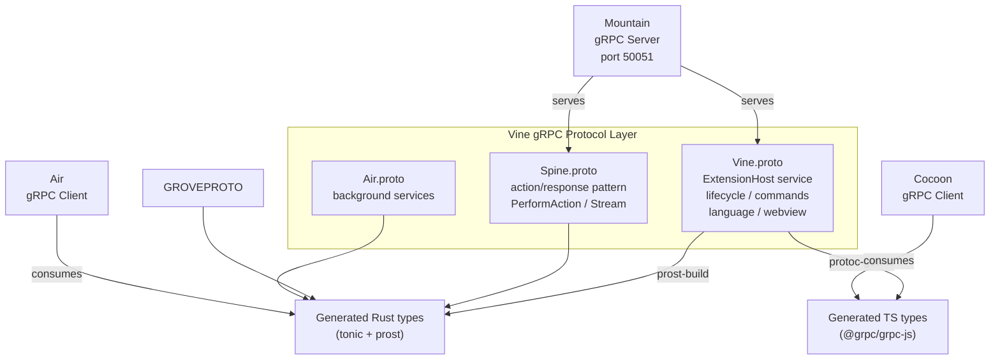
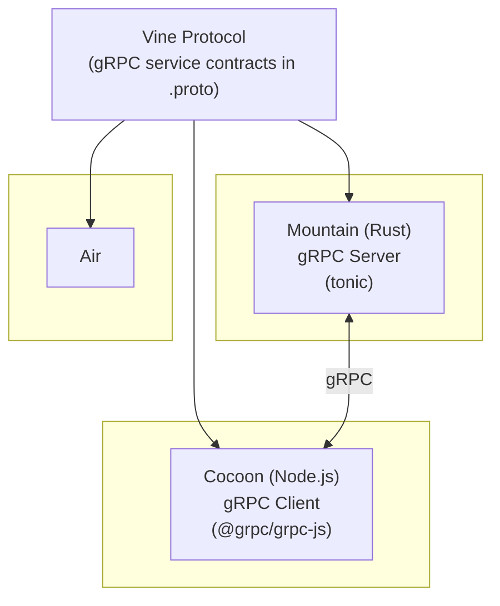

Vine is the gRPC protocol definition and communication specification for the
Land project. It defines the strongly-typed IPC layer used for communication
between:

- **Mountain** (Rust backend) - gRPC server
- **Cocoon** (Node.js extension host) - gRPC client
- **Air** (background daemon) - gRPC client



## Why a Typed Protocol

Tauri's IPC is untyped. A call to `invoke('open-file', { path })` has no
enforced contract on either side. Renaming a field, changing an argument type,
or removing a handler produces a silent runtime failure rather than a build
error.

Vine defines every inter-process call as a `.proto` service method with typed
request and response messages. The generated Rust stubs (via `tonic`) and
TypeScript stubs (via `@grpc/proto-loader`) are the only way Mountain and Cocoon
communicate. If a message field is renamed or removed, the Rust build and the
TypeScript build each fail independently at their own compile step. Neither side
can silently drift from the schema.

## Architecture

Vine is the protocol layer that enables all inter-component communication:



## Protocol Files

| File          | Location                             | Defines                              |
| ------------- | ------------------------------------ | ------------------------------------ |
| `Vine.proto`  | `Element/Mountain/Proto/Vine.proto`  | Core Mountain↔Cocoon gRPC services   |
| `Spine.proto` | `Element/Mountain/Proto/Spine.proto` | Extension host coordination protocol |
| `Air.proto`   | (in-source in Air Element)           | Mountain↔Air background services     |

The working proto definitions and gRPC server code currently reside inside
Mountain's own `Source/Vine/` directory. The standalone
[Vine repository](https://github.com/CodeEditorLand/Vine) is the future home for
these schemas as a published, independently versioned package once the protocol
stabilises.

## Protocol Schema Family

Vine is the umbrella name for a family of proto files:

| Schema        | Server port | Direction                             | Purpose                                                                                                |
| ------------- | ----------- | ------------------------------------- | ------------------------------------------------------------------------------------------------------ |
| `Vine.proto`  | 50051       | Cocoon → Mountain (`MountainService`) | Core Mountain↔Cocoon communication: file system, terminal, language features, extension host lifecycle |
| `Vine.proto`  | 50052       | Mountain → Cocoon (`CocoonService`)   | Core Mountain↔Cocoon communication: language provider dispatch, notifications, inline completions      |
| `Spine.proto` | 50052       | Mountain → Cocoon                     | Extension host coordination - action/response pattern for command execution                            |
| `Air.proto`   | 50053       | Mountain → Air                        | Mountain↔Air background daemon services                                                                |

> [!NOTE] `NetworkMountainPort` (default 50051) is Mountain's gRPC listen
> port. `NetworkCocoonPort` (default 50052) is Cocoon's gRPC listen port. Both
> are overridable to support parallel development sessions on the same machine.

## Service Definitions

### MountainService: Cocoon → Mountain

`MountainService` is implemented by Mountain's gRPC server. Cocoon calls these
RPCs when extensions need native capabilities.

| RPC                      | Direction         | Purpose                                |
| ------------------------ | ----------------- | -------------------------------------- |
| `ProcessCocoonRequest`   | Cocoon → Mountain | Generic request-response               |
| `SendCocoonNotification` | Cocoon → Mountain | Fire-and-forget event                  |
| `CancelOperation`        | Cocoon → Mountain | Cancel an in-flight request            |
| `OpenChannelFromCocoon`  | Cocoon → Mountain | LAND-PATCH B7-S6 P2 multiplexed stream |

### CocoonService: Mountain → Cocoon

`CocoonService` is implemented by Cocoon's gRPC server. Mountain calls these
RPCs to drive the extension host.

| RPC                                    | Direction         | Purpose                                             |
| -------------------------------------- | ----------------- | --------------------------------------------------- |
| `ProcessMountainRequest`               | Mountain → Cocoon | Generic request-response                            |
| `SendMountainNotification`             | Mountain → Cocoon | Fire-and-forget notification                        |
| `CancelOperation`                      | Mountain → Cocoon | Cancel an in-flight request                         |
| `OpenChannelFromMountain`              | Mountain → Cocoon | LAND-PATCH B7-S6 P2 multiplexed stream              |
| `InitialHandshake`                     | Mountain → Cocoon | Handshake sent after gRPC connection established    |
| `InitExtensionHost`                    | Mountain → Cocoon | Send workspace / extensions / config at startup     |
| `RegisterCommand`                      | Mountain → Cocoon | Register a VS Code command contributed by extension |
| `ExecuteContributedCommand`            | Mountain → Cocoon | Execute a command registered by an extension        |
| `UnregisterCommand`                    | Mountain → Cocoon | Unregister a previously registered command          |
| `RegisterHoverProvider`                | Mountain → Cocoon | Register a hover information provider               |
| `ProvideHover`                         | Mountain → Cocoon | Request hover from a registered provider            |
| `RegisterCompletionItemProvider`       | Mountain → Cocoon | Register a completion item provider                 |
| `ProvideCompletionItems`               | Mountain → Cocoon | Request completion items from a registered provider |
| `RegisterDefinitionProvider`           | Mountain → Cocoon | Register a definition provider                      |
| `ProvideDefinition`                    | Mountain → Cocoon | Request definition location                         |
| `RegisterReferenceProvider`            | Mountain → Cocoon | Register a reference provider                       |
| `ProvideReferences`                    | Mountain → Cocoon | Request reference locations                         |
| `RegisterCodeActionsProvider`          | Mountain → Cocoon | Register a code actions provider                    |
| `ProvideCodeActions`                   | Mountain → Cocoon | Request code actions                                |
| `RegisterDocumentHighlightProvider`    | Mountain → Cocoon | Register a document highlight provider              |
| `ProvideDocumentHighlights`            | Mountain → Cocoon | Request document highlights                         |
| `RegisterDocumentSymbolProvider`       | Mountain → Cocoon | Register a document symbol provider                 |
| `ProvideDocumentSymbols`               | Mountain → Cocoon | Request document symbols                            |
| `RegisterWorkspaceSymbolProvider`      | Mountain → Cocoon | Register a workspace symbol provider                |
| `ProvideWorkspaceSymbols`              | Mountain → Cocoon | Request workspace-wide symbols                      |
| `RegisterInlineCompletionItemProvider` | Mountain → Cocoon | Register an inline completion provider              |
| `ProvideInlineCompletionItems`         | Mountain → Cocoon | Request inline completion items                     |

### Spine Service: Cocoon → Mountain

The `Spine.proto` defines the extension host coordination protocol:

| RPC             | Direction         | Purpose                          |
| --------------- | ----------------- | -------------------------------- |
| `PerformAction` | Cocoon → Mountain | Execute an ActionEffect natively |
| `CancelAction`  | Cocoon → Mountain | Cancel an in-flight action       |
| `StreamActions` | Cocoon → Mountain | Open action streaming channel    |

Streaming (`OpenChannelFromMountain` / `OpenChannelFromCocoon`) replaces the
older unary path for any caller that needs concurrent dispatch. Unary RPCs are
preserved for backward compatibility.

## Message Types

### Initialize

```protobuf
message InitRequest {
    string workspace_path = 1;
    string app_root = 2;
    repeated ExtensionManifest extensions = 3;
    Configuration configuration = 4;
    map<string, string> environment = 5;
    string commit_hash = 6;
    ProductInfo product = 7;
}

message ProductInfo {
    string name = 1;
    string version = 2;
    string commit = 3;
    string quality = 4;
}
```

### Commands

```protobuf
message CommandRequest {
    string command_id = 1;
    repeated bytes args = 2;       // Serialized arguments
    string caller_id = 3;
}

message CommandResponse {
    bytes result = 1;             // Serialized result
    bool success = 2;
    string error = 3;
}
```

### Language Features

```protobuf
message HoverRequest {
    string document_uri = 1;
    uint32 line = 2;
    uint32 column = 3;
}

message HoverResponse {
    string markup_content = 1;    // Markdown string
    uint32 range_start_line = 2;
    uint32 range_start_column = 3;
    uint32 range_end_line = 4;
    uint32 range_end_column = 5;
}
```

### Common Message Types

Shared types used across multiple RPCs:

| Message               | Fields                                             | Used In                                          |
| --------------------- | -------------------------------------------------- | ------------------------------------------------ |
| `Uri`                 | `scheme`, `authority`, `path`, `query`, `fragment` | All file and document RPCs                       |
| `Position`            | `line` (0-based), `character` (0-based)            | Language feature RPCs                            |
| `Range`               | `start: Position`, `end: Position`                 | Language feature RPCs                            |
| `GenericRequest`      | `method`, `params` (JSON bytes)                    | `ProcessCocoonRequest`, `ProcessMountainRequest` |
| `GenericNotification` | `method`, `params` (JSON bytes)                    | Fire-and-forget notifications                    |
| `Envelope`            | `id`, `payload`                                    | Bidirectional streaming multiplexing             |

## Transport

Both Mountain and Cocoon run gRPC servers and both act as gRPC clients - the
protocol is fully bidirectional. Mountain hosts `MountainService` for Cocoon to
call; Cocoon hosts `CocoonService` for Mountain to call.

Both sockets are strictly local. The connection uses TCP loopback with no
external network traffic. `NetworkMountainPort` overrides Mountain's listen port
(default 50051); `NetworkCocoonPort` overrides Cocoon's listen port (default
50052); `NetworkAirPort` overrides the Air port (default 50053).

## Port Allocation

| Service       | Port  | Transport    | Components                         |
| ------------- | ----- | ------------ | ---------------------------------- |
| Mountain Vine | 50051 | TCP loopback | Mountain (server), Cocoon (client) |
| Cocoon Vine   | 50052 | TCP loopback | Cocoon (server), Mountain (client) |
| Air Vine      | 50053 | TCP loopback | Air (server)                       |

Ports can be overridden via environment variables:

- `NetworkMountainPort` (default: 50051)
- `NetworkCocoonPort` (default: 50052)
- `NetworkAirPort` (default: 50053)

## Client Implementation

Cocoon's gRPC client (`Cocoon/Source/Services/Mountain/gRPC/Client.ts`) uses
`@grpc/grpc-js`:

```typescript
import * as grpc from "@grpc/grpc-js";

import { ExtensionHostClient } from "./generated/vine";

const client = new ExtensionHostClient(
	`127.0.0.1:${config.networkMountainPort}`,
	grpc.credentials.createInsecure(),
);

// Execute command via gRPC
const response = await new Promise<CommandResponse>((resolve, reject) => {
	client.executeCommand(
		{ commandId, args: serializedArgs, callerId },
		(error, response) => {
			if (error) reject(error);
			else resolve(response);
		},
	);
});
```

## Server Implementation

Mountain's gRPC server (`Mountain/Source/Vine/Server/`) uses `tonic`:

```rust
use tonic::{Request, Response, Status};
use editor::land::vine::{
    extension_host_server::{ExtensionHost, ExtensionHostServer},
    CommandRequest, CommandResponse,
};

#[tonic::async_trait]
impl ExtensionHost for VineServiceImpl {
    async fn execute_command(
        &self,
        request: Request<CommandRequest>,
    ) -> Result<Response<CommandResponse>, Status> {
        let cmd = request.into_inner();
        let result = self.command_executor
            .execute(&cmd.command_id, cmd.args)
            .await
            .map_err(|e| Status::internal(e.to_string()))?;
        Ok(Response::new(CommandResponse {
            result: result.into(),
            success: true,
            error: String::new(),
        }))
    }
}
```

## Code Generation

### Rust (compile-time via build.rs)

Mountain's `build.rs` compiles the proto files at build time using `tonic-build`:

```rust
// Mountain/build.rs
fn main() {
    tonic_build::configure()
        .compile(&["Proto/Vine.proto", "Proto/Spine.proto"], &["Proto"])
        .expect("Failed to compile protos");
}
```

The generated types live in Mountain's `Source/Vine/Generated/` directory and
are not checked in - they are produced on every build.

### TypeScript (pre-generated via protoc-gen-ts)

TypeScript stubs are generated via `protoc-gen-ts` and committed to the Cocoon
source tree under `Source/Generated/`. This means Cocoon does not require
`protoc` at runtime; the generated files are part of the checked-in source.

```sh
protoc \
    --ts_out=Element/Cocoon/Source/Generated/ \
    --ts_opt=target=node \
    --proto_path=Element/Mountain/Proto/ \
    Element/Mountain/Proto/Vine.proto
```

Cocoon's gRPC client loads these generated types via `@grpc/grpc-js` at startup.

## Development Status

| Feature                                               | Status      |
| ----------------------------------------------------- | ----------- |
| `Vine.proto` - Mountain↔Cocoon gRPC (in Mountain)     | Active      |
| `Spine.proto` - extension host coordination           | Specified   |
| `Air.proto` - background daemon services              | Active      |
| Standalone Vine package (published `.proto` files)    | In progress |
| Transport agnosticism - WASM host functions for Grove | Planned     |

## What Is Not Yet Covered

The schema does not yet include service definitions for `vscode.lm.*`,
`vscode.chat.*`, `vscode.notebook.*`, or `vscode.tests.*`. Those APIs are not
yet implemented in Cocoon, so no Vine service definitions exist for them. The
`vscode.tasks.*` task resolver is partially implemented; the corresponding
service methods are being completed.

## Related Documentation

- [Mountain](https://github.com/CodeEditorLand/Mountain/tree/Current/Documentation/GitHub/Architecture.md) -
  gRPC server implementation
- [Cocoon](https://github.com/CodeEditorLand/Cocoon/tree/Current/Documentation/GitHub/Architecture.md) -
  gRPC client implementation
- [Air](https://github.com/CodeEditorLand/Air/tree/Current/Documentation/GitHub/Architecture.md) -
  Background daemon (gRPC consumer)
- [Grove](https://github.com/CodeEditorLand/Grove/tree/Current/Documentation/GitHub/Architecture.md) -
  WASM host (gRPC consumer)
- [InterComponentProtocol](https://github.com/CodeEditorLand/Land/tree/Current/Documentation/GitHub/InterComponentProtocol.md) -
  Full protocol specification
- [Vine Deep Dive](/Doc/deep-dive-vine)
- [Source Code](https://github.com/CodeEditorLand/Vine)

---

**Project Maintainers:** Source Open
([Source/Open@editor.land](mailto:Source/Open@editor.land)) |
[GitHub Repository](https://github.com/CodeEditorLand/Vine) |
[Report an Issue](https://github.com/CodeEditorLand/Vine/issues)
