## Workflow Example: Executing a Command from the Command Palette ⌨️

**Goal:** The user opens the Command Palette (`Ctrl+Shift+P`), types the name of
a command (e.g., "Format Document"), and selects it. The corresponding action is
executed. This workflow covers both a native command and an extension-provided
command.

The command palette is a thin UI over Mountain's `CommandRegistry`. Every
command - whether implemented in Rust or contributed by an extension in
Cocoon - is registered in that single registry. Wind fetches the list via Tauri
IPC, the user selects an entry, and Mountain routes execution either to a native
Rust function pointer or to Cocoon via gRPC, depending on the handler type
stored at registration time.

```mermaid
flowchart LR
    subgraph OpenPalette["Phase 1: Opening Command Palette"]
        UserKeybind([User presses<br/>Ctrl+Shift+P]) --> Dispatch["Dispatch<br/>workbench.action.showCommands"]
        Dispatch --> InvokeQuickInput["QuickInputService.quickAccess.show()"]
        InvokeQuickInput --> CommandsProvider["CommandsQuickAccessProvider"]
    end

    subgraph FetchCommands["Phase 2: Fetching Command List"]
        CommandsProvider --> GetAllCommands["TauriInvoke<br/>mountain://command/get-all"]
        GetAllCommands --> Track1["Track Dispatcher"]
        Track1 --> Effect1["Common::command::GetAllCommands<br/>Effect"]
        Effect1 --> CommandProviderGetAll
    end

    subgraph GetAll["GetAllCommands Execution"]
        CommandProviderGetAll["Mountain<br/>CommandProvider.GetAllCommands()"] --> LockRegistry["Acquire lock on<br/>CommandRegistry"]
        LockRegistry --> GetKeys["Get command ID keys<br/>from HashMap"]
        GetKeys --> ReturnIds["Return command ID list"]
    end

    ReturnIds --> DisplayList

    subgraph DisplaySelect["Phase 3: Displaying & Selecting"]
        DisplayList["Populate Quick Pick UI<br/>with command list"] --> UserSelect([User types & selects<br/>command])
        UserSelect --> ExecuteService["ICommandService.executeCommand()"]
    end

    ExecuteService --> NativeCheck{Native or<br/>Extension?}

    subgraph NativeFlow["Phase 4A: Native Command Execution"]
        NativeCheck -->|Native| NativeInvoke["TauriInvoke<br/>mountain://command/execute"]
        NativeInvoke --> Track2["Track Dispatcher"]
        Track2 --> Effect2["Common::command::ExecuteCommand<br/>Effect"]
        Effect2 --> LookupNative["Lookup command in<br/>CommandRegistry"]
        LookupNative --> NativeHandler["Invoke native Rust<br/>function pointer"]
        NativeHandler --> NativeResult["Execute command logic"]
        NativeResult --> ReturnNative["Return result"]
    end

    subgraph ExtensionFlow["Phase 4B: Extension Command Execution"]
        NativeCheck -->|Extension| ExtensionCmd["TauriInvoke<br/>mountain://command/execute"]
        ExtensionCmd --> Track3["Track Dispatcher"]
        Track3 --> Effect3["Common::command::ExecuteCommand<br/>Effect"]
        Effect3 --> LookupExt["Lookup Proxied handler<br/>in CommandRegistry"]
        LookupExt --> ProxyRequest["IpcProvider makes<br/>$executeContributedCommand<br/>gRPC request"]
        ProxyRequest --> CocoonRPC["Cocoon gRPC Server"]
        CocoonRPC --> LookupProvider["Lookup command in<br/>Cocoon registry"]
        LookupProvider --> ExecuteExt["Execute extension's<br/>JavaScript function"]
        ExecuteExt --> ReturnExt["Return result to Mountain"]
        ReturnExt --> ForwardToWind["Forward result to Wind"]
    end
```



---

## Phase 1 - Opening the Command Palette (Sky → Wind)

**Source files:**

- `Wind/Source/Application/QuickInput/Definition.ts`
- `vs/workbench/contrib/quickaccess/browser/commandsQuickAccess.ts`

1. **User Input** - The user presses `Ctrl+Shift+P`. The keybinding system
   dispatches the `workbench.action.showCommands` command.

2. **`QuickInputService`** - The handler for `showCommands` invokes
   `quickInputService.quickAccess.show()`, which opens the Quick Pick UI
   configured for showing commands. Delegates population to
   `CommandsQuickAccessProvider`.

3. **`CommandsQuickAccessProvider`** needs the full command list. Since this
   provider lives in Wind but the registry lives in Mountain, it makes an
   Integration-layer call. It executes an Effect that wraps:

    ```ts
    TauriInvoke("mountain://command/get-all");
    ```

## Phase 2 - Fetching the Command List (Mountain)

**Source files:**

- [`track.rs`](https://github.com/CodeEditorLand/Mountain/tree/Current/Source/Track/mod.rs)
- [`CommandProvider.rs`](https://github.com/CodeEditorLand/Mountain/tree/Current/Source/Environment/CommandProvider.rs)

4. **Track Dispatch** - The Tauri command is dispatched to Mountain's `track`
   module, which creates the `Common::command::GetAllCommands` Effect. The
   `AppRuntime` executes the Effect, calling
   `MountainEnvironment`'s `CommandExecutor::GetAllCommands` implementation,
   which delegates to the handler.

5. **`CommandProvider.GetAllCommands()`** (
   [`CommandProvider.rs:L322`](https://github.com/CodeEditorLand/Mountain/tree/Current/Source/Environment/CommandProvider.rs#L322))
    - Acquires a read lock on `AppState.CommandRegistry`, retrieves the `keys()`
      of the `HashMap` (containing IDs of all registered native commands AND all
      proxied commands from Cocoon), and returns the list of command ID strings.

6. **List Resolution** - The list resolves back to
   `CommandsQuickAccessProvider` in Wind, which populates the Quick Pick UI,
   making the commands visible to the user.

## Phase 3 - User Selection (Sky)

7. The user types a query (e.g. "Format Document") and presses Enter. The Quick
   Pick widget registers that the command `editor.action.formatDocument` has been
   selected, and calls:

    ```ts
    ICommandService.executeCommand("editor.action.formatDocument");
    ```

## Phase 4A - Native Command Execution (Wind → Mountain)

8. **`CommandService` (Wind)** - Since Wind's `CommandService` is a thin client,
   it immediately forwards the request to the backend by creating and running an
   Effect that wraps:

    ```ts
    TauriInvoke("mountain://command/execute", {
    	commandId: "editor.action.formatDocument",
    	args: [],
    });
    ```

    Arguments are serialized as a JSON array matching the command's parameter
    signature. For commands accepting primitive types, objects, or even editor
    references (resolved by Wind before dispatch), each argument is encoded as a
    JSON value. Complex types like `TextEditor` or `Uri` are serialized to their
    identifier form (`{ $mid: 1, path: "/..." }` for `Uri`, or the editor ID for
    `TextEditor`) and reconstituted on the Mountain side before being passed to
    the native handler.

9. **Track Dispatch (Mountain)** - The request is dispatched to `track`,
   creating the `Common::command::ExecuteCommand` Effect. The `AppRuntime`
   executes it, calling
   `MountainEnvironment`'s `CommandExecutor::ExecuteCommand`.

10. **`CommandProvider.ExecuteCommand()`** (
    [`CommandProvider.rs:L231`](https://github.com/CodeEditorLand/Mountain/tree/Current/Source/Environment/CommandProvider.rs#L231))
    - Acquires a lock on `AppState.CommandRegistry` and looks up
      `"editor.action.formatDocument"`. It finds that the handler is of type
      `CommandHandler::Native`, then invokes the corresponding native Rust function
      pointer, passing it the `AppHandle`, `Window`, `AppRuntime`, and arguments.

11. **Native Formatting Handler** - The native Rust code for formatting a
    document runs. This typically involves:
    - Getting the active document's content from `AppState`.
    - Finding a registered formatting provider in `AppState` (which may itself
      be proxied to Cocoon for extension-backed formatters).
    - Requesting edits from the provider.
    - Applying the edits via the `WorkspaceEditApplier`.
    - Returning the command result (if any) up the call chain.

## Phase 4B - Extension Command Execution (Wind → Mountain → Cocoon)

Steps 8 and 9 are identical to Phase 4A. The difference is in what Mountain
finds at step 10.

10. **`handlers/commands/CommandsLogic.rs` (Mountain)** - `ExecuteCommandLogic`
    looks up `"my-extension.doSomething"`. It finds the handler is of type:

    ```rust
    CommandHandler::Proxied {
        SidecarIdentifier: "cocoon-main",
        CommandIdentifier: "my-extension.doSomething",
    }
    ```

11. **`IpcProvider` (Mountain)** - The handler knows it must proxy the request.
    It uses the `IpcProvider` capability from the `MountainEnvironment` and sends
    a **`$executeContributedCommand` gRPC request to Cocoon**, carrying the
    command ID and its arguments. The arguments are serialized using the same
    JSON encoding used in Phase 4A, then deserialized by Cocoon before invoking
    the JavaScript handler.

12. **Cocoon Command Resolution** - Cocoon's gRPC server receives the request
    and dispatches it to the `CommandsProvider`. The `CommandsProvider` looks up
    `"my-extension.doSomething"` in its own local registry and executes the
    extension's JavaScript handler function with the deserialized arguments.

13. **Result Propagation** - The extension's command finishes and returns a
    result (e.g. a string, number, or object). This result is serialized and
    sent back to Mountain as the gRPC response. Mountain receives the response
    and forwards it back to Wind as the resolution of the `TauriInvoke` promise.
    The command execution is complete.

> [!IMPORTANT] Extension commands are registered in Mountain's `CommandRegistry`
> as proxied entries during extension activation - Cocoon sends a
> `$registerExtensionCommand` gRPC call for each
> `vscode.commands.registerCommand` invocation. Mountain never needs to know a
> command's implementation language; the `CommandHandler` enum value determines
> the dispatch path at execution time.

---

## registerTextEditorCommand

`vscode.commands.registerTextEditorCommand(id, callback)` wraps the callback so
it always receives `(textEditor, editBuilder, ...args)` with live objects:

- `textEditor` is the active `TextEditor` proxy, including `.edit()`,
  `.setDecorations()`, and `.revealRange()`.
- `editBuilder` is a real `TextEditorEdit` buffer tied to the active Monaco
  model. Edits collected via `builder.replace()`, `builder.insert()`, or
  `builder.delete()` are applied atomically when the callback returns. If the
  callback is async (returns a `Promise`), the builder waits for resolution
  before flushing.

When no editor is active, a no-op builder is passed so the extension's pre-edit
setup still runs without throwing.

## onDidExecuteCommand

Mountain emits `sky://commands/executed` to the Sky renderer after every command
dispatch, and simultaneously sends `$acceptCommandExecuted` over the Vine gRPC
channel to Cocoon. `Notification/Handler.ts` in Cocoon catches the Vine
notification and re-emits it on the shared `Emitter` channel `commands.executed`.
The `onDidExecuteCommand` subscription in `Commands/Namespace.ts` listens on
that channel, so extensions receive the event for both native and
extension-contributed commands. Local (Cocoon-to-Cocoon) `executeCommand` calls
also emit on `commands.executed` directly, ensuring extension-to-extension calls
are visible to listeners without a Mountain round-trip.

The dispatched command's ID and its arguments are both forwarded as part of the
notification payload, so listeners can filter by command or inspect what was
passed. This is how downstream features like keybinding recording, command
history, and extension debugging observe which commands have been executed.
