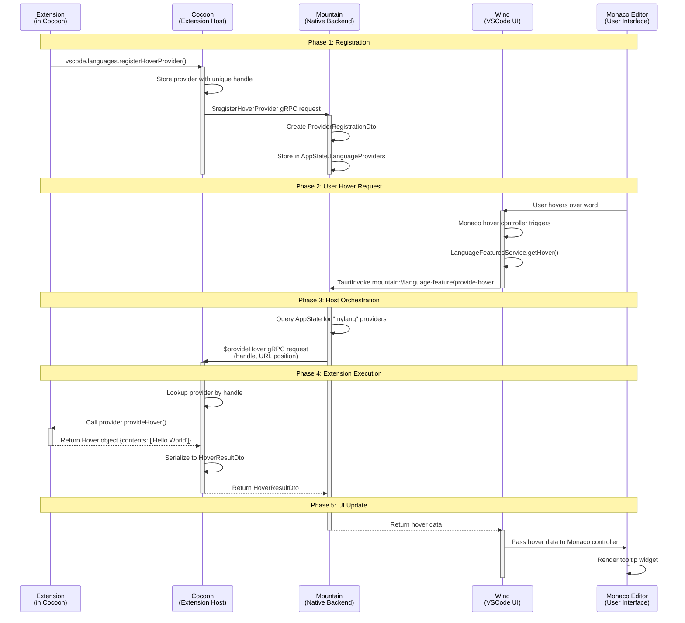

# Hover Provider Invocation

A hover provider demonstrates the full five-element request cycle: registration
flows from Cocoon to Mountain at activation time, then each live hover request
flows Sky → Wind → Mountain → Cocoon → extension → back the same way. Mountain
acts as the broker that maps language selectors to provider handles and routes
requests to the correct sidecar.



---

## Phase 1 - Extension registration (Cocoon → Mountain)

1. The extension is activated by Cocoon. Its `activate()` function runs and
   calls:

    ```ts
    vscode.languages.registerHoverProvider("mylang", provider);
    ```

2. Cocoon's `LanguageFeaturesProvider` stores the `provider` object in a local
   handle map under a unique handle (e.g. `123`) and sends a
   **`$registerHoverProvider` gRPC request** to Mountain. The request carries
   the handle, the language selector (`"mylang"`), and the owning extension ID.

3. Mountain's Vine gRPC server receives the request and dispatches it through
   the `track` module to `LanguageFeatureProvider.RegisterProvider()`.

4. `Registration.register_provider()` creates a `ProviderRegistrationDto`
   (handle `123`, type `Hover`, language `"mylang"`, sidecar `"cocoon-main"`)
   and stores it in `AppState.LanguageProviders`. Mountain now knows which
   sidecar owns which provider for which language.

| Step | Component | File                                                                  |
| ---- | --------- | --------------------------------------------------------------------- |
| 1    | Cocoon    | `Cocoon/src/Core/ExtensionHost.ts`                                    |
| 2    | Cocoon    | `Cocoon/src/Service/LanguageFeatures.ts`                              |
| 3    | Mountain  | `Mountain/Source/Vine/server/MountainVineGrpcService.rs`              |
| 4    | Mountain  | `Mountain/Source/Environment/LanguageFeatureProvider/Registration.rs` |

## Phase 2 - User hover request (Sky → Wind → Mountain)

5. The user moves the mouse over a symbol in an editor showing a `"mylang"`
   file. Monaco's internal hover controller fires and calls
   `ILanguageFeaturesService.getHover()` in Wind.

6. The service constructs an Effect that calls:

    ```ts
    TauriInvoke("mountain://language-feature/provide-hover", {
    	uri,
    	position,
    });
    ```

    This crosses the webview boundary and reaches Mountain's IPC dispatcher.

| Step | Component | File                                                            |
| ---- | --------- | --------------------------------------------------------------- |
| 5    | Wind      | `Wind/src/vs/editor/common/services/languageFeaturesService.ts` |
| 6    | Wind      | `Wind/src/vs/platform/editor/common/editorService.ts`           |

## Phase 3 - Mountain orchestrates the request (Mountain → Cocoon)

7. Mountain's `ProtocolLogic.HandleCustomUriSchemeRequest()` receives the
   `mountain://language-feature/provide-hover` request and dispatches it to
   the `track` module, which creates the `LanguageFeature::ProvideHover`
   effect.

8. `LanguageFeatureProvider.ProvideHover()` queries
   `AppState.LanguageProviders` for all registered hover providers matching the
   document's language (`"mylang"`). It finds handle `123` belonging to
   `"cocoon-main"`.

9. Mountain sends a **`$provideHover` gRPC request** to Cocoon with the
   document URI, cursor position, and provider handle `123`.

| Step | Component | File                                                                    |
| ---- | --------- | ----------------------------------------------------------------------- |
| 7    | Mountain  | `Mountain/Source/handlers/protocol/ProtocolLogic.rs`                    |
| 8-9  | Mountain  | `Mountain/Source/Environment/LanguageFeatureProvider/FeatureMethods.rs` |

## Phase 4 - Extension execution (Cocoon)

10. Cocoon's gRPC server (`Cocoon/src/Service/Ipc/Server.ts`) receives the
    `$provideHover` request and dispatches it to the language provider handler,
    which looks up handle `123` in its local map and retrieves the original
    `provider` object.

11. The handler calls:

    ```ts
    provider.provideHover(document, position, token);
    ```

    The extension's code executes and returns a `Hover` object, e.g.
    `{ contents: ["Hello World"] }`.

12. The handler serialises the result into a `HoverResultDto` via `TypeConverter`
    and returns it to Mountain as the gRPC response.

| Step  | Component | File                                                   |
| ----- | --------- | ------------------------------------------------------ |
| 10    | Cocoon    | `Cocoon/src/Service/Ipc/Server.ts`                     |
| 11-12 | Cocoon    | `Cocoon/src/Service/LanguageFeatures/TypeConverter.ts` |

## Phase 5 - Result reaches the UI (Mountain → Wind → Sky)

13. Mountain receives the `HoverResultDto`, serialises it, and sends it back as
    the response to the original `TauriInvoke` call from step 6.

14. Wind's `getHover` Effect resolves. The service passes the `Hover` data to
    Monaco's hover controller.

15. Monaco renders the tooltip widget on screen. The user sees the hover card.

| Step | Component | File                                                                    |
| ---- | --------- | ----------------------------------------------------------------------- |
| 13   | Mountain  | `Mountain/Source/Environment/LanguageFeatureProvider/FeatureMethods.rs` |
| 14   | Wind      | `Wind/src/vs/editor/common/services/languageFeaturesService.ts`         |
| 15   | Monaco    | Monaco Editor (embedded in Sky webview)                                 |

## Resolve methods

Two-phase providers return a partial result from `$provide*` and then expect a
`$resolve*` call to fill in expensive-to-compute fields. The following resolve
methods are fully routed through `FeatureMethods.rs` via the same
`InvokeLanguageProvider` dispatch path and return results to the caller rather
than being dropped:

- `$resolveCodeAction`
- `$resolveCompletionItem`
- `$resolveHover`
- `$resolveInlayHint`
- `$resolveDocumentLink`
- `$resolveWorkspaceSymbol`

## Inline completions

The same gRPC dispatch path handles inline completion providers (used by Copilot
and similar AI tools). When an extension calls
`vscode.languages.registerInlineCompletionItemProvider()`, the handle is stored
in `AppState.LanguageProviders` under the `InlineCompletion` type. Sky registers
the provider with `ILanguageFeaturesService.inlineCompletionsProvider` via the
`sky://language/register-inline-completions` bridge channel. When the editor
requests completions, Mountain routes `language:provideInlineCompletions` through
the same `LanguageFeatureProviderRegistry` trait and gRPC path as hover,
returning `InlineCompletionItem[]` to the editor.

> [!IMPORTANT] The same registration and dispatch pattern applies to every
> language feature (`$registerCompletionItemProvider`,
> `$registerDefinitionProvider`, etc.). The only difference is the gRPC method
> name and the DTO shape. Mountain always stores handle→sidecar mappings in
> `AppState.LanguageProviders` and routes each `$provide*` call to the correct
> sidecar at request time.
