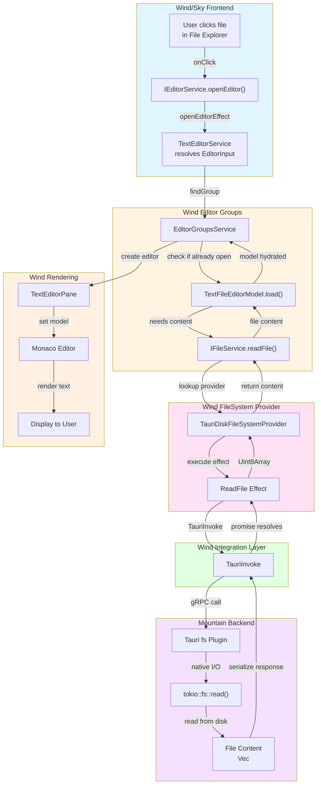

Opening a file involves four layer boundaries: Sky dispatches the intent,
Wind's editor and filesystem services resolve and load the model, a Tauri IPC
call reaches Mountain for the native disk read, and the result unwinds back
through the same chain until Monaco renders the content.



## Phase 1 - User interaction (Sky)

1. The user clicks a file entry in the File Explorer component. The `onClick`
   handler holds the file's `URI` and calls into `IEditorService`.

2. `IEditorService.openEditor({ resource: fileUri })` executes the
   `openEditorEffect` defined in `Wind/Source/Effect/Editor`. The effect first
   passes the untyped input to `TextEditorService` to resolve it into a
   concrete `EditorInput`, then calls `findGroup` to identify the target editor
   group.

## Phase 2 - Editor and filesystem logic (Wind → Mountain)

3. `EditorGroupsService` checks whether an editor for `fileUri` is already open.
   If it is, Wind focuses that tab and stops. Otherwise it calls
   `EditorInput.resolve()` to obtain the underlying model.

4. `TextFileEditorModel.load()` needs file content. It calls
   `IFileService.readFile(fileUri)` from `Wind/Source/FileSystem`.

5. `IFileService` looks up the registered provider for the `file:` URI scheme
   and finds `TauriDiskFileSystemProvider` (`Wind/Source/FileSystem`).

6. `TauriDiskFileSystemProvider.readFile()` executes the `ReadFile` Effect from
   the Tauri integration layer:

    ```ts
    Effect.runPromise(ReadFile(fileUri));
    ```

7. The `ReadFile` effect calls:

    ```ts
    TauriInvoke("plugin:fs|ReadFile", { path: fileUri.fsPath });
    ```

    This crosses the webview boundary into the Mountain process.

## Phase 3 - Native file I/O (Mountain)

8. Tauri routes the `plugin:fs|ReadFile` command to the `tauri-plugin-fs`
   internal Rust handler:

    ```rust
    tokio::fs::read(path)
    ```

9. The file content (`Vec<u8>`) is serialised and returned to Wind as the
   resolution of the `TauriInvoke` promise.

## Phase 4 - Data unwinds and UI renders (Wind)

10. The `ReadFile` Effect succeeds, yielding a `Uint8Array`.

11. `TextFileEditorModel.load()` completes. The model is now hydrated with the
    file content.

12. `EditorGroupsService` creates a `TextEditorPane` within the target group and
    sets the `TextFileEditorModel` on the Monaco editor instance inside that
    pane.

13. Monaco receives the text model and renders the content. The user sees the
    file open in the editor.

> [!IMPORTANT] The `IFileService` provider lookup is keyed on URI scheme. Only
> `file:` URIs reach `TauriDiskFileSystemProvider`. Custom-scheme URIs (e.g.
> `git:`, `output:`) are served by their own registered
> `TextDocumentContentProvider` in Cocoon, which follows a different path
> through the gRPC layer.

## openTextDocument variants

`vscode.workspace.openTextDocument` supports three calling forms beyond a plain
file URI:

- **`{ language, content }`** - creates an in-memory untitled document
  pre-populated with `content` and tagged with `languageId`. The document is
  added to `workspace.textDocuments` and `onDidOpenTextDocument` fires
  immediately. No Mountain round-trip occurs.
- **`"untitled:..."` scheme** - returns an empty document without any backend
  call. Content is read from `DocumentContentCache` if a prior write has
  populated it.
- **Custom scheme (e.g. `git:`, `output:`)** - Cocoon checks whether a
  `TextDocumentContentProvider` has been registered for that scheme. If one is
  found, Cocoon calls `provider.provideTextDocumentContent()` directly with no
  Mountain round-trip and no 10-second timeout. For schemes where no provider
  is registered and Mountain is the authoritative owner (e.g. output channels),
  the standard `FileSystem.ReadFile` gRPC route is used instead.
