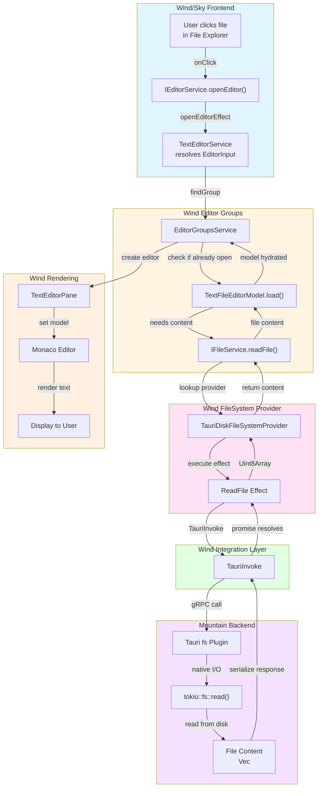

**Workflow Example: Opening a File from the UI**

**Goal:** The user clicks on a file in the File Explorer (Wind/Sky UI), and the
file's content is loaded into an editor.

This workflow demonstrates the interplay between the UI, the editor services,
the filesystem provider, and the backend. A single file-tree click traverses
four layer boundaries: Sky dispatches the intent, Wind's editor and filesystem
services resolve and load the model, a Tauri IPC call reaches Mountain for the
native disk read, and the result unwinds back through the same chain until
Monaco renders the content.



## Phase 1 - User Interaction (Sky)

1.  **File Explorer UI** - The user clicks on a file entry (`<div>`
    representing `my-file.ts`) in the File Explorer component. The `onClick`
    handler holds the file's `URI` and calls into `IEditorService`.

2.  **`IEditorService.openEditor()`** (Wind/Source/Effect/Editor) - The UI calls
    `editorService.openEditor({ resource: fileUri })`. The `openEditorEffect`
    inside the editor `Definition.ts` is executed. The input is an
    `IUntypedEditorInput`. The effect first passes it to `TextEditorService` to
    resolve it into a concrete `EditorInput` instance, then calls `findGroup` to
    determine which editor group should handle the opening (e.g. the currently
    active group).

## Phase 2 - Editor and Filesystem Logic (Wind → Mountain)

3.  **`EditorGroupsService`** - The `openEditor` method is called on the target
    `EditorGroupModel`. The group model checks whether an editor for `fileUri`
    is already open:
    - **Already open:** Wind focuses that tab and stops.
    - **Not open:** It begins opening a new editor. It uses the `EditorInput`'s
      `resolve()` method to obtain the editor model.

4.  **`TextFileEditorModel.load()`** - To display the content, the editor input
    loads its underlying model. `TextFileEditorModel` is responsible for this.
    Its `load()` method needs the file content. It calls
    `IFileService.readFile(fileUri)` from Wind/Source/FileSystem.

5.  **`IFileService.readFile()`** (Wind/Source/FileSystem) - The file service's
    `readFile(fileUri)` method looks up the registered provider for the URI's
    scheme (in this case `file:`). It finds
    `TauriDiskFileSystemProvider` from FileSystem/Definition.ts.

6.  **`TauriDiskFileSystemProvider.readFile()`** (Wind/Source/FileSystem) - The
    provider's `readFile` method immediately executes the `ReadFile` Effect from
    the Tauri integration layer:

    ```ts
    Effect.runPromise(ReadFile(fileUri));
    ```

7.  **`TauriMainProcessService.ts`** (Wind/Source/Service) - The `ReadFile`
    effect executes. It calls:

    ```ts
    TauriInvoke("plugin:fs|ReadFile", { path: fileUri.fsPath });
    ```

    This sends the request from the webview across the process boundary into the
    Mountain backend.

## Phase 3 - Native File I/O (Mountain)

8.  **Mountain/Source/Binary/Main/Entry.rs → Tauri `fs` Plugin** - Tauri
    receives the `plugin:fs|ReadFile` command and routes it to the
    `tauri-plugin-fs` internal Rust handler. The plugin performs the native
    filesystem operation:

    ```rust
    tokio::fs::read(path)
    ```

    The file content (`Vec<u8>`) is read from disk. The result is serialised and
    sent back to the Wind webview as the resolution of the `TauriInvoke`
    promise.

## Phase 4 - Data Unwinds and UI Renders (Wind)

9.  **`TauriMainProcessService.ts` (continued)** - The `TauriInvoke` promise
    resolves with the file content. The `ReadFile` Effect succeeds, yielding the
    `Uint8Array` containing the raw bytes of the file.

10. **`TextFileEditorModel` (continued)** - The `load()` method completes. The
    model is now hydrated with the file content. The `EditorInput` is fully
    resolved.

11. **`EditorGroupsService` (continued)** - The `openEditor` method now has a
    resolved input and model. It creates a new `TextEditorPane` within the
    target editor group and sets the `TextFileEditorModel` on the underlying
    Monaco editor instance inside that pane.

12. **Monaco Editor** - Monaco receives the new text model and renders the text
    content to the screen. **The user now sees their file open in the editor.**

This workflow shows how a simple UI action is translated through layers of
abstraction (`EditorService` → `FileService` → `FileSystemProvider` → Tauri
Integration) until it becomes a native OS call, with the result flowing back up
the same chain to update the UI.

### File Content Flow

The raw byte payload passes through distinct representations at each layer:

| Layer                | Representation         | Component           |
| -------------------- | ---------------------- | ------------------- |
| Mountain (disk)      | `Vec<u8>`              | tokio::fs::read     |
| Mountain → Tauri IPC | Serialised byte vector | tauri-plugin-fs     |
| Wind integration     | `Uint8Array`           | TauriInvoke promise |
| Wind FileSystem      | `Uint8Array`           | ReadFile Effect     |
| Wind Editor          | Decoded string model   | TextFileEditorModel |
| Monaco               | Text buffer            | editor.setModel()   |

> [!IMPORTANT] The `IFileService` provider lookup is keyed on URI scheme. Only
> `file:` URIs reach `TauriDiskFileSystemProvider`. Custom-scheme URIs (e.g.
> `git:`, `output:`) are served by their own registered
> `TextDocumentContentProvider` in Cocoon, which follows a different path
> through the gRPC layer.

## openTextDocument variants

`vscode.workspace.openTextDocument` supports three calling forms beyond a plain
file URI:

- **`{ language, content }`** - Creates an in-memory untitled document
  pre-populated with `content` and tagged with `languageId`. The document is
  added to `workspace.textDocuments` and `onDidOpenTextDocument` fires
  immediately. No Mountain round-trip occurs.
- **`"untitled:..."` scheme** - Returns an empty document without any backend
  call. Content is read from `DocumentContentCache` if a prior write has
  populated it.
- **Custom scheme (e.g. `git:`, `output:`)** - Cocoon checks whether a
  `TextDocumentContentProvider` has been registered for that scheme via
  `registerTextDocumentContentProvider`. If one is found, Cocoon calls
  `provider.provideTextDocumentContent()` directly with no Mountain round-trip
  and no 10-second timeout. For schemes where no provider is registered and
  Mountain is the authoritative owner (e.g. output channels), the standard
  `FileSystem.ReadFile` gRPC route is used instead.

### openTextDocument API parameters

The `openTextDocument` function has three overloads in the VS Code API:

| Overload                     | First Parameter                      | Description                                                                                                                                                      |
| ---------------------------- | ------------------------------------ | ---------------------------------------------------------------------------------------------------------------------------------------------------------------- |
| `openTextDocument(uri)`      | `Uri`                                | Opens the resource identified by the URI. `file:`-scheme reads from disk; `untitled:` creates a blank untitled file; other schemes consult registered providers. |
| `openTextDocument(path)`     | `string`                             | Short-hand for `openTextDocument(Uri.file(path))`. A filesystem path on disk.                                                                                    |
| `openTextDocument(options?)` | `{ language?, content?, encoding? }` | Creates an in-memory untitled document. `language` sets the language ID, `content` sets initial contents, `encoding` specifies text encoding.                    |

All overloads return `Thenable<TextDocument>`. The `uri` and `string` overloads
also accept an optional `{ encoding?: string }` options parameter to control
text decoding of the underlying buffer.
