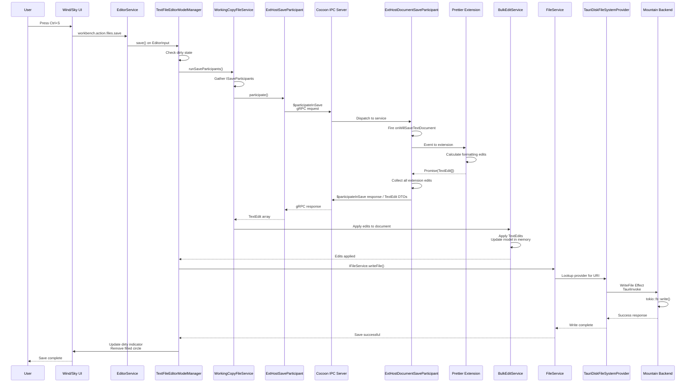

A save with participants involves two distinct network round-trips before the
file is written: Wind asks Cocoon to run all `onWillSaveTextDocument` handlers
and collect their edits, then the merged edits are applied in-memory before the
normal write path to Mountain executes. The extension author sees only a single
`onWillSaveTextDocument` event; the IPC machinery is invisible.



## Phase 1 - User action and save trigger (Wind/Sky)

1. The user presses `Ctrl+S` in an editor with unsaved changes. The keybinding
   system dispatches `workbench.action.files.save`.

2. `IEditorService.save()` identifies the active editor and calls `save` on its
   `EditorInput`.

3. `TextFileEditorModelManager` intercepts the save before any disk write. It
   emits a `willSave` event and passes control to `IWorkingCopyFileService` to
   run all registered save participants.

## Phase 2 - Save participant orchestration (Wind → Cocoon → Wind)

4. `WorkingCopyFileService.runSaveParticipants()` gathers every registered
   `ISaveParticipant`. The relevant one here is `ExtHostSaveParticipant`, which
   bridges to Cocoon.

5. `ExtHostSaveParticipant.participate()` sends a **`$participateInSave` gRPC
   request** to Cocoon, carrying the document URI and save reason (e.g.
   `explicit`). Wind then awaits the response.

## Phase 3 - Extension execution (Cocoon)

6. Cocoon's gRPC server receives `$participateInSave` and dispatches it to
   `ExtHostDocumentSaveParticipant`.

7. The service constructs a `WillSaveTextDocumentEvent` and fires the
   `onWillSaveTextDocument` event, delivering it to every subscribed extension.

8. Each participating extension (e.g. a Prettier formatter) receives the event,
   calculates its formatting edits for the document, and returns a
   `Promise<TextEdit[]>`.

9. `ExtHostDocumentSaveParticipant` awaits all returned promises, collects the
   `TextEdit` arrays, serialises them into DTOs via `TypeConverter`, and returns
   the complete array to Wind as the `$participateInSave` gRPC response.

## Phase 4 - Apply edits and write to disk (Wind → Mountain)

10. The `$participateInSave` gRPC call resolves in Wind.
    `WorkingCopyFileService` passes the collected edits to `IBulkEditService`.

    > `workspace.applyEdit()` is a full awaitable round-trip: the call is a
    > `sendRequest` round-trip to Mountain rather than a fire-and-forget
    > notification. The caller receives confirmation that the edit was applied
    > before proceeding. Mountain treats a `null` response from Sky as `true`
    > (matching VS Code's own `MainThreadBulkEdits` behaviour). The
    > `WorkspaceEdit` payload is normalised in the Sky bridge to handle multiple
    > wire shapes: `_edits` with `_type: 2` entries (text edits, `_range` using
    > 0-based lines converted to Monaco 1-based), `_type: 1` entries (file
    > operations), and serialised `vscode.Uri` objects.

11. `BulkEditService` applies every `TextEdit` to the document model in memory.
    Edits are applied atomically; extensions listening to
    `onDidChangeTextDocument` see a single composite change event.

12. With all participants complete and edits applied,
    `TextFileEditorModelManager` proceeds to the disk write. It calls
    `IFileService.writeFile()`.

13. The write follows the same provider chain as reading: `IFileService` →
    `TauriDiskFileSystemProvider` → `WriteFile` Effect →
    `TauriInvoke("plugin:fs|WriteFile")` → Mountain.

14. Mountain executes:

    ```rust
    tokio::fs::write(path, content)
    ```

    The formatted document is now on disk. Success propagates back up.

15. `TextFileEditorModel` transitions out of the dirty state. The filled-circle
    indicator disappears from the editor tab. The save is complete.

> [!IMPORTANT] Save participants can return edits that themselves trigger
> further change notifications. `BulkEditService` applies edits atomically to
> the in-memory model, so extensions that listen to `onDidChangeTextDocument`
> see a single composite change rather than one event per `TextEdit`.

## workspace.saveAll and related APIs

`workspace.saveAll()` previously called `Document.Save` with no arguments
(always an error). It now calls `Workspace.SaveAll`, which routes to
`sky://workspace/saveAll` and dispatches `workbench.action.files.saveAll` in the
renderer, flushing every open dirty document through `IFileService.writeFile()`.

`workspace.save(uri)` routes to `sky://workspace/save` and saves the specific
document via `ITextFileService.save` (falling back to the workbench save
command). `workspace.saveAs(uri)` routes to `sky://workspace/saveAs` and opens
the native save-as dialog. Both are round-trip request channels that resolve the
extension's awaited promise.

### applyEdit round-trip

`workspace.applyEdit(edit)` is a full awaitable round-trip via
`Call(Context, "applyEdit", [edit])` (Mountain `sendRequest`, not a
fire-and-forget notification). The extension's `await workspace.applyEdit(...)`
resolves only after Sky's `sky://workspace/applyEdit` handler finishes applying
the edit to the Monaco model and returns a success boolean. Mountain treats a
`null` response from Sky as `true` (matching VS Code's own `MainThreadBulkEdits`
behaviour).

The `WorkspaceEdit` payload is normalised inside the Sky bridge to handle
multiple wire shapes:

- `_edits` array with `_type: 2` entries (extHostTypes text edit) - `_range`
  uses `_start._line` / `_end._line` (0-based, converted to Monaco 1-based)
- `_edits` array with `_type: 1` entries (file operations: create, rename,
  delete)
- Serialised `vscode.Uri` objects (`_scheme` / `_path` fields)

`IBulkEditService` is tried first; if unavailable, the bridge falls back to
direct Monaco model operations.
