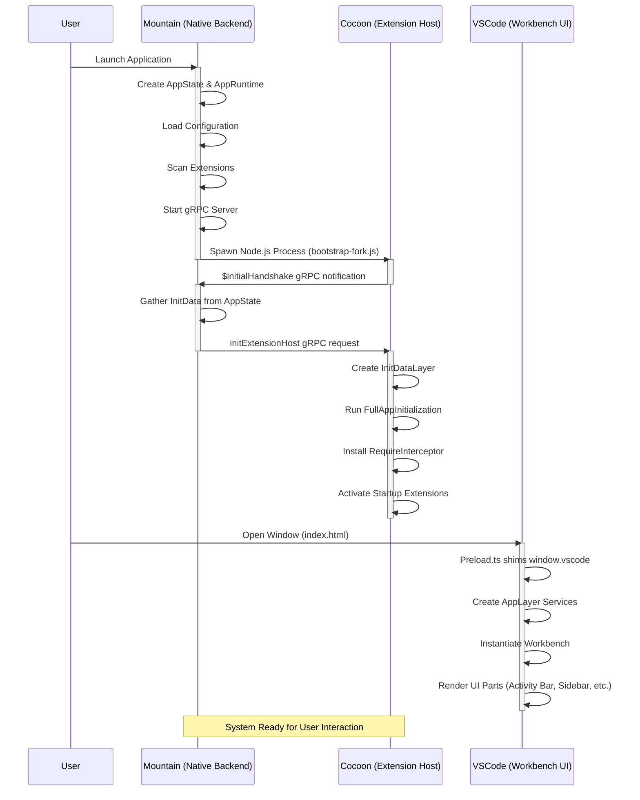

Land starts in three overlapping phases: the native Mountain binary starts its
gRPC listener and spawns the Cocoon Node.js sidecar, Cocoon bootstraps and
completes the `initExtensionHost` handshake, and the Wind workbench renders in
the Tauri webview. The Mountain↔Cocoon handshake is the hard ordering constraint
that gates extension activation; everything else proceeds in parallel.

This is the foundational workflow that enables all others. Once the handshake
completes and the workbench paints its first frame, the system is ready for user
interaction and all dependent workflows - opening files, executing commands,
language features - can proceed.



## Phase 1 - Mountain native startup

1. The OS launches the Mountain binary. The `main` function in
   `Binary/Main/Entry.rs` creates Tauri's `Builder` and configures the
   `.setup()` hook. Inside the hook, the central `AppState` is created and
   managed by Tauri, the `MountainEnvironment` (which implements every `Common`
   trait) is created, the `AppRuntime` (the engine for running effects) is
   created wrapping the environment, and a Tokio background task is spawned for
   post-setup work.

2. Inside the background task, four steps run in strict order:
    1. **`InitializeConfiguration`** - reads all `settings.json` files from disk
       into `AppState.Configuration`.

    2. **`ExtensionManagement`** - walks extension roots and loads manifests into
       `AppState.Extensions`. If a pre-baked `extensions.manifest.json` exists on
       disk (written by `Maintain/Build/Manifest/PreBake.ts` during the build's
       `beforeBundleCommand`), this step completes in under 50 ms. On first boot
       or when the cache is absent, a parallel `join_all` live scan runs (~1200
       ms) and caches the result for subsequent launches.

    3. **`vine::server::Initialize`** - starts the Vine gRPC server (default
       port 50051) and begins listening for connections from Cocoon.

    4. **`InitializeCocoon`** (`ProcessManagement/CocoonManagement.rs`) - spawns
       the Node.js sidecar process. It constructs a detailed environment that
       includes `VSCODE_PARENT_PID`, so the child terminates automatically when
       Mountain exits. The exact command is:

        ```bash
        node ./Element/Cocoon/Scripts/cocoon/bootstrap-fork.js
        ```

        Mountain then waits up to 30 seconds for Cocoon's `$initialHandshake`
        gRPC notification.

## Phase 2 - Cocoon bootstrap and handshake

Cocoon's `Bootstrap.ts` runs seven stages in strict order:

1. **Environment** - records Node.js version, platform, and architecture.

2. **Configuration** - resolves `MOUNTAIN_GRPC_PORT` (50051) and
   `COCOON_GRPC_PORT` (50052); populates `globalThis.__cocoonBootstrapConfig`
   and `globalThis.__LandTiers`.

3. **RPCServer** - binds Cocoon's own gRPC server on port 50052. **This must
   complete before Mountain's 30-second connection budget expires.**

4. **ModuleInterceptor** - installs the `require()` interceptor, remapping
   `electron` to Tauri stubs and patching VS Code bundle loading.

5. **MountainConnection** - TCP-probes Mountain on port 50051, opens the gRPC
   channel, and sends the **`$initialHandshake` notification** to signal
   readiness.

6. **Extensions** - activates enabled extensions concurrently (up to 8 in
   parallel). Extension activation uses topological ordering: if extension A
   declares `extensionDependencies: ["B"]`, extension B activates first. An
   `InProgress` set prevents circular dependency deadlocks.

7. **HealthCheck** - optional final service health sweep.

Between stages 5 and 6, Mountain responds to the handshake:

- Mountain receives `$initialHandshake` and calls
  `ProcessManagement/InitializationData.rs`, which assembles the full
  `ISandboxConfiguration` + `IExtensionHostInitData` payload. This payload
  includes: workspace roots, extension list and metadata, configuration state
  (`argv.json`, `settings.json`, `keybindings.json`), registered profiles,
  `dataFolderName` (a primary crash source when missing), `perfMarks`,
  `loggers`, `colorScheme`, `mainPid`, and OS metadata (platform, arch, release,
  hostname).

- Mountain sends the **`initExtensionHost` gRPC request** back to Cocoon,
  containing this initialization payload.

- Cocoon's handler fires: it uses the payload to create and provide the
  `InitDataLayer`, runs `FullAppInitialization`, resolves the
  `ExtensionHostProvider`, installs the `RequireInterceptor` so every
  `require('vscode')` returns the Cocoon shim, and activates startup extensions
  (`*` activation event). The topological ordering from the Extensions stage
  (step 6) ensures that extension dependency chains resolve correctly before
  providers register. At this point, workflows like Language Features and
  Webviews can begin, as extensions register their providers.

## Phase 3 - Wind workbench launch

These steps run in parallel with Phase 2, starting from the moment Tauri opens
the main window.

1. Tauri loads `index.html` in the webview, built by
   `Sky/Source/pages/Mountain.astro`. The Astro page produces the static HTML
   shell that bootstraps the Wind application script. `Wind/Source/Preload.ts`
   executes first, shimming `window.vscode` with Tauri-backed implementations
   for `ipcRenderer` and `process`. This shim is the critical bridge that allows
   the VS Code workbench code to run in a non-Electron, Tauri-based webview
   context.

2. The main Wind entry script waits for DOM ready, then composes the
   `AppLayer` - an Effect-TS `Layer` providing every Wind service:
   `LiveClipboardService`, `LiveDialogService`, `LiveEditorService`, and all
   the rest. Each service is backed by Tauri IPC calls or native Rust commands,
   replacing the Electron APIs that VS Code's workbench would normally consume.

3. The layer is converted to a Runtime and the VS Code `Workbench` is
   instantiated via `new Workbench(...)`. The `Workbench` constructor receives
   the resolved service runtime as its dependency container. `Workbench.startup()`
   is then called, which kicks off the entire UI rendering lifecycle - creating
   every UI part: Activity Bar, Status Bar, Side Bar, Editor Part, and
   instantiating the editor pane itself. Each part begins requesting data from
   Wind services, which in turn invoke Mountain IPC for filesystem reads,
   command lists, configuration values, and extension contributions.

4. As these parts are created, they trigger downstream workflows. For example,
   the File Explorer uses `IFileService` to list directory contents (triggering
   the Opening a File workflow), and the Command Palette uses
   `ICommandService` (triggering the Executing a Command workflow). Extension
   contributions to the UI (views, menus, keybindings) are registered via the
   `IExtensionService`, which is populated during Cocoon's startup extension
   activation in Phase 2.

5. **Extension activation timing after handshake:** Once Cocoon's
   `initExtensionHost` handler completes (Phase 2), activated extensions begin
   contributing to the workbench in real-time. The `IExtensionService` on the
   Wind side subscribes to a gRPC stream from Cocoon that relays
   `activatedExtension` events as each extension finishes its `activate()` call.
   This means the Command Palette and language features become available
   progressively - the first extension's contributions appear before the last
   one has finished activating. The workbench does not block paint on extension
   activation; it renders its chrome immediately and populates contributed UI
   elements as the extension stream arrives.

> [!IMPORTANT] The workbench's first meaningful paint depends on Mountain
> returning the `InitializationData` payload promptly. Delays in the extension
> scan (Phase 1, step 2) or the handshake round-trip (Phase 2, stage 5)
> directly delay first sidebar render. The pre-baked manifest and the
> RPCServer-before-MountainConnection bootstrap ordering are the two changes
> that keep first paint under 800 ms.


---

## See Also

- [🟠 Low-Level Shim](/doc/low-level-shim) - Engine-level prototype hooks
- [🔵 Coverage / Telemetry](/doc/coverage) - Application-level service routing
