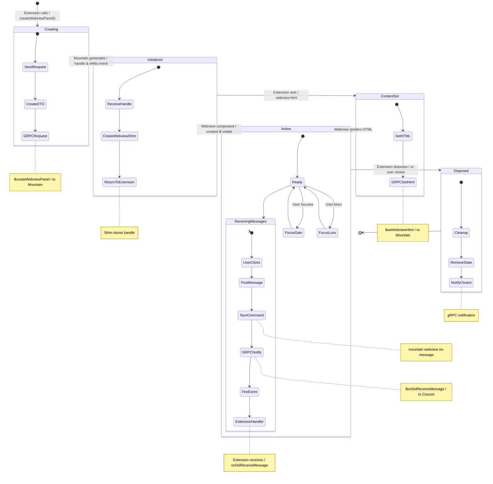

# Webview Panel Lifecycle

Webview panels let extensions embed arbitrary HTML inside the editor. The panel
itself is a native Tauri webview managed by Mountain; Cocoon holds a lightweight
shim that proxies property assignments and message events across gRPC. Every
`panel.webview.html` assignment and every `postMessage` call crosses the full
Cocoon → Mountain → Sky path.



---

## Phase 1 - Extension creates the panel (Cocoon → Mountain)

1. **Extension Activation (`Cocoon`)** — An extension is activated. Its
   `activate()` function runs.

2. **`vscode.window.createWebviewPanel()`** (Cocoon's
   `src/Service/WebviewPanel.ts`) — The extension calls
   `window.createWebviewPanel(...)`, providing `viewType`, `title`,
   `viewColumn`, and `options` (which include enabling scripts).

3. The call is received by the `WebviewPanelProvider` service in Cocoon. Its
   `CreateWebviewPanel` effect is executed.

4. **`IpcProvider`** (Cocoon's `src/Service/Ipc.ts`) — The `CreateWebviewPanel`
   effect constructs a detailed DTO containing all panel options, the
   extension's ID, and its location on disk (for resolving
   `localResourceRoots`).

5. Cocoon sends a **`$createWebviewPanel` gRPC request** to Mountain, passing this
   DTO, and awaits a unique handle in the response.

## Phase 2 - Mountain allocates the native handle (Mountain → Sky)

6. Mountain's Vine gRPC server dispatches the request to
   `WebviewProvider.CreateWebviewPanel()` on the `MountainEnvironment`.

7. The method generates a UUID handle, creates a `WebviewStateDto` with the
   received options, and stores it in `AppState.ActiveWebviews` keyed on the
   handle.

8. Mountain **emits a Tauri event to the Sky frontend**:
   `AppHandle.emit("sky://webview/create", { Handle, Title, ... })`. This
   tells the UI layer to physically create a new webview component.

9. Mountain returns the handle to Cocoon as the gRPC response.

## Phase 3 - Sky renders the empty panel (Sky)

10. A listener in Wind's `WebviewManagementService` receives the
    `sky://webview/create` event, creates a new `TauriWebviewWindow` or an
    `<iframe>` element inside the main window's DOM, and associates it with the
    handle. The webview is initially empty.

## Phase 4 - Extension sets content (Cocoon → Mountain → Sky)

11. Cocoon receives the handle from the gRPC response and constructs a
    `WebviewPanelShim` and a `WebviewShim` instance that store the handle
    internally. It returns the `WebviewPanelShim` to the extension.

12. The extension sets the panel's HTML:

    ```ts
    panel.webview.html = "<h1>Hello World</h1>";
    ```

13. The `set html` accessor on `WebviewShim` (Cocoon's `src/Service/Webview.ts`)
    is triggered. It sends a **`$setWebviewHtml` gRPC request** to Mountain
    carrying the handle and the HTML string.

14. Mountain's `WebviewProvider` receives `$setWebviewHtml`, looks up the handle
    in `AppState.ActiveWebviews`, then emits:

    ```ts
    AppHandle.emit("sky://webview/set-html", { Handle, Html });
    ```

15. Wind's webview manager receives the `sky://webview/set-html` event, finds
    the element associated with the handle, and sets its inner HTML. "Hello
    World" is now visible in the panel.

## Phase 5 - Bidirectional message passing (Sky → Mountain → Cocoon)

16. The user clicks a button inside the webview. The webview's HTML has an
    `onclick` handler that calls
    `vscode.postMessage({ command: "doSomething" })` using the `vscode` object
    injected by the preload script for that webview.

17. The message is sent from the webview to its host (Wind). Wind intercepts the
    message and sends a Tauri command to the backend:

    ```ts
    TauriInvoke("mountain://webview/on-message", { Handle, Message });
    ```

18. Mountain receives the command. The handler looks up the webview's owner
    sidecar (`"cocoon-main"`) in `AppState.ActiveWebviews`.

19. Mountain sends a **`$onDidReceiveMessage` gRPC notification** to Cocoon,
    including the `handle` and the message payload.

20. Cocoon receives the notification. The `WebviewPanelProvider` finds the
    `WebviewShim` for that `handle` and fires its `onDidReceiveMessage` event.

21. The extension's listener for `panel.webview.onDidReceiveMessage` is executed
    with the `{ command: "doSomething" }` payload. **The communication loop is
    complete.** The extension can now react to the user's action in the UI.

## Phase 6 - Disposal

22. The extension calls `panel.dispose()` or the user closes the webview tab.
    Cocoon sends a **`$disposeWebviewPanel` gRPC request** to Mountain.

23. Mountain removes the entry from `AppState.ActiveWebviews`, emits a Tauri
    close event to Sky, and Wind tears down the webview DOM element.

24. During cleanup, Mountain also removes the webview state and notifies Cocoon
    via gRPC that the panel has been closed.

## Cleanup patterns

- **Extension-initiated disposal**: Cocoon sends `$disposeWebviewPanel` gRPC
  request. Mountain removes the state from `AppState.ActiveWebviews` and emits
  a close event to Sky. Wind removes the DOM element.

- **User-initiated closure**: The user closes the webview tab in the UI. Wind
  notifies Mountain via a Tauri command. Mountain removes the state, emits a
  gRPC notification back to Cocoon, and Cocoon fires the panel's
  `onDidDispose` event.

- **Extension deactivation**: When the extension deactivates, Cocoon
  automatically disposes all webview panels owned by that extension. Each
  panel follows the extension-initiated disposal path above.

> [!WARNING] The webview messaging bridge (`$onDidReceiveMessage` gRPC) requires
> the `Environment/WebviewProvider/Messaging.rs` handler to be present in the
> Mountain build. If `setup_webview_message_listener_impl` is absent, messages
> posted from the webview content are silently dropped and the extension never
> receives them. This affects all panel-based extensions including Roo, Continue,
> and Continue.
